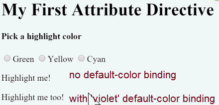

# Директивы атрибутов

:date: 28.02.2022

Измените внешний вид или поведение элементов DOM и компонентов Angular с помощью **директив атрибутов**.

!!!note ""

    Смотрите [код](https://angular.io/generated/live-examples/attribute-directives/stackblitz.html) для рабочего примера, содержащего фрагменты кода, приведенные в этом руководстве.

## Создание директивы атрибута

В этом разделе рассказывается о создании директивы выделения, которая устанавливает желтый цвет фона основного элемента.

1.  Чтобы создать директиву, используйте команду CLI `ng generate directive`.

    ```shell
    ng generate directive highlight
    ```

    CLI создает `src/app/highlight.directive.ts`, соответствующий тестовый файл `src/app/highlight.directive.spec.ts` и объявляет класс директивы в `AppModule`.

    CLI генерирует стандартный `src/app/highlight.directive.ts` следующим образом:

    ```ts
    import { Directive } from '@angular/core';

    @Directive({
        selector: '[appHighlight]',
    })
    export class HighlightDirective {}
    ```

    Свойство конфигурации декоратора `@Directive()` определяет селектор CSS-атрибутов директивы, `[appHighlight]`.

2.  Импортируйте `ElementRef` из `@angular/core`.

    `ElementRef` предоставляет прямой доступ к основному элементу DOM через свойство `nativeElement`.

3.  Добавьте `ElementRef` в `constructor()` директивы для [inject](dependency-injection.md) ссылки на основной элемент DOM, элемент, к которому вы применяете `appHighlight`.

4.  Добавьте логику в класс `HighlightDirective`, которая устанавливает желтый фон.

    ```ts
    import { Directive, ElementRef } from '@angular/core';

    @Directive({
        selector: '[appHighlight]',
    })
    export class HighlightDirective {
        constructor(private el: ElementRef) {
            this.el.nativeElement.style.backgroundColor =
                'yellow';
        }
    }
    ```

!!!danger "Внимание"

    Директивы _не_ поддерживают пространства имен.

    ```html
    <p app:Highlight>This is invalid</p>
    ```

## Применение директивы атрибута

Чтобы использовать `HighlightDirective`, добавьте элемент `<p>` в HTML-шаблон с директивой в качестве атрибута.

```html
<p appHighlight>Highlight me!</p>
```

Angular создает экземпляр класса `HighlightDirective` и вставляет ссылку на элемент `<p>` в конструктор директивы, который устанавливает стиль фона элемента `<p>` на желтый.

## Обработка событий пользователя

В этом разделе показано, как определить, когда пользователь наводит мышь на элемент или выходит из него, и отреагировать, установив или убрав цвет подсветки.

1.  Импортируйте `HostListener` из '@angular/core'.

    ```ts
    import {
        Directive,
        ElementRef,
        HostListener,
    } from '@angular/core';
    ```

2.  Добавьте два обработчика событий, которые реагируют, когда мышь входит или выходит, каждый с декоратором `@HostListener()`.

    ```ts
    @HostListener('mouseenter') onMouseEnter() {
    	this.highlight('yellow');
    }

    @HostListener('mouseleave') onMouseLeave() {
    	this.highlight('');
    }

    private highlight(color: string) {
    	this.el.nativeElement.style.backgroundColor = color;
    }
    ```

Подписка на события элемента DOM, в котором размещена директива атрибутов, в данном случае `<p>`, с помощью декоратора `@HostListener()`.

!!!note ""

    Обработчики делегируют вспомогательному методу `highlight()`, который устанавливает цвет для основного элемента DOM, `el`.

Полная директива выглядит следующим образом:

```ts
@Directive({
    selector: '[appHighlight]',
})
export class HighlightDirective {
    constructor(private el: ElementRef) {}

    @HostListener('mouseenter') onMouseEnter() {
        this.highlight('yellow');
    }

    @HostListener('mouseleave') onMouseLeave() {
        this.highlight('');
    }

    private highlight(color: string) {
        this.el.nativeElement.style.backgroundColor = color;
    }
}
```

Цвет фона появляется при наведении указателя на элемент абзаца и исчезает при перемещении указателя.


## Передача значений в директиву атрибутов

В этом разделе мы рассмотрим установку цвета подсветки при применении директивы `HighlightDirective`.

1.  В `highlight.directive.ts` импортируйте `Input` из `@angular/core`.

    ```ts
    import {
        Directive,
        ElementRef,
        HostListener,
        Input,
    } from '@angular/core';
    ```

2.  Добавьте свойство `appHighlight` `@Input()`.

    ```ts
    @Input() appHighlight = '';
    ```

    Декоратор `@Input()` добавляет метаданные к классу, которые делают свойство директивы `appHighlight` доступным для привязки.

3.  В `app.component.ts` добавьте свойство `color` к `AppComponent`.

    ```ts
    export class AppComponent {
        color = 'yellow';
    }
    ```

4.  Чтобы одновременно применить директиву и цвет, используйте связывание свойств с селектором директивы `appHighlight`, установив его равным `color`.

    ```html
    <p [appHighlight]="color">Highlight me!</p>
    ```

    Привязка атрибута `[appHighlight]` выполняет две задачи:

    -   Применяет директиву подсветки к элементу `<p>`.
    -   Устанавливает цвет выделения директивы с помощью привязки свойства.

### Установка значения с помощью пользовательского ввода

Этот раздел поможет вам добавить радиокнопки для привязки выбора цвета к директиве `appHighlight`.

1.  Добавьте разметку в `app.component.html` для выбора цвета следующим образом:

    ```html
    <h1>My First Attribute Directive</h1>

    <h2>Pick a highlight color</h2>
    <div>
        <input
            type="radio"
            name="colors"
            (click)="color='lightgreen'"
        />Green
        <input
            type="radio"
            name="colors"
            (click)="color='yellow'"
        />Yellow
        <input
            type="radio"
            name="colors"
            (click)="color='cyan'"
        />Cyan
    </div>
    <p [appHighlight]="color">Highlight me!</p>
    ```

2.  Измените `AppComponent.color` так, чтобы он не имел начального значения.

    ```ts
    export class AppComponent {
        color = '';
    }
    ```

3.  В `highlight.directive.ts` пересмотрите метод `onMouseEnter` так, чтобы он сначала пытался выделить с помощью `appHighlight` и возвращался к `red`, если `appHighlight` является `undefined`.

    ```ts
    @HostListener('mouseenter') onMouseEnter() {
    	this.highlight(this.appHighlight || 'red');
    }
    ```

4.  Проверьте свое приложение, чтобы убедиться, что пользователь может выбрать цвет с помощью радиокнопок.

    

## Привязка ко второму свойству

Этот раздел поможет вам настроить приложение так, чтобы разработчик мог установить цвет по умолчанию.

1.  Добавьте второе свойство `Input()` в `HighlightDirective` под названием `defaultColor`.

    ```ts
    @Input() defaultColor = '';
    ```

2.  Пересмотрите директиву `onMouseEnter` так, чтобы она сначала пыталась выделить с помощью `appHighlight`, затем с помощью `defaultColor`, и возвращалась к `red`, если оба свойства `не определены`.

    ```ts
    @HostListener('mouseenter') onMouseEnter() {
    	this.highlight(this.appHighlight || this.defaultColor || 'red');
    }
    ```

3.  Чтобы привязать к `AppComponent.color` и вернуться к "фиолетовому" цвету по умолчанию, добавьте следующий HTML.

    В этом случае для привязки `defaultColor` не используются квадратные скобки, `[]`, поскольку она статична.

    ```html
    <p [appHighlight]="color" defaultColor="violet">
        Highlight me too!
    </p>
    ```

    Как и в случае с компонентами, вы можете добавить несколько привязок свойств директив к элементу `host`.

Если нет привязки цвета по умолчанию, то цвет по умолчанию красный. Когда пользователь выбирает цвет, выбранный цвет становится активным цветом подсветки.



## Деактивация обработки Angular с помощью `NgNonBindable`.

Чтобы предотвратить оценку выражения в браузере, добавьте `ngNonBindable` к элементу host. `ngNonBindable` деактивирует интерполяцию, директивы и привязку в шаблонах.

В следующем примере выражение `{{ 1 + 1 }}` отображается так же, как и в вашем редакторе кода, и не отображает `2`.

```html
<p>Use ngNonBindable to stop evaluation.</p>
<p ngNonBindable>This should not evaluate: {{ 1 + 1 }}</p>
```

Применение `ngNonBindable` к элементу останавливает привязку для дочерних элементов этого элемента. Однако `ngNonBindable` по-прежнему позволяет директивам работать с элементом, к которому вы применили `ngNonBindable`.

В следующем примере директива `appHighlight` все еще активна, но Angular не оценивает выражение `{{ 1 + 1 }}}`.

```html
<h3>ngNonBindable with a directive</h3>
<div ngNonBindable [appHighlight]="'yellow'">
    This should not evaluate: {{ 1 +1 }}, but will highlight
    yellow.
</div>
```

Если вы примените `ngNonBindable` к родительскому элементу, Angular отключит интерполяцию и привязку любого рода, такую как привязка свойств или привязка событий, для дочерних элементов.
