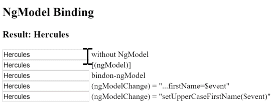
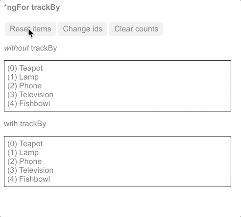

# Встроенные директивы

:date: 28.02.2022

**Директивы** — это классы, которые добавляют дополнительное поведение к элементам в ваших приложениях Angular.

Используйте встроенные директивы Angular для управления формами, списками, стилями и тем, что видят пользователи.

!!!note ""

    Смотрите [код](https://angular.io/generated/live-examples/built-in-directives/stackblitz.html) для рабочего примера, содержащего фрагменты кода, приведенные в этом руководстве.

Ниже перечислены различные типы директив Angular:

| Типы директив                                                                  | Подробности                                                                    |
| :----------------------------------------------------------------------------- | :----------------------------------------------------------------------------- |
| [Components](component-overview.md)                                            | Используется с шаблоном. Этот тип директив является наиболее распространенным. |
| [Директивы атрибутов](built-in-directives.md#built-in-attribute-directives)    | Изменяют внешний вид или поведение элемента, компонента или другой директивы.  |
| [Структурные директивы](built-in-directives.md#built-in-structural-directives) | Изменяют компоновку DOM путем добавления и удаления элементов DOM.             |

Это руководство охватывает встроенные [атрибутивные директивы](built-in-directives.md#built-in-attribute-directives) и [структурные директивы](built-in-directives.md#built-in-structural-directives).

## Встроенные директивы атрибутов

Директивы атрибутов слушают и изменяют поведение других элементов HTML, атрибутов, свойств и компонентов.

Многие модули NgModule, такие как [`RouterModule`](router.md) и [`FormsModule`](forms.md) определяют свои собственные директивы атрибутов. Наиболее распространенными директивами атрибутов являются следующие:

| Общие директивы                             | Подробности                                                   |
| :------------------------------------------ | :------------------------------------------------------------ |
| [`NgClass`](built-in-directives.md#ngClass) | Добавляет и удаляет набор классов CSS.                        |
| [`NgStyle`](built-in-directives.md#ngstyle) | Добавляет и удаляет набор стилей HTML.                        |
| [`NgModel`](built-in-directives.md#ngModel) | Добавляет двустороннюю привязку данных к элементу HTML-формы. |

!!!note ""

    Встроенные директивы используют только общедоступные API. Они не имеют специального доступа к каким-либо частным API, к которым не могут обращаться другие директивы.

## Добавление и удаление классов с помощью `NgClass`

Добавьте или удалите несколько классов CSS одновременно с помощью `ngClass`.

!!!note ""

    Чтобы добавить или удалить _один_ класс, используйте [class binding](class-binding.md), а не `NgClass`.

### Использование `NgClass` с выражением

Для элемента, который вы хотите стилизовать, добавьте `[ngClass]` и установите его равным выражению. В данном случае `isSpecial` — это булево значение `true` в `app.component.ts`.

Поскольку `isSpecial` истинно, `ngClass` применяет класс `special` к `<div>`.

```html
<!-- toggle the "special" class on/off with a property -->
<div [ngClass]="isSpecial ? 'special' : ''">
    This div is special
</div>
```

### Использование `NgClass` с методом

1.  Чтобы использовать `NgClass` с методом, добавьте метод в класс компонента.

    В следующем примере `setCurrentClasses()` устанавливает свойство `currentClasses` с объектом, который добавляет или удаляет три класса на основе состояния `true` или `false` трех других свойств компонента.

    Каждый ключ объекта — это имя класса CSS. Если ключ имеет значение `true`, `ngClass` добавляет класс. Если ключ равен `false`, то `ngClass` удаляет класс.

    ```ts
    currentClasses: Record<string, boolean> = {};
    /* . . . */
    setCurrentClasses() {
    	// CSS classes: added/removed
    	// per current state of component properties
    	this.currentClasses =  {
    		saveable: this.canSave,
    		modified: !this.isUnchanged,
    		special:  this.isSpecial
    	};
    }
    ```

2.  В шаблоне добавьте привязку свойства `ngClass` к `currentClasses` для установки классов элемента:

    ```html
    <div [ngClass]="currentClasses">
        This div is initially saveable, unchanged, and
        special.
    </div>
    ```

Для этого случая использования Angular применяет классы при инициализации и в случае изменений. Полный пример вызывает `setCurrentClasses()` изначально с `ngOnInit()` и когда зависимые свойства изменяются по нажатию кнопки.

Эти шаги не являются необходимыми для реализации `ngClass`.

Для получения дополнительной информации смотрите [код](https://angular.io/generated/live-examples/built-in-directives/stackblitz.html) `app.component.ts` и `app.component.html`.

## Установка встроенных стилей с помощью `NgStyle`

Используйте `NgStyle` для установки нескольких встроенных стилей одновременно, основываясь на состоянии компонента.

1.  Чтобы использовать `NgStyle`, добавьте метод в класс компонента.

    В следующем примере `setCurrentStyles()` устанавливает свойство `currentStyles` с объектом, определяющим три стиля, основываясь на состоянии трех других свойств компонента.

    ```ts
    currentStyles: Record<string, string> = {};
    /* . . . */
    setCurrentStyles() {
    	// CSS styles: set per current state of component properties
    	this.currentStyles = {
    		'font-style':  this.canSave      ? 'italic' : 'normal',
    		'font-weight': !this.isUnchanged ? 'bold'   : 'normal',
    		'font-size':   this.isSpecial    ? '24px'   : '12px'
    	};
    }
    ```

2.  Чтобы установить стили элемента, добавьте свойство `ngStyle`, связывающее `currentStyles`.

    ```html
    <div [ngStyle]="currentStyles">
        This div is initially italic, normal weight, and
        extra large (24px).
    </div>
    ```

Для этого случая использования Angular применяет стили при инициализации и в случае изменений. Для этого в полном примере вызывается `setCurrentStyles()` изначально с `ngOnInit()` и при изменении зависимых свойств по нажатию кнопки.

Однако эти шаги не являются необходимыми для самостоятельной реализации `ngStyle`.

Смотрите [код](https://angular.io/generated/live-examples/built-in-directives/stackblitz.html) `app.component.ts` и `app.component.html` для этой дополнительной реализации.

## Отображение и обновление свойств с помощью `ngModel`

Используйте директиву `NgModel` для отображения свойства данных и обновления этого свойства, когда пользователь вносит изменения.

1.  Импортируйте `FormsModule` и добавьте его в список `imports` модуля NgModule.

    ```ts
    // <--- JavaScript import from Angular
    import { FormsModule } from '@angular/forms';
    /* . . . */
    @NgModule({
        /* . . . */

        imports: [
            BrowserModule,
            FormsModule, // <--- import into the NgModule
        ],
        /* . . . */
    })
    export class AppModule {}
    ```

2.  Добавьте привязку `[(ngModel)]` на элемент HTML `<form>` и установите ее равной свойству, здесь `name`.

    ```html
    <label for="example-ngModel">[(ngModel)]:</label>
    <input
        [(ngModel)]="currentItem.name"
        id="example-ngModel"
    />
    ```

    Этот синтаксис `[(ngModel)]` может установить только свойство, связанное с данными.

Чтобы настроить конфигурацию, напишите расширенную форму, которая разделяет привязку свойств и событий. Используйте [property binding](property-binding.md) для установки свойства и [event binding](event-binding.md) для реакции на изменения.

В следующем примере значение `<input>` изменяется на заглавное:

```html
<input
    [ngModel]="currentItem.name"
    (ngModelChange)="setUppercaseName($event)"
    id="example-uppercase"
/>
```

Вот все варианты в действии, включая версию в верхнем регистре:



### `NgModel` и аксессоры значений

Директива `NgModel` работает для элемента, поддерживаемого [ControlValueAccessor](https://angular.io/api/forms/ControlValueAccessor). Angular предоставляет _аксессоры значений_ для всех основных элементов HTML-форм.

Для получения дополнительной информации смотрите [Forms](forms.md).

Чтобы применить `[(ngModel)]` к встроенному элементу, не являющемуся формой, или стороннему пользовательскому компоненту, необходимо написать аксессор значения. Для получения дополнительной информации смотрите документацию API по [DefaultValueAccessor](https://angular.io/api/forms/DefaultValueAccessor).

!!!note ""

    Когда вы пишете компонент Angular, вам не нужен аксессор значения или `NgModel`, если вы называете свойства значения и события в соответствии с [синтаксисом двустороннего связывания Angular](two-way-binding.md#how-two-way-binding-works).

## Встроенные структурные директивы

Структурные директивы отвечают за верстку HTML. Они формируют или изменяют структуру DOM, как правило, путем добавления, удаления и манипулирования элементами, к которым они прикреплены.

В этом разделе представлены наиболее распространенные встроенные структурные директивы:

| Общие встроенные структурные директивы        | Подробности                                                          |
| :-------------------------------------------- | :------------------------------------------------------------------- |
| [`NgIf`](built-in-directives.md#ngIf)         | Условно создает или удаляет вложенные представления из шаблона.      |
| [`NgFor`](built-in-directives.md#ngFor)       | Повторяет узел для каждого элемента в списке.                        |
| [`NgSwitch`](built-in-directives.md#ngSwitch) | Набор директив, переключающих между альтернативными представлениями. |

Для получения дополнительной информации смотрите [Структурные директивы](structural-directives.md).

## Добавление или удаление элемента с помощью `NgIf` {: #ngIf}

Добавьте или удалите элемент, применив директиву `NgIf` к главному элементу.

Когда `NgIf` имеет значение `false`, Angular удаляет элемент и его потомков из DOM. Затем Angular утилизирует их компоненты, освобождая память и ресурсы.

Чтобы добавить или удалить элемент, привяжите `*ngIf` к выражению условия, например `isActive` в следующем примере.

```html
<app-item-detail
    *ngIf="isActive"
    [item]="item"
></app-item-detail>
```

Если выражение `isActive` возвращает истинное значение, `NgIf` добавляет `ItemDetailComponent` в DOM. Если выражение ложно, `NgIf` удаляет `ItemDetailComponent` из DOM и избавляется от компонента и всех его подкомпонентов.

Более подробную информацию о `NgIf` и `NgIfElse` смотрите в [документации NgIf API](https://angular.io/api/common/NgIf).

### Защита от `null`

По умолчанию `NgIf` предотвращает отображение элемента, связанного с нулевым значением.

Чтобы использовать `NgIf` для защиты `<div>`, добавьте `*ngIf="yourProperty"` к `<div>`. В следующем примере имя `currentCustomer` отображается, потому что существует `currentCustomer`.

```html
<div *ngIf="currentCustomer">
    Hello, {{currentCustomer.name}}
</div>
```

Однако если свойство является `null`, Angular не отображает `<div>`. В этом примере Angular не отображает `nullCustomer`, потому что это `null`.

```html
<div *ngIf="nullCustomer">
    Hello, <span>{{nullCustomer}}</span>
</div>
```

## Вывод списка элементов с помощью `NgFor` {: #ngFor}

Используйте директиву `NgFor` для представления списка элементов.

1.  Определите блок HTML, который определяет, как Angular отображает отдельный элемент.
2.  Чтобы перечислить элементы, назначьте сокращение `let item of items` для `*ngFor`.

```html
<div *ngFor="let item of items">{{item.name}}</div>
```

Строка `"let item of items"` инструктирует Angular делать следующее:

-   Хранить каждый элемент массива `items` в локальной циклической переменной `item`.
-   Сделать каждый элемент доступным в шаблоне HTML для каждой итерации.
-   Перевести `let item of items` в `<ng-template>` вокруг основного элемента.
-   Повторять `<ng-template>` для каждого `item` в списке.

Для получения дополнительной информации смотрите раздел [Сокращение структурных директив](structural-directives.md#shorthand) раздела [Структурные директивы](structural-directives.md).

### Повторение компонентного представления

Чтобы повторить элемент компонента, примените `*ngFor` к селектору. В следующем примере селектором является `<app-item-detail>`.

```html
<app-item-detail
    *ngFor="let item of items"
    [item]="item"
></app-item-detail>
```

Ссылайтесь на входную переменную шаблона, такую как `item`, в следующих местах:

-   В главном элементе `ngFor`.
-   В потомках главного элемента для доступа к свойствам элемента.

Следующий пример сначала ссылается на `item` в интерполяции, а затем передает привязку к свойству `item` компонента `<app-item-detail>`.

```html
<div *ngFor="let item of items">{{item.name}}</div>
<!-- . . . -->
<app-item-detail
    *ngFor="let item of items"
    [item]="item"
></app-item-detail>
```

Для получения дополнительной информации о входных переменных шаблона смотрите [Сокращение структурных директив](structural-directives.md#shorthand).

### Получение `index` из `*ngFor`.

Получите `index` из `*ngFor` во входной переменной шаблона и используйте его в шаблоне.

В `*ngFor` добавьте точку с запятой и `let i=index` к сокращению. Следующий пример получает `index` в переменную с именем `i` и отображает его вместе с именем элемента.

```html
<div *ngFor="let item of items; let i=index">
    {{i + 1}} - {{item.name}}
</div>
```

Свойство `index` контекста директивы `NgFor` возвращает нулевой индекс элемента в каждой итерации.

Angular переводит эту инструкцию в `<ng-template>` вокруг основного элемента, затем использует этот шаблон несколько раз для создания нового набора элементов и привязок для каждого `item` в списке.

Более подробную информацию о сокращении см. в руководстве [Структурные директивы](structural-directives.md#shorthand).

## Повторение элементов при истинности условия

Чтобы повторить блок HTML, когда определенное условие истинно, поместите `*ngIf` в контейнерный элемент, который обертывает элемент `*ngFor`.

Дополнительную информацию смотрите в разделе [одна структурная директива на элемент](structural-directives.md#one-per-element).

### Отслеживание элементов с `*ngFor` `trackBy`

Сократите количество обращений вашего приложения к серверу, отслеживая изменения в списке элементов. С помощью свойства `*ngFor` `trackBy`, Angular может изменять и перерисовывать только те элементы, которые изменились, вместо того, чтобы перезагружать весь список элементов.

1.  Добавьте в компонент метод, возвращающий значение, которое должен отслеживать `NgFor`.

    В данном примере значением для отслеживания является `id` элемента.

    Если браузер уже отобразил `id`, Angular отслеживает его и не запрашивает сервер повторно для получения того же `id`.

    ```ts
    trackByItems(index: number, item: Item): number { return item.id; }
    ```

2.  В сокращенном выражении установите `trackBy` на метод `trackByItems()`.

    ```html
    <div *ngFor="let item of items; trackBy: trackByItems">
        ({{item.id}}) {{item.name}}
    </div>
    ```

**Изменение id** создает новые элементы с новыми `item.id`. В следующей иллюстрации эффекта `trackBy`, **Reset items** создает новые элементы с теми же `item.id`.

-   При отсутствии `trackBy` обе кнопки вызывают полную замену элементов DOM.
-   При использовании `trackBy` только изменение `id` вызывает замену элемента.



## Размещение директивы без элемента DOM

Angular `<ng-container>` — это группирующий элемент, который не вмешивается в стили или макет, потому что Angular не помещает его в DOM.

Используйте `<ng-container>`, когда нет отдельного элемента для размещения директивы.

Вот условный параграф с использованием `<ng-container>`.

```html
<p>
    I turned the corner
    <ng-container *ngIf="hero">
        and saw {{hero.name}}. I waved
    </ng-container>
    and continued on my way.
</p>
```


1.  Импортируйте директиву `ngModel` из `FormsModule`.

2.  Добавьте `FormsModule` в раздел imports соответствующего модуля Angular.

3.  Чтобы условно исключить `<option>`, оберните `<option>` в `<ng-container>`.

    ```html
    <div>
        Pick your favorite hero (<label
            ><input
                type="checkbox"
                checked
                (change)="showSad = !showSad"
            />show sad</label
        >)
    </div>
    <select [(ngModel)]="hero">
        <ng-container *ngFor="let h of heroes">
            <ng-container
                *ngIf="showSad || h.emotion !== 'sad'"
            >
                <option [ngValue]="h">
                    {{h.name}} ({{h.emotion}})
                </option>
            </ng-container>
        </ng-container>
    </select>
    ```

    

## Переключение случаев с помощью `NgSwitch` {: #ngSwitch}

Как и оператор JavaScript `switch`, `NgSwitch` отображает один элемент из нескольких возможных элементов, основываясь на условии переключения. Angular помещает в DOM только выбранный элемент.

<!--todo: API Flagged -->

`NgSwitch` — это набор из трех директив:

| Директивы `NgSwitch` | Подробности                                                                                                                                                                           |
| :------------------- | :------------------------------------------------------------------------------------------------------------------------------------------------------------------------------------ |
| `NgSwitch`           | Атрибутивная директива, которая изменяет поведение сопутствующих директив.                                                                                                            |
| `NgSwitchCase`       | Структурная директива, которая добавляет свой элемент в DOM, когда его связанное значение равно значению switch и удаляет его связанное значение, когда оно не равно значению switch. |
| `NgSwitchDefault`    | Структурная директива, которая добавляет свой элемент в DOM, когда нет выбранного `NgSwitchCase`.                                                                                     |

1.  На элемент, например `<div>`, добавьте `[ngSwitch]`, связанный с выражением, которое возвращает значение переключателя, например `feature`.
    Хотя значение `feature` в этом примере является строкой, значение переключателя может быть любого типа.

2.  Привязка к `*ngSwitchCase` и `*ngSwitchDefault` на элементах для случаев.

    ```html
    <div [ngSwitch]="currentItem.feature">
        <app-stout-item
            *ngSwitchCase="'stout'"
            [item]="currentItem"
        ></app-stout-item>
        <app-device-item
            *ngSwitchCase="'slim'"
            [item]="currentItem"
        ></app-device-item>
        <app-lost-item
            *ngSwitchCase="'vintage'"
            [item]="currentItem"
        ></app-lost-item>
        <app-best-item
            *ngSwitchCase="'bright'"
            [item]="currentItem"
        ></app-best-item>
        <!-- . . . -->
        <app-unknown-item
            *ngSwitchDefault
            [item]="currentItem"
        ></app-unknown-item>
    </div>
    ```

3.  В родительском компоненте определите `currentItem`, чтобы использовать его в выражении `[ngSwitch]`.

    ```ts
    currentItem!: Item;
    ```

4.  В каждом дочернем компоненте добавьте `item` [свойство ввода](inputs-outputs.md#input 'Свойство ввода'), который привязан к `currentItem` родительского компонента.

    Следующие два фрагмента показывают родительский компонент и один из дочерних компонентов.

    Остальные дочерние компоненты идентичны `StoutItemComponent`.

    ```ts
    export class StoutItemComponent {
        @Input() item!: Item;
    }
    ```

    

Директивы switch также работают со встроенными элементами HTML и веб-компонентами. Например, вы можете заменить `<app-best-item>` switch case на `<div>` следующим образом.

```html
<div *ngSwitchCase="'bright'">
    Are you as bright as {{currentItem.name}}?
</div>
```

## Что дальше

Информацию о том, как создавать свои собственные пользовательские директивы, смотрите в [Директивы атрибутов](attribute-directives.md) и [Структурные директивы](structural-directives.md).
