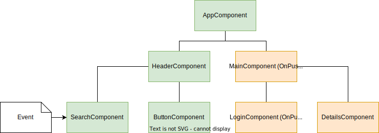
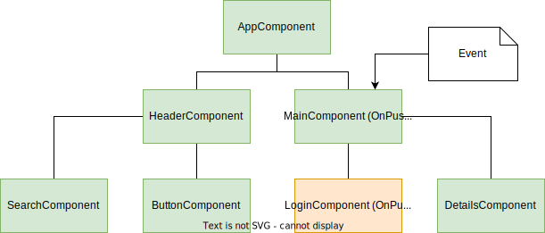
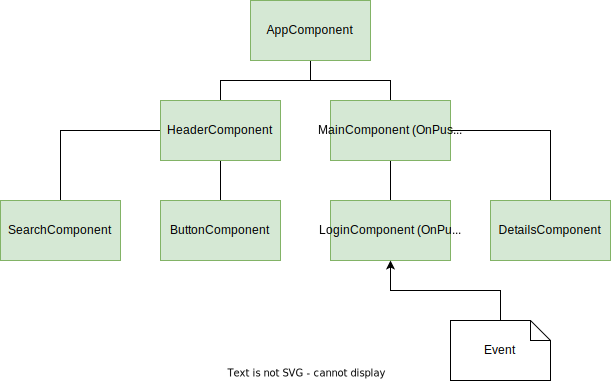
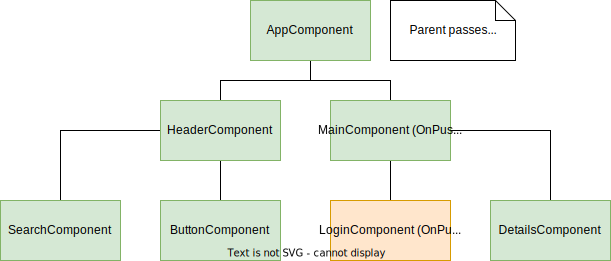

# Пропуск поддеревьев компонентов

:date: 4.05.2022

JavaScript по умолчанию использует изменяемые структуры данных, на которые можно ссылаться из нескольких различных компонентов. Angular выполняет обнаружение изменений во всем дереве компонентов, чтобы убедиться, что самое актуальное состояние структур данных отражается в DOM.

Обнаружение изменений происходит достаточно быстро для большинства приложений. Однако, когда приложение имеет особенно большое дерево компонентов, запуск обнаружения изменений по всему приложению может вызвать проблемы с производительностью. Вы можете решить эту проблему, настроив обнаружение изменений только на подмножество дерева компонентов.

Если вы уверены, что часть приложения не затронута изменением состояния, вы можете использовать [OnPush](https://angular.io/api/core/ChangeDetectionStrategy), чтобы пропустить обнаружение изменений во всем поддереве компонентов.

## Использование `OnPush`

Обнаружение изменений `OnPush` предписывает Angular запускать обнаружение изменений для поддерева компонентов **только** когда:

-   Корневой компонент поддерева получает новые входные данные в результате привязки шаблона. Angular сравнивает текущее и прошлое значение входа с `==`.
-   Angular обрабатывает событие _(например, используя привязку событий, привязку вывода или `@HostListener` )_ в корневом компоненте поддерева или любом из его дочерних компонентов, независимо от того, используют они обнаружение изменений `OnPush` или нет.

Вы можете установить стратегию обнаружения изменений компонента на `OnPush` в декораторе `@Component`:

```ts
import {
    ChangeDetectionStrategy,
    Component,
} from '@angular/core';
@Component({
    changeDetection: ChangeDetectionStrategy.OnPush,
})
export class MyComponent {}
```

## Общие сценарии обнаружения изменений

В этом разделе рассматриваются несколько распространенных сценариев обнаружения изменений, чтобы проиллюстрировать поведение Angular.

## Событие обрабатывается компонентом с обнаружением изменений по умолчанию

Если Angular обрабатывает событие в компоненте без стратегии `OnPush`, фреймворк выполняет обнаружение изменений для всего дерева компонентов. Angular пропустит нисходящие поддеревья компонентов с корнями, использующими `OnPush`, которые не получили новых входов.

Например, если мы установим стратегию обнаружения изменений для `MainComponent` в `OnPush` и пользователь будет взаимодействовать с компонентом вне поддерева с корнем `MainComponent`, Angular проверит все зеленые компоненты из диаграммы ниже (`AppComponent`, `HeaderComponent`, `SearchComponent`, `ButtonComponent`), если `MainComponent` не получит новых входов:



## Событие обрабатывается компонентом со стратегией OnPush

Если Angular обрабатывает событие внутри компонента со стратегией `OnPush`, фреймворк будет выполнять обнаружение изменений во всем дереве компонентов. Angular будет игнорировать поддеревья компонентов с корнями, использующими `OnPush`, которые не получили новых входов и находятся вне компонента, обработавшего событие.

Например, если Angular обработает событие в `MainComponent`, фреймворк выполнит обнаружение изменений во всем дереве компонентов. Angular проигнорирует поддерево с корнем `LoginComponent`, потому что у него есть `OnPush` и событие произошло вне его области действия.



## Событие обрабатывается потомком компонента с OnPush

Если Angular обрабатывает событие в компоненте с помощью `OnPush`, фреймворк будет выполнять обнаружение изменений во всем дереве компонентов, включая предков компонента.

В качестве примера, на диаграмме ниже Angular обрабатывает событие в `LoginComponent`, которое использует `OnPush`. Angular вызовет обнаружение изменений во всем поддереве компонентов, включая `MainComponent` (родитель `LoginComponent`), даже если `MainComponent` также имеет `OnPush`. Angular также проверяет `MainComponent`, поскольку `LoginComponent` является частью его представления.



## Новые входы в компонент с помощью `OnPush`

Angular будет выполнять обнаружение изменений в дочернем компоненте с `OnPush` при установке свойства `input` в результате привязки шаблона.

Например, на диаграмме ниже `AppComponent` передает новый вход в `MainComponent`, который имеет `OnPush`. Angular запустит обнаружение изменений в `MainComponent`, но не запустит обнаружение изменений в `LoginComponent`, который также имеет `OnPush`, пока не получит новые входные данные.



## Краевые случаи

-   **Модификация свойств ввода в коде TypeScript**. Когда вы используете API, например `@ViewChild` или `@ContentChild`, чтобы получить ссылку на компонент в TypeScript и вручную изменяете свойство `@Input`, Angular не будет автоматически запускать обнаружение изменений для компонентов `OnPush`. Если вам необходимо, чтобы Angular выполнял обнаружение изменений, вы можете внедрить `ChangeDetectorRef` в свой компонент и вызвать `changeDetectorRef.markForCheck()`, чтобы указать Angular запланировать обнаружение изменений.
-   **Модификация ссылок на объекты**. Если вход получает в качестве значения изменяемый объект, а вы изменяете объект, но сохраняете ссылку, Angular не будет вызывать обнаружение изменений. Это ожидаемое поведение, потому что предыдущее и текущее значение входа указывают на одну и ту же ссылку.
