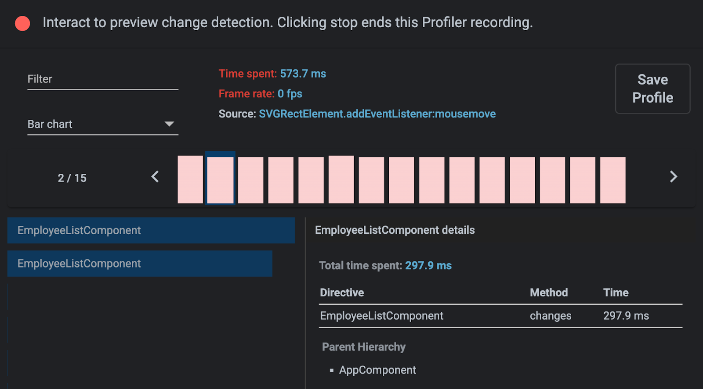

# Медленные вычисления

:date: 4.05.2022

В каждом цикле обнаружения изменений Angular синхронно:

-   Оценивает все шаблонные выражения во всех компонентах, если не указано иное, на основе стратегии обнаружения каждого компонента.
-   Выполняет хуки жизненного цикла `ngDoCheck`, `ngAfterContentChecked`, `ngAfterViewChecked` и `ngOnChanges`.

    Одно медленное вычисление в шаблоне или хуке жизненного цикла может замедлить весь процесс обнаружения изменений, поскольку Angular выполняет вычисления последовательно.

## Выявление медленных вычислений

Вы можете определить тяжелые вычисления с помощью профилировщика Angular DevTools. На временной шкале производительности нажмите на столбец, чтобы просмотреть определенный цикл обнаружения изменений. Это отобразит гистограмму, которая показывает, сколько времени фреймворк потратил на обнаружение изменений для каждого компонента. Если щелкнуть компонент, можно просмотреть, сколько времени Angular потратил на оценку его шаблона и крючков жизненного цикла.

Например, на предыдущем снимке экрана выбран второй записанный цикл обнаружения изменений. Angular потратил на этот цикл более 573 мс, причем больше всего времени было потрачено на `EmployeeListComponent`. На панели деталей видно, что Angular потратил более 297 мс на оценку шаблона `EmployeeListComponent`.

## Оптимизация медленных вычислений

Вот несколько методов устранения медленных вычислений:

-   **Оптимизация базового алгоритма**. Это рекомендуемый подход. Если вы сможете ускорить алгоритм, который вызывает проблему, вы сможете ускорить весь механизм обнаружения изменений.
-   **Кэширование с использованием чистых каналов**. Вы можете перенести тяжелые вычисления в чистый [pipe](pipes.md). Angular повторно оценивает чистую трубу, только если обнаруживает, что ее входы изменились по сравнению с предыдущим обращением к ней.
-   **Использование мемоизации**. [Memoization](https://ru.wikipedia.org/wiki/%D0%9C%D0%B5%D0%BC%D0%BE%D0%B8%D0%B7%D0%B0%D1%86%D0%B8%D1%8F) — это техника, схожая с чистыми пайпами, с той разницей, что чистые трубы сохраняют только последний результат вычислений, а мемоизация может хранить несколько результатов.
-   **Избегайте перерисовки/перетекания в крючках жизненного цикла**. Определенные [операции](https://web.dev/avoid-large-complex-layouts-and-layout-thrashing/) заставляют браузер либо синхронно пересчитывать макет страницы, либо перерисовывать ее. Поскольку переливание и перерисовка обычно медленные, вы хотите избежать их выполнения в каждом цикле обнаружения изменений.

Чистые пайпы и мемоизация имеют различные компромиссы. Чистые пайпы — это встроенная концепция Angular по сравнению с мемоизацией, которая является общей практикой разработки программного обеспечения для кэширования результатов функций. Избыток памяти при мемоизации может быть значительным, если вы часто вызываете тяжелые вычисления с разными аргументами.
