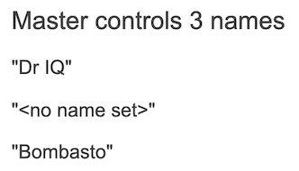
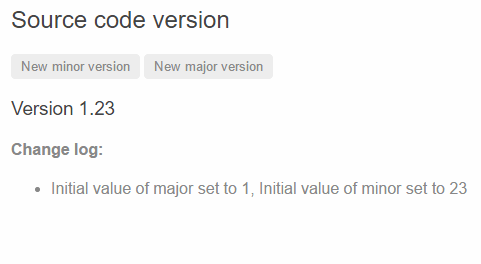
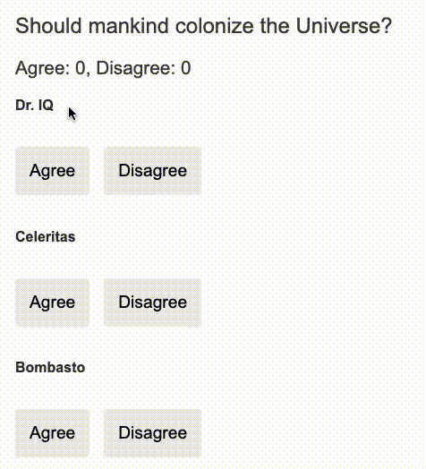

# Взаимодействие компонентов

Эта поваренная книга содержит рецепты для распространенных сценариев взаимодействия компонентов, в которых два или более компонентов обмениваются информацией.

Смотрите [пример](https://angular.io/generated/live-examples/component-interaction/stackblitz.html).

## Передача данных от родителя к ребенку с помощью привязки ввода

`HeroChildComponent` имеет два _input свойства_, обычно украшенные декоратором [@Input()](inputs-outputs.md#input).

```ts title="component-interaction/src/app/hero-parent.component.ts"
import { Component, Input } from '@angular/core';

import { Hero } from './hero';

@Component({
    selector: 'app-hero-child',
    template: `
        <h3>{{ hero.name }} says:</h3>
        <p>
            I, {{ hero.name }}, am at your service,
            {{ masterName }}.
        </p>
    `,
})
export class HeroChildComponent {
    @Input() hero!: Hero;
    @Input('master') masterName = '';
}
```

Второй `@Input` псевдонизирует имя свойства дочернего компонента `masterName` как `'master'`.

Родительский компонент `HeroParentComponent` вставляет дочерний компонент `HeroChildComponent` внутрь повторителя `*ngFor`, связывая его строковое свойство `master` с псевдонимом `master` дочернего компонента, а экземпляр `hero` каждой итерации - со свойством `hero` дочернего компонента.

```ts title="component-interaction/src/app/hero-parent.component.ts"
import { Component } from '@angular/core';

import { HEROES } from './hero';

@Component({
    selector: 'app-hero-parent',
    template: `
        <h2>
            {{ master }} controls {{ heroes.length }} heroes
        </h2>

        <app-hero-child
            *ngFor="let hero of heroes"
            [hero]="hero"
            [master]="master"
        >
        </app-hero-child>
    `,
})
export class HeroParentComponent {
    heroes = HEROES;
    master = 'Master';
}
```

Запущенное приложение отображает трех героев:


**Протестируйте его на передачу данных от родителя к ребенку с привязкой к входу**

E2E проверка того, что все дочерние элементы были созданы и отображены, как ожидалось:

```ts title="component-interaction/e2e/src/app.e2e-spec.ts"
// ...
const heroNames = ['Dr. IQ', 'Magneta', 'Bombasto'];
const masterName = 'Master';

it('should pass properties to children properly', async () => {
    const parent = element(by.tagName('app-hero-parent'));
    const heroes = parent.all(by.tagName('app-hero-child'));

    for (let i = 0; i < heroNames.length; i++) {
        const childTitle = await heroes
            .get(i)
            .element(by.tagName('h3'))
            .getText();
        const childDetail = await heroes
            .get(i)
            .element(by.tagName('p'))
            .getText();
        expect(childTitle).toEqual(heroNames[i] + ' says:');
        expect(childDetail).toContain(masterName);
    }
});
// ...
```

## Перехват изменений входного свойства с помощью сеттера

Используйте сеттер входного свойства, чтобы перехватить значение от родителя и действовать в соответствии с ним.

Сеттер входного свойства `name` в дочернем `NameChildComponent` удаляет пробелы из имени и заменяет пустое значение текстом по умолчанию.

```ts title="component-interaction/src/app/name-child.component.ts"
import { Component, Input } from '@angular/core';

@Component({
    selector: 'app-name-child',
    template: '<h3>"{{name}}"</h3>',
})
export class NameChildComponent {
    @Input()
    get name(): string {
        return this._name;
    }
    set name(name: string) {
        this._name =
            (name && name.trim()) || '<no name set>';
    }
    private _name = '';
}
```

Вот `NameParentComponent`, демонстрирующий варианты имен, включая имя со всеми пробелами:

```ts title="component-interaction/src/app/name-parent.component.ts"
import { Component } from '@angular/core';

@Component({
    selector: 'app-name-parent',
    template: `
        <h2>Master controls {{ names.length }} names</h2>

        <app-name-child
            *ngFor="let name of names"
            [name]="name"
        ></app-name-child>
    `,
})
export class NameParentComponent {
    // Displays 'Dr. IQ', '<no name set>', 'Bombasto'
    names = ['Dr. IQ', '   ', '  Bombasto  '];
}
```



**Тест на перехват изменений входного свойства с помощью сеттера**

E2E тесты сеттера входного свойства с пустыми и непустыми именами:

```ts title="component-interaction/e2e/src/app.e2e-spec.ts"
// ...
it('should display trimmed, non-empty names', async () => {
    const nonEmptyNameIndex = 0;
    const nonEmptyName = '"Dr. IQ"';
    const parent = element(by.tagName('app-name-parent'));
    const hero = parent
        .all(by.tagName('app-name-child'))
        .get(nonEmptyNameIndex);

    const displayName = await hero
        .element(by.tagName('h3'))
        .getText();
    expect(displayName).toEqual(nonEmptyName);
});

it('should replace empty name with default name', async () => {
    const emptyNameIndex = 1;
    const defaultName = '"<no name set>"';
    const parent = element(by.tagName('app-name-parent'));
    const hero = parent
        .all(by.tagName('app-name-child'))
        .get(emptyNameIndex);

    const displayName = await hero
        .element(by.tagName('h3'))
        .getText();
    expect(displayName).toEqual(defaultName);
});
// ...
```

## Перехват изменений свойств ввода с помощью `ngOnChanges()`.

Обнаруживайте изменения значений входных свойств и действуйте в соответствии с ними с помощью метода `ngOnChanges()` интерфейса хука жизненного цикла `OnChanges`.

!!!info ""

    Вы можете предпочесть этот подход к установщику свойств при наблюдении за несколькими взаимодействующими свойствами ввода.

    Узнайте о `ngOnChanges()` в главе [Lifecycle Hooks](lifecycle-hooks.md).

Этот `VersionChildComponent` обнаруживает изменения входных свойств `major` и `minor` и составляет сообщение журнала, сообщающее об этих изменениях:

```ts title="component-interaction/src/app/version-child.component.ts"
import {
    Component,
    Input,
    OnChanges,
    SimpleChanges,
} from '@angular/core';

@Component({
    selector: 'app-version-child',
    template: `
        <h3>Version {{ major }}.{{ minor }}</h3>
        <h4>Change log:</h4>
        <ul>
            <li *ngFor="let change of changeLog">
                {{ change }}
            </li>
        </ul>
    `,
})
export class VersionChildComponent implements OnChanges {
    @Input() major = 0;
    @Input() minor = 0;
    changeLog: string[] = [];

    ngOnChanges(changes: SimpleChanges) {
        const log: string[] = [];
        for (const propName in changes) {
            const changedProp = changes[propName];
            const to = JSON.stringify(
                changedProp.currentValue
            );
            if (changedProp.isFirstChange()) {
                log.push(
                    `Initial value of ${propName} set to ${to}`
                );
            } else {
                const from = JSON.stringify(
                    changedProp.previousValue
                );
                log.push(
                    `${propName} changed from ${from} to ${to}`
                );
            }
        }
        this.changeLog.push(log.join(', '));
    }
}
```

Компонент `VersionParentComponent` предоставляет значения `minor` и `major` и привязывает кнопки к методам, которые их изменяют.

```ts title="component-interaction/src/app/version-parent.component.ts"
import { Component } from '@angular/core';

@Component({
    selector: 'app-version-parent',
    template: `
        <h2>Source code version</h2>
        <button type="button" (click)="newMinor()">
            New minor version
        </button>
        <button type="button" (click)="newMajor()">
            New major version
        </button>
        <app-version-child
            [major]="major"
            [minor]="minor"
        ></app-version-child>
    `,
})
export class VersionParentComponent {
    major = 1;
    minor = 23;

    newMinor() {
        this.minor++;
    }

    newMajor() {
        this.major++;
        this.minor = 0;
    }
}
```

Вот результат последовательности нажатия кнопки:



**Протестируйте его на перехват изменений свойств ввода с помощью `ngOnChanges()`**

Проверьте, что _обои_ входные свойства установлены изначально и что нажатие на кнопку вызывает ожидаемые вызовы и значения `ngOnChanges`:

```ts title="component-interaction/e2e/src/app.e2e-spec.ts"
// ...
// Test must all execute in this exact order
it('should set expected initial values', async () => {
    const actual = await getActual();

    const initialLabel = 'Version 1.23';
    const initialLog =
        'Initial value of major set to 1, Initial value of minor set to 23';

    expect(actual.label).toBe(initialLabel);
    expect(actual.count).toBe(1);
    expect(await actual.logs.get(0).getText()).toBe(
        initialLog
    );
});

it("should set expected values after clicking 'Minor' twice", async () => {
    const repoTag = element(
        by.tagName('app-version-parent')
    );
    const newMinorButton = repoTag
        .all(by.tagName('button'))
        .get(0);

    await newMinorButton.click();
    await newMinorButton.click();

    const actual = await getActual();

    const labelAfter2Minor = 'Version 1.25';
    const logAfter2Minor = 'minor changed from 24 to 25';

    expect(actual.label).toBe(labelAfter2Minor);
    expect(actual.count).toBe(3);
    expect(await actual.logs.get(2).getText()).toBe(
        logAfter2Minor
    );
});

it("should set expected values after clicking 'Major' once", async () => {
    const repoTag = element(
        by.tagName('app-version-parent')
    );
    const newMajorButton = repoTag
        .all(by.tagName('button'))
        .get(1);

    await newMajorButton.click();
    const actual = await getActual();

    const labelAfterMajor = 'Version 2.0';
    const logAfterMajor =
        'major changed from 1 to 2, minor changed from 23 to 0';

    expect(actual.label).toBe(labelAfterMajor);
    expect(actual.count).toBe(2);
    expect(await actual.logs.get(1).getText()).toBe(
        logAfterMajor
    );
});

async function getActual() {
    const versionTag = element(
        by.tagName('app-version-child')
    );
    const label = await versionTag
        .element(by.tagName('h3'))
        .getText();
    const ul = versionTag.element(by.tagName('ul'));
    const logs = ul.all(by.tagName('li'));

    return {
        label,
        logs,
        count: await logs.count(),
    };
}
// ...
```

## Родитель слушает событие ребенка

Дочерний компонент раскрывает свойство `EventEmitter`, с помощью которого он `издает` события, когда что-то происходит. Родитель привязывается к этому свойству событий и реагирует на эти события.

Свойство дочернего компонента `EventEmitter` является **_выводным свойством_**, обычно украшенным декоратором [@Output()](inputs-outputs.md#output), как показано в этом `VoterComponent`:

```ts title="component-interaction/src/app/voter.component.ts"
import {
    Component,
    EventEmitter,
    Input,
    Output,
} from '@angular/core';

@Component({
    selector: 'app-voter',
    template: `
        <h4>{{ name }}</h4>
        <button
            type="button"
            (click)="vote(true)"
            [disabled]="didVote"
        >
            Agree
        </button>
        <button
            type="button"
            (click)="vote(false)"
            [disabled]="didVote"
        >
            Disagree
        </button>
    `,
})
export class VoterComponent {
    @Input() name = '';
    @Output() voted = new EventEmitter<boolean>();
    didVote = false;

    vote(agreed: boolean) {
        this.voted.emit(agreed);
        this.didVote = true;
    }
}
```

Нажатие на кнопку вызывает испускание `true` или `false`, булевой _payload_.

Родительский `VoteTakerComponent` связывает обработчик события `onVoted()`, который реагирует на дочернее событие полезной нагрузки `$event` и обновляет счетчик.

```ts title="component-interaction/src/app/votetaker.component.ts"
import { Component } from '@angular/core';

@Component({
    selector: 'app-vote-taker',
    template: `
        <h2>Should mankind colonize the Universe?</h2>
        <h3>
            Agree: {{ agreed }}, Disagree: {{ disagreed }}
        </h3>

        <app-voter
            *ngFor="let voter of voters"
            [name]="voter"
            (voted)="onVoted($event)"
        >
        </app-voter>
    `,
})
export class VoteTakerComponent {
    agreed = 0;
    disagreed = 0;
    voters = ['Dr. IQ', 'Celeritas', 'Bombasto'];

    onVoted(agreed: boolean) {
        if (agreed) {
            this.agreed++;
        } else {
            this.disagreed++;
        }
    }
}
```

Фреймворк передает аргумент события &mdash;представленный `$event` &mdash; в метод обработчика, и метод обрабатывает его:



**Проверьте, что родитель прослушивает событие ребенка**

Проверьте, что нажатие кнопок _Согласен_ и _Не согласен_ обновляет соответствующие счетчики:

```ts title="component-interaction/e2e/src/app.e2e-spec.ts"
// ...
it('should not emit the event initially', async () => {
    const voteLabel = element(
        by.tagName('app-vote-taker')
    ).element(by.tagName('h3'));
    expect(await voteLabel.getText()).toBe(
        'Agree: 0, Disagree: 0'
    );
});

it('should process Agree vote', async () => {
    const voteLabel = element(
        by.tagName('app-vote-taker')
    ).element(by.tagName('h3'));
    const agreeButton1 = element
        .all(by.tagName('app-voter'))
        .get(0)
        .all(by.tagName('button'))
        .get(0);

    await agreeButton1.click();

    expect(await voteLabel.getText()).toBe(
        'Agree: 1, Disagree: 0'
    );
});

it('should process Disagree vote', async () => {
    const voteLabel = element(
        by.tagName('app-vote-taker')
    ).element(by.tagName('h3'));
    const agreeButton1 = element
        .all(by.tagName('app-voter'))
        .get(1)
        .all(by.tagName('button'))
        .get(1);

    await agreeButton1.click();

    expect(await voteLabel.getText()).toBe(
        'Agree: 0, Disagree: 1'
    );
});
// ...
```

## Родитель взаимодействует с ребенком, используя _локальную переменную_

Родительский компонент не может использовать привязку данных для чтения дочерних свойств или вызова дочерних методов. Для этого нужно создать переменную-ссылку шаблона для дочернего элемента, а затем ссылаться на эту переменную _в родительском шаблоне_, как показано в следующем примере.

Ниже представлен дочерний `CountdownTimerComponent`, который многократно отсчитывает время до нуля и запускает ракету. Методы `start` и `stop` управляют часами, а сообщение о состоянии обратного отсчета отображается в собственном шаблоне.

```ts title="component-interaction/src/app/countdown-timer.component.ts"
import { Component, OnDestroy } from '@angular/core';

@Component({
    selector: 'app-countdown-timer',
    template: '<p>{{message}}</p>',
})
export class CountdownTimerComponent implements OnDestroy {
    message = '';
    seconds = 11;

    ngOnDestroy() {
        this.clearTimer?.();
    }

    start() {
        this.countDown();
    }
    stop() {
        this.clearTimer?.();
        this.message = `Holding at T-${this.seconds} seconds`;
    }

    private clearTimer: VoidFunction | undefined;

    private countDown() {
        this.clearTimer?.();
        const interval = setInterval(() => {
            this.seconds -= 1;
            if (this.seconds === 0) {
                this.message = 'Blast off!';
            } else {
                if (this.seconds < 0) {
                    this.seconds = 10;
                } // reset
                this.message = `T-${this.seconds} seconds and counting`;
            }
        }, 1000);
        this.clearTimer = () => clearInterval(interval);
    }
}
```

Родительский компонент `CountdownLocalVarParentComponent`, в котором размещается компонент таймера, выглядит следующим образом:

```ts title="component-interaction/src/app/countdown-parent.component.ts"
import { Component } from '@angular/core';
import { CountdownTimerComponent } from './countdown-timer.component';

@Component({
    selector: 'app-countdown-parent-lv',
    template: `
        <h3>Countdown to Liftoff (via local variable)</h3>
        <button type="button" (click)="timer.start()">
            Start
        </button>
        <button type="button" (click)="timer.stop()">
            Stop
        </button>
        <div class="seconds">{{ timer.seconds }}</div>
        <app-countdown-timer #timer></app-countdown-timer>
    `,
    styleUrls: ['../assets/demo.css'],
})
export class CountdownLocalVarParentComponent {}
```

Родительский компонент не может привязать данные к методам `start` и `stop` дочернего компонента, а также к его свойству `seconds`.

Поместите локальную переменную `#timer` на тег `<app-countdown-timer>`, представляющий дочерний компонент. Это даст вам ссылку на дочерний компонент и возможность доступа к _любым его свойствам или методам_ из родительского шаблона.

В этом примере родительские кнопки подключаются к дочерним `start` и `stop`, а для отображения дочернего свойства `seconds` используется интерполяция.

Здесь родитель и ребенок работают вместе.


**Проверьте, что родитель взаимодействует с ребенком с помощью _локальной переменной_**

Проверьте, что секунды, отображаемые в шаблоне родителя, совпадают с секундами, отображаемыми в сообщении о статусе ребенка. Проверьте также, что нажатие кнопки _Stop_ приостанавливает таймер обратного отсчета:

```ts title="component-interaction/e2e/src/app.e2e-spec.ts"
// ...
// The tests trigger periodic asynchronous operations (via `setInterval()`), which will prevent
// the app from stabilizing. See https://angular.io/api/core/ApplicationRef#is-stable-examples
// for more details.
// To allow the tests to complete, we will disable automatically waiting for the Angular app to
// stabilize.
beforeEach(() => browser.waitForAngularEnabled(false));
afterEach(() => browser.waitForAngularEnabled(true));

it('timer and parent seconds should match', async () => {
    const parent = element(by.tagName(parentTag));
    const startButton = parent.element(
        by.buttonText('Start')
    );
    const seconds = parent.element(by.className('seconds'));
    const timer = parent.element(
        by.tagName('app-countdown-timer')
    );

    await startButton.click();

    // Wait for `<app-countdown-timer>` to be populated with any text.
    await browser.wait(() => timer.getText(), 2000);

    expect(await timer.getText()).toContain(
        await seconds.getText()
    );
});

it('should stop the countdown', async () => {
    const parent = element(by.tagName(parentTag));
    const startButton = parent.element(
        by.buttonText('Start')
    );
    const stopButton = parent.element(
        by.buttonText('Stop')
    );
    const timer = parent.element(
        by.tagName('app-countdown-timer')
    );

    await startButton.click();
    expect(await timer.getText()).not.toContain('Holding');

    await stopButton.click();
    expect(await timer.getText()).toContain('Holding');
});
// ...
```

## Родитель вызывает `@ViewChild()`

Подход _локальной переменной_ является простым. Но он ограничен, поскольку связь между родителями и детьми должна осуществляться исключительно в родительском шаблоне.

Родительский компонент _сам по себе_ не имеет доступа к дочернему.

Вы не можете использовать технику _локальной переменной_, если _класс_ родительского компонента зависит от _класса_ дочернего компонента. Отношения "родитель-ребенок" компонентов не устанавливаются внутри соответствующего _класса_ каждого компонента с помощью техники _локальной переменной_.

Поскольку экземпляры _класса_ не связаны друг с другом, родительский _класс_ не может получить доступ к свойствам и методам дочернего _класса_.

Когда родительский компонент _класса_ требует такого доступа, _вставьте_ дочерний компонент в родительский как _ViewChild_.

Следующий пример иллюстрирует эту технику на примере того же Countdown Timer. Ни его внешний вид, ни поведение не меняются.

Дочерний `CountdownTimerComponent` также не меняется.

!!!note ""

    Переход от _локальной переменной_ к технике _ViewChild_ осуществляется исключительно в целях демонстрации.

Здесь находится родитель, `CountdownViewChildParentComponent`:

```ts title=""
import { AfterViewInit, ViewChild } from '@angular/core';
import { Component } from '@angular/core';
import { CountdownTimerComponent } from './countdown-timer.component';

@Component({
    selector: 'app-countdown-parent-vc',
    template: `
        <h3>Countdown to Liftoff (via ViewChild)</h3>
        <button type="button" (click)="start()">
            Start
        </button>
        <button type="button" (click)="stop()">Stop</button>
        <div class="seconds">{{ seconds() }}</div>
        <app-countdown-timer></app-countdown-timer>
    `,
    styleUrls: ['../assets/demo.css'],
})
export class CountdownViewChildParentComponent
    implements AfterViewInit {
    @ViewChild(CountdownTimerComponent)
    private timerComponent!: CountdownTimerComponent;

    seconds() {
        return 0;
    }

    ngAfterViewInit() {
        // Redefine `seconds()` to get from the `CountdownTimerComponent.seconds` ...
        // but wait a tick first to avoid one-time devMode
        // unidirectional-data-flow-violation error
        setTimeout(
            () =>
                (this.seconds = () =>
                    this.timerComponent.seconds),
            0
        );
    }

    start() {
        this.timerComponent.start();
    }
    stop() {
        this.timerComponent.stop();
    }
}
```

Потребуется немного больше работы, чтобы вписать дочернее представление в класс _класса_ родительского компонента.

Сначала нужно импортировать ссылки на декоратор `ViewChild` и хук жизненного цикла `AfterViewInit`.

Затем внедрите дочерний `CountdownTimerComponent` в частное свойство `timerComponent`, используя декоратор свойства `@ViewChild`.

Локальная переменная `#timer` исчезнет из метаданных компонента. Вместо этого привяжите кнопки к собственным методам родительского компонента `start` и `stop` и представьте тикающие секунды в интерполяции вокруг метода родительского компонента `seconds`.

Эти методы обращаются непосредственно к инжектированному компоненту таймера.

Хук жизненного цикла `ngAfterViewInit()` является важным моментом. Компонент таймера становится доступным только после того, как Angular отобразит родительское представление.

Поэтому первоначально он отображает `0` секунд.

Затем Angular вызывает хук жизненного цикла `ngAfterViewInit`, и в это время уже _слишком поздно_ обновлять отображение секунд обратного отсчета в родительском представлении. Правило однонаправленного потока данных Angular не позволяет обновить родительское представление в том же цикле.

Приложение должно _выждать один оборот_, прежде чем оно сможет отобразить секунды.

Используйте `setTimeout()` для ожидания одного такта, а затем пересмотрите метод `seconds()` так, чтобы он принимал будущие значения от компонента таймера.

**Протестируйте его на вызов родительского компонента `@ViewChild()`.**

Используйте те же тесты таймера обратного отсчета, что и раньше.

## Родительский и дочерний компоненты общаются с помощью сервиса

Родительский компонент и его дочерние компоненты совместно используют сервис, интерфейс которого обеспечивает двунаправленную связь _в пределах семейства_.

Областью действия экземпляра сервиса является родительский компонент и его дочерние компоненты. Компоненты вне этого поддерева компонентов не имеют доступа к сервису или их коммуникациям.

Этот `MissionService` соединяет `MissionControlComponent` с несколькими дочерними `AstronautComponent`.

```ts title="component-interaction/src/app/mission.service.ts"
import { Injectable } from '@angular/core';
import { Subject } from 'rxjs';

@Injectable()
export class MissionService {
    // Observable string sources
    private missionAnnouncedSource = new Subject<string>();
    private missionConfirmedSource = new Subject<string>();

    // Observable string streams
    missionAnnounced$ = this.missionAnnouncedSource.asObservable();
    missionConfirmed$ = this.missionConfirmedSource.asObservable();

    // Service message commands
    announceMission(mission: string) {
        this.missionAnnouncedSource.next(mission);
    }

    confirmMission(astronaut: string) {
        this.missionConfirmedSource.next(astronaut);
    }
}
```

Компонент `MissionControlComponent` предоставляет экземпляр сервиса, который он разделяет со своими дочерними компонентами (через массив метаданных `providers`) и внедряет этот экземпляр в себя через свой конструктор:

```ts title="component-interaction/src/app/missioncontrol.component.ts"
import { Component } from '@angular/core';

import { MissionService } from './mission.service';

@Component({
    selector: 'app-mission-control',
    template: `
        <h2>Mission Control</h2>
        <button type="button" (click)="announce()">
            Announce mission
        </button>

        <app-astronaut
            *ngFor="let astronaut of astronauts"
            [astronaut]="astronaut"
        >
        </app-astronaut>

        <h3>History</h3>
        <ul>
            <li *ngFor="let event of history">
                {{ event }}
            </li>
        </ul>
    `,
    providers: [MissionService],
})
export class MissionControlComponent {
    astronauts = ['Lovell', 'Swigert', 'Haise'];
    history: string[] = [];
    missions = [
        'Fly to the moon!',
        'Fly to mars!',
        'Fly to Vegas!',
    ];
    nextMission = 0;

    constructor(private missionService: MissionService) {
        missionService.missionConfirmed$.subscribe(
            (astronaut) => {
                this.history.push(
                    `${astronaut} confirmed the mission`
                );
            }
        );
    }

    announce() {
        const mission = this.missions[this.nextMission++];
        this.missionService.announceMission(mission);
        this.history.push(`Mission "${mission}" announced`);
        if (this.nextMission >= this.missions.length) {
            this.nextMission = 0;
        }
    }
}
```

Компонент `AstronautComponent` также инжектирует сервис в своем конструкторе. Каждый `AstronautComponent` является дочерним компонентом `MissionControlComponent` и поэтому получает экземпляр службы своего родителя:

```ts title="component-interaction/src/app/astronaut.component.ts"
import { Component, Input, OnDestroy } from '@angular/core';

import { MissionService } from './mission.service';
import { Subscription } from 'rxjs';

@Component({
    selector: 'app-astronaut',
    template: `
        <p>
            {{ astronaut }}: <strong>{{ mission }}</strong>
            <button
                type="button"
                (click)="confirm()"
                [disabled]="!announced || confirmed"
            >
                Confirm
            </button>
        </p>
    `,
})
export class AstronautComponent implements OnDestroy {
    @Input() astronaut = '';
    mission = '<no mission announced>';
    confirmed = false;
    announced = false;
    subscription: Subscription;

    constructor(private missionService: MissionService) {
        this.subscription = missionService.missionAnnounced$.subscribe(
            (mission) => {
                this.mission = mission;
                this.announced = true;
                this.confirmed = false;
            }
        );
    }

    confirm() {
        this.confirmed = true;
        this.missionService.confirmMission(this.astronaut);
    }

    ngOnDestroy() {
        // prevent memory leak when component destroyed
        this.subscription.unsubscribe();
    }
}
```

!!!note ""

    Обратите внимание, что в этом примере фиксируется `subscription` и `unsubscribe()` при уничтожении `AstronautComponent`. Это шаг защиты от утечки памяти.
    В этом приложении нет фактического риска, потому что время жизни `AstronautComponent` равно времени жизни самого приложения.

    Это _не всегда_ будет верно в более сложном приложении.

    Вы не добавляете эту защиту к `MissionControlComponent`, потому что, как родитель, он контролирует время жизни `MissionService`.

Журнал _History_ демонстрирует, что сообщения перемещаются в обоих направлениях между родительским `MissionControlComponent` и дочерними `AstronautComponent`, чему способствует служба:


**Тестирование взаимодействия родительского и дочернего компонентов с помощью службы**

Тестирует нажатие на кнопки как родительского `MissionControlComponent`, так и дочернего `AstronautComponent` и проверяет, что история соответствует ожиданиям:

```ts title="component-interaction/e2e/src/app.e2e-spec.ts"
// ...
it('should announce a mission', async () => {
    const missionControl = element(
        by.tagName('app-mission-control')
    );
    const announceButton = missionControl
        .all(by.tagName('button'))
        .get(0);
    const history = missionControl.all(by.tagName('li'));

    await announceButton.click();

    expect(await history.count()).toBe(1);
    expect(await history.get(0).getText()).toMatch(
        /Mission.* announced/
    );
});

it('should confirm the mission by Lovell', async () => {
    await testConfirmMission(1, 'Lovell');
});

it('should confirm the mission by Haise', async () => {
    await testConfirmMission(3, 'Haise');
});

it('should confirm the mission by Swigert', async () => {
    await testConfirmMission(2, 'Swigert');
});

async function testConfirmMission(
    buttonIndex: number,
    astronaut: string
) {
    const missionControl = element(
        by.tagName('app-mission-control')
    );
    const announceButton = missionControl
        .all(by.tagName('button'))
        .get(0);
    const confirmButton = missionControl
        .all(by.tagName('button'))
        .get(buttonIndex);
    const history = missionControl.all(by.tagName('li'));

    await announceButton.click();
    await confirmButton.click();

    expect(await history.count()).toBe(2);
    expect(await history.get(1).getText()).toBe(
        `${astronaut} confirmed the mission`
    );
}
// ...
```

:date: 28.02.2022
