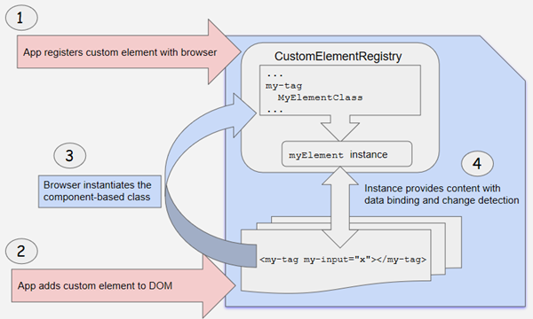
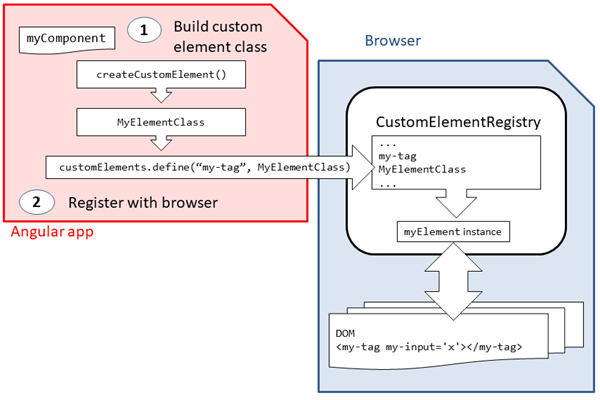

# Обзор элементов Angular

**Элементы Angular** — это компоненты Angular, упакованные как _custom elements_ (также называемые Web Components), веб-стандарт для определения новых элементов HTML в независимости от фреймворка.

!!!note ""

    [Пример приложения](https://angular.io/generated/live-examples/elements/stackblitz.html), которое описывается на этой странице.

[Пользовательские элементы](https://developer.mozilla.org/docs/Web/Web_Components/Using_custom_elements) — это функция веб-платформы, которая в настоящее время поддерживается в Chrome, Edge (на базе Chromium), Firefox, Opera и Safari, и доступна в других браузерах через полифиллы (см. "Поддержка браузеров"). Пользовательский элемент расширяет HTML, позволяя вам определить тег, содержимое которого создается и контролируется кодом JavaScript.

Браузер поддерживает `CustomElementRegistry` определенных пользовательских элементов, который отображает инстанцируемый JavaScript класс на HTML тег.

Пакет `@angular/elements` экспортирует API `createCustomElement()`, который обеспечивает мост от интерфейса компонента Angular и функциональности обнаружения изменений к встроенному API DOM.

Преобразование компонента в пользовательский элемент делает всю необходимую инфраструктуру Angular доступной для браузера. Создание пользовательского элемента является простым и понятным и автоматически соединяет ваше представление, определяемое компонентом, с обнаружением изменений и привязкой данных, отображая функциональность Angular на соответствующие встроенные эквиваленты HTML.

!!!note ""

    Мы работаем над созданием пользовательских элементов, которые могут быть использованы веб-приложениями, построенными на других фреймворках. Минимальная, самодостаточная версия фреймворка Angular внедряется в качестве сервиса для поддержки функций обнаружения изменений и привязки данных компонента.

    Подробнее о направлении развития можно узнать из этой [видеопрезентации](https://www.youtube.com/watch?v=Z1gLFPLVJjY&t=4s).

## Использование пользовательских элементов

Пользовательские элементы загружаются самостоятельно — они автоматически запускаются при добавлении в DOM и автоматически уничтожаются при удалении из DOM. После добавления пользовательского элемента в DOM любой страницы он выглядит и ведет себя как любой другой элемент HTML, и не требует специальных знаний терминов Angular или соглашений об использовании.

|                                                           | Подробности                                                                                                                                                                                                                                                                                                                                                                                                                                                                                                                                                                                                                                                                                     |
| :-------------------------------------------------------- | :---------------------------------------------------------------------------------------------------------------------------------------------------------------------------------------------------------------------------------------------------------------------------------------------------------------------------------------------------------------------------------------------------------------------------------------------------------------------------------------------------------------------------------------------------------------------------------------------------------------------------------------------------------------------------------------------- |
| Простой динамический контент в приложении Angular         | Преобразование компонента в пользовательский элемент обеспечивает прямой путь к созданию динамического HTML-контента в приложении Angular. HTML-контент, который вы добавляете непосредственно в DOM в приложении Angular, обычно отображается без обработки Angular, если вы не определите _динамический компонент_, добавив свой собственный код для подключения HTML-тега к данным приложения и участия в обнаружении изменений. При использовании пользовательского элемента все эти действия выполняются автоматически.                                                                                                                                                                    |
| Если у вас есть приложение с большим количеством контента | Если у вас есть приложение с большим количеством контента, например, приложение Angular, в котором представлена эта документация, пользовательские элементы позволят вам предоставить поставщикам контента сложную функциональность Angular, не требуя знания Angular. Например, руководство Angular, подобное этому, добавляется непосредственно в DOM средствами навигации Angular, но может включать специальные элементы типа `<code-snippet>`, которые выполняют сложные операции. Все, что вам нужно сообщить поставщику контента, — это синтаксис вашего пользовательского элемента. Им не нужно знать ничего об Angular, ни о структурах данных вашего компонента, ни о его реализации. |

### Как это работает

Используйте функцию `createCustomElement()` для преобразования компонента в класс, который может быть зарегистрирован в браузере как пользовательский элемент. После регистрации настроенного класса в реестре пользовательских элементов браузера, используйте новый элемент так же, как встроенный элемент HTML в содержимом, которое вы добавляете непосредственно в DOM:

```html
<my-popup message="Use Angular!"></my-popup>
```

Когда ваш пользовательский элемент размещается на странице, браузер создает экземпляр зарегистрированного класса и добавляет его в DOM. Содержание предоставляется шаблоном компонента, который использует синтаксис шаблонов Angular, и отображается с использованием данных компонента и DOM.

Входные свойства в компоненте соответствуют входным атрибутам для элемента.



## Преобразование компонентов в пользовательские элементы

Angular предоставляет функцию `createCustomElement()` для преобразования компонента Angular вместе с его зависимостями в пользовательский элемент. Функция собирает наблюдаемые свойства компонента, а также функциональные возможности Angular, необходимые браузеру для создания и уничтожения экземпляров, обнаружения и реагирования на изменения.

Процесс преобразования реализует интерфейс `NgElementConstructor` и создает класс-конструктор, настроенный на создание самозагружающегося экземпляра вашего компонента.

Используйте встроенную функцию [`customElements.define()`](https://developer.mozilla.org/docs/Web/API/CustomElementRegistry/define) для регистрации настроенного конструктора и связанного с ним тега пользовательского элемента в [`CustomElementRegistry`](https://developer.mozilla.org/docs/Web/API/CustomElementRegistry) браузера. Когда браузер встречает тег для зарегистрированного элемента, он использует конструктор для создания экземпляра пользовательского элемента.



!!!warning ""

    Избегайте использования [`@Component`](https://angular.io/api/core/Component) [selector](https://angular.io/api/core/Directive#selector) в качестве имени тега custom-элемента. Это может привести к неожиданному поведению, поскольку Angular создает два экземпляра компонента для одного элемента DOM: один обычный компонент Angular и второй, использующий пользовательский элемент.

### Маппинг

Пользовательский элемент _хостит_ компонент Angular, обеспечивая мост между данными и логикой, определенными в компоненте, и стандартными API DOM. Свойства и логика компонента отображаются непосредственно на атрибуты HTML и систему событий браузера.

-   API создания анализирует компонент в поисках входных свойств и определяет соответствующие атрибуты для пользовательского элемента.

    Он преобразует имена свойств, чтобы сделать их совместимыми с пользовательскими элементами, которые не различают регистр.

    В результирующих именах атрибутов используется строчный регистр, разделенный тире.

    Например, для компонента с `@Input('myInputProp') inputProp`, соответствующий пользовательский элемент определяет атрибут `my-input-prop`.

-   Выводы компонентов отправляются как HTML [Custom Events](https://developer.mozilla.org/docs/Web/API/CustomEvent), причем имя пользовательского события совпадает с именем вывода.

    Например, для компонента с `@Output() valueChanged = new EventEmitter()`, соответствующий пользовательский элемент отправляет события с именем "valueChanged", а выдаваемые данные сохраняются в свойстве `detail` события.

    Если вы указываете псевдоним, то используется это значение; например, `@Output('myClick') clicks = new EventEmitter<string>();` приводит к диспетчеризации событий с именем "myClick".

Для получения дополнительной информации см. документацию по веб-компоненту [Создание пользовательских событий](https://developer.mozilla.org/docs/Web/Guide/Events/Creating_and_triggering_events#Creating_custom_events).

## Поддержка браузером пользовательских элементов

Недавно разработанная функция [custom elements](https://developer.mozilla.org/docs/Web/Web_Components/Using_custom_elements) Web Platform в настоящее время поддерживается в нескольких браузерах.

| Браузер               | Поддержка пользовательских элементов |
| :-------------------- | :----------------------------------- |
| Chrome                | Поддерживается нативно.              |
| Edge (Chromium-based) | Поддерживается нативно.              |
| Firefox               | Поддерживается нативно.              |
| Opera                 | Поддерживается нативно.              |
| Safari                | Поддерживается нативно.              |

Чтобы добавить пакет `@angular/elements` в свое рабочее пространство, выполните следующую команду:

```shell
npm install @angular/elements --save
```

## Пример: Служба всплывающих окон

Раньше, когда вы хотели добавить компонент в приложение во время выполнения, вам нужно было определить _динамический компонент_, а затем загрузить его, прикрепить к элементу в DOM и подключить все зависимости, обнаружение изменений и обработку событий, как описано в [Dynamic Component Loader](dynamic-component-loader.md).

Использование пользовательского элемента Angular делает этот процесс намного проще и прозрачнее, предоставляя всю инфраструктуру и каркас автоматически &mdash; все, что вам нужно сделать, это определить вид обработки событий, который вы хотите. Вам все равно придется исключить компонент из компиляции, если вы не собираетесь использовать его в своем приложении.

Следующий пример приложения Popup Service определяет компонент, который вы можете либо загрузить динамически, либо преобразовать в пользовательский элемент.

| Файлы                | Детали                                                                                                                                                                                                                                                       |
| :------------------- | :----------------------------------------------------------------------------------------------------------------------------------------------------------------------------------------------------------------------------------------------------------- |
| `popup.component.ts` | Определяет простой всплывающий элемент, который отображает сообщение ввода, с некоторой анимацией и стилизацией.                                                                                                                                             |
| `popup.service.ts`   | Создает инжектируемый сервис, который предоставляет два различных способа вызова `PopupComponent`: как динамический компонент или как пользовательский элемент Обратите внимание, насколько больше настроек требуется для метода динамической загрузки.      |
| `app.module.ts`      | Добавляет `PopupComponent` в список `declarations` модуля.                                                                                                                                                                                                   |
| `app.component.ts`   | Определяет корневой компонент приложения, который использует `PopupService` для добавления всплывающего окна в DOM во время выполнения. Когда приложение запущено, конструктор корневого компонента преобразует `PopupComponent` в пользовательский элемент. |

Для сравнения в демонстрации показаны оба метода. Одна кнопка добавляет всплывающее окно с помощью метода динамической загрузки, а другая — с помощью пользовательского элемента.

Результат один и тот же, отличается только подготовка.

=== "popup.component.ts"

    ```ts
    import {
        Component,
        EventEmitter,
        HostBinding,
        Input,
        Output,
    } from '@angular/core';
    import {
        animate,
        state,
        style,
        transition,
        trigger,
    } from '@angular/animations';

    @Component({
        selector: 'my-popup',
        template: `
            <span>Popup: {{ message }}</span>
            <button type="button" (click)="closed.next()">
                &#x2716;
            </button>
        `,
        animations: [
            trigger('state', [
                state(
                    'opened',
                    style({ transform: 'translateY(0%)' })
                ),
                state(
                    'void, closed',
                    style({
                        transform: 'translateY(100%)',
                        opacity: 0,
                    })
                ),
                transition('* => *', animate('100ms ease-in')),
            ]),
        ],
        styles: [
            `
                :host {
                    position: absolute;
                    bottom: 0;
                    left: 0;
                    right: 0;
                    background: #009cff;
                    height: 48px;
                    padding: 16px;
                    display: flex;
                    justify-content: space-between;
                    align-items: center;
                    border-top: 1px solid black;
                    font-size: 24px;
                }

                button {
                    border-radius: 50%;
                }
            `,
        ],
    })
    export class PopupComponent {
        @HostBinding('@state')
        state: 'opened' | 'closed' = 'closed';

        @Input()
        get message(): string {
            return this._message;
        }
        set message(message: string) {
            this._message = message;
            this.state = 'opened';
        }
        private _message = '';

        @Output()
        closed = new EventEmitter<void>();
    }
    ```

=== "popup.service.ts"

    ```ts
    import {
        ApplicationRef,
        createComponent,
        EnvironmentInjector,
        Injectable,
    } from '@angular/core';
    import {
        NgElement,
        WithProperties,
    } from '@angular/elements';
    import { PopupComponent } from './popup.component';

    @Injectable()
    export class PopupService {
        constructor(
            private injector: EnvironmentInjector,
            private applicationRef: ApplicationRef
        ) {}

        // Previous dynamic-loading method required
        // you to set up infrastructure
        // before adding the popup to the DOM.
        showAsComponent(message: string) {
            // Create element
            const popup = document.createElement(
                'popup-component'
            );

            // Create the component and wire it up with the element
            const popupComponentRef = createComponent(
                PopupComponent,
                {
                    environmentInjector: this.injector,
                    hostElement: popup,
                }
            );

            // Attach to the view so that the change detector knows to run
            this.applicationRef.attachView(
                popupComponentRef.hostView
            );

            // Listen to the close event
            popupComponentRef.instance.closed.subscribe(() => {
                document.body.removeChild(popup);
                this.applicationRef.detachView(
                    popupComponentRef.hostView
                );
            });

            // Set the message
            popupComponentRef.instance.message = message;

            // Add to the DOM
            document.body.appendChild(popup);
        }

        // This uses the new custom-element method
        // to add the popup to the DOM.
        showAsElement(message: string) {
            // Create element
            const popupEl: NgElement &
                WithProperties<
                    PopupComponent
                > = document.createElement(
                'popup-element'
            ) as any;

            // Listen to the close event
            popupEl.addEventListener('closed', () =>
                document.body.removeChild(popupEl)
            );

            // Set the message
            popupEl.message = message;

            // Add to the DOM
            document.body.appendChild(popupEl);
        }
    }
    ```

=== "app.module.ts"

    ```ts
    import { NgModule } from '@angular/core';
    import { BrowserModule } from '@angular/platform-browser';
    import {
        BrowserAnimationsModule
    } from '@angular/platform-browser/animations';

    import { AppComponent } from './app.component';
    import { PopupComponent } from './popup.component';
    import { PopupService } from './popup.service';

    @NgModule({
        imports: [BrowserModule, BrowserAnimationsModule],
        providers: [PopupService],
        declarations: [AppComponent, PopupComponent],
        bootstrap: [AppComponent],
    })
    export class AppModule {}
    ```

=== "app.component.ts"

    ```ts
    import { Component, Injector } from '@angular/core';
    import { createCustomElement } from '@angular/elements';
    import { PopupService } from './popup.service';
    import { PopupComponent } from './popup.component';

    @Component({
        selector: 'app-root',
        template: `
            <input #input value="Message" />
            <button
                type="button"
                (click)="popup.showAsComponent(input.value)"
            >
                Show as component
            </button>
            <button
                type="button"
                (click)="popup.showAsElement(input.value)"
            >
                Show as element
            </button>
        `,
    })
    export class AppComponent {
        constructor(
            injector: Injector,
            public popup: PopupService
        ) {
            // Convert `PopupComponent` to a custom element.
            const PopupElement = createCustomElement(
                PopupComponent,
                { injector }
            );
            // Register the custom element with the browser.
            customElements.define(
                'popup-element',
                PopupElement
            );
        }
    }
    ```

## Типы для пользовательских элементов

Общие API DOM, такие как `document.createElement()` или `document.querySelector()`, возвращают тип элемента, соответствующий указанным аргументам. Например, вызов `document.createElement('a')` возвращает `HTMLAnchorElement`, который, как известно TypeScript, имеет свойство `href`.

Аналогично, вызов `document.createElement('div')` возвращает `HTMLDivElement`, который, как известно TypeScript, не имеет свойства `href`.

При вызове неизвестных элементов, таких как пользовательское имя элемента (`popup-element` в нашем примере), методы возвращают общий тип, такой как `HTMLElement`, потому что TypeScript не может определить правильный тип возвращаемого элемента.

Пользовательские элементы, созданные с помощью Angular, расширяют `NgElement` (который, в свою очередь, расширяет `HTMLElement`). Кроме того, эти пользовательские элементы будут иметь свойство для каждого входа соответствующего компонента.

Например, наш `popup-element` имеет свойство `message` типа `string`.

Есть несколько вариантов, если вы хотите получить правильные типы для ваших пользовательских элементов. Предположим, вы создаете пользовательский элемент `my-dialog` на основе следующего компонента:

```ts
@Component(…)
class MyDialog {
  @Input() content: string;
}
```

Самый простой способ получить точную типизацию — привести возвращаемое значение соответствующих методов DOM к нужному типу. Для этого используйте типы `NgElement` и `WithProperties` (оба экспортируются из `@angular/elements`):

```ts
const aDialog = document.createElement(
    'my-dialog'
) as NgElement & WithProperties<{ content: string }>;
aDialog.content = 'Hello, world!';
aDialog.content = 123; // <-- ERROR: TypeScript knows this should be a string.
aDialog.body = 'News'; // <-- ERROR: TypeScript knows there is no `body` property on `aDialog`.
```

Это хороший способ быстро получить возможности TypeScript, такие как проверка типов и поддержка автозаполнения, для вашего пользовательского элемента. Но он может стать громоздким, если он нужен в нескольких местах, потому что вам придется приводить возвращаемый тип в каждом случае.

Альтернативный способ, который требует определения типа каждого пользовательского элемента только один раз, заключается в дополнении `HTMLElementTagNameMap`, который TypeScript использует для вывода типа возвращаемого элемента на основе его имени тега (для методов DOM, таких как `document.createElement()`, `document.querySelector()` и т.д.):

```ts
declare global {
  interface HTMLElementTagNameMap {
    'my-dialog': NgElement & WithProperties<{content: string}>;
    'my-other-element': NgElement & WithProperties<{foo: 'bar'}>;
    …
  }
}
```

Теперь TypeScript может вывести правильный тип так же, как он это делает для встроенных элементов:

```ts
document.createElement('div'); //--> HTMLDivElement (built-in element)
document.querySelector('foo'); //--> Element        (unknown element)
document.createElement('my-dialog'); //--> NgElement & WithProperties<{content: string}> (custom element)
document.querySelector('my-other-element'); //--> NgElement & WithProperties<{foo: 'bar'}>      (custom element)
```

:date: 28.02.2022
