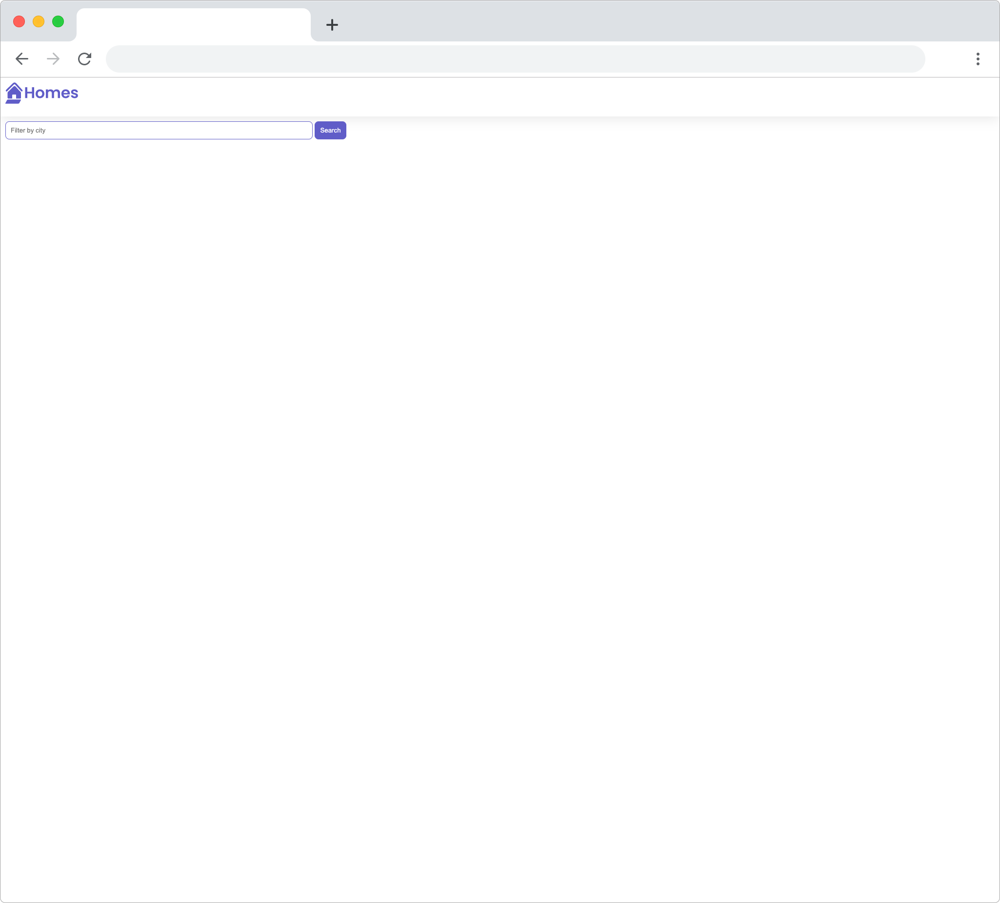

# Первое приложение Angular урок 2 - Создание компонента Home

Этот урок демонстрирует, как создать новый [компонент](component-overview.md) для вашего приложения Angular.

**Затраты времени:** ожидайте, что на выполнение этого урока вы потратите около 10 минут.

## Перед началом

Этот урок начинается с кода из предыдущего урока, поэтому вы можете:

-   Использовать код, который вы создали в Уроке 1, в своей интегрированной среде разработки (IDE).

-   Начните с примера кода из предыдущего урока. Выберите из Урока 1, где вы можете:

    -   Использовать [живой пример](https://angular.io/generated/live-examples/first-app-lesson-01/stackblitz.html) в StackBlitz, где интерфейс StackBlitz является вашей IDE.

    -   Использовать [download пример](https://angular.io/generated/zips/first-app-lesson-01/first-app-lesson-01.zip) и открыть его в вашей IDE.

Если вы не просмотрели введение, посетите [Введение в Angular tutorial](first-app.md), чтобы убедиться, что у вас есть все необходимое для завершения этого урока.

Если у вас возникнут трудности во время этого урока, вы можете просмотреть [готовый код](https://angular.io/generated/live-examples/first-app-lesson-02/stackblitz.html) для этого урока.

## После завершения

-   В вашем приложении появился новый компонент: `HomeComponent`.

## Концептуальный обзор компонентов Angular

Приложения Angular строятся на основе компонентов, которые являются строительными блоками Angular. Компоненты содержат код, HTML-макет и информацию о стилях CSS, которые обеспечивают функционирование и внешний вид элемента в приложении.

В Angular компоненты могут содержать другие компоненты. Функции и внешний вид приложения могут быть разделены и разбиты на компоненты.

В [Уроке 1](first-app-lesson-01.md) вы обновили `AppComponent`, функция которого - содержать все остальные компоненты. В этом уроке вы создадите компонент `HomeComponent` для отображения главной страницы приложения.

В последующих уроках вы создадите больше компонентов для обеспечения дополнительных возможностей приложения.

В Angular компоненты имеют метаданные, которые определяют их свойства. Когда вы создаете свой `HomeComponent`, вы используете эти свойства:

-   `selector`: для описания того, как Angular обращается к компоненту в шаблонах.
-   `standalone`: чтобы описать, требует ли компонент `ngModule`.
-   `imports`: для описания зависимостей компонента.
-   `template`: для описания HTML-разметки и макета компонента.
-   `styleUrls`: перечисление URL файлов CSS, которые использует компонент, в виде массива.

Компоненты имеют и другие [свойства](https://angular.io/api/core/Component), но эти используются `HomeComponent`.

## Шаги урока

Выполните эти шаги над кодом приложения в вашей IDE.

### Шаг 1 - Создание `HomeComponent`

В этом шаге вы создаете новый компонент для вашего приложения.

В панели **Terminal** вашей IDE:

1.  В каталоге проекта перейдите в каталог `first-app`.

2.  Выполните эту команду для создания нового `HomeComponent`.

    ```shell
    ng generate component home --standalone --inline-template --skip-tests
    ```

3.  Выполните эту команду, чтобы собрать и обслужить ваше приложение.

    ```shell
    ng serve
    ```

4.  Откройте браузер и перейдите по адресу `http://localhost:4200`, чтобы найти приложение.

5.  Убедитесь, что приложение создается без ошибок.

    Примечание: оно должно отображаться так же, как и в предыдущем уроке, потому что, хотя вы и добавили новый компонент, вы еще не включили его ни в один из шаблонов приложения.

6.  Оставьте `ng serve` запущенным, пока вы выполняете следующие шаги.

### Шаг 2 - Добавьте новый компонент в макет вашего приложения.

В этом шаге вы добавите новый компонент `HomeComponent` к корневому компоненту вашего приложения `AppComponent`, чтобы он отображался в макете вашего приложения.

В панели **Редактирование** вашей IDE:

1.  Откройте `app.component.ts` в редакторе.
2.  В `app.component.ts` импортируйте `HomeComponent`, добавив эту строку в импорт на уровне файла.

    ```ts
    import { HomeComponent } from './home/home.component';
    ```

3.  В `app.component.ts`, в `@Component`, обновите свойство массива `imports` и добавьте `HomeComponent`.

    ```ts
    imports: [
    	HomeComponent,
    ],
    ```

4.  В `app.component.ts`, в `@Component`, обновите свойство `template`, чтобы включить следующий HTML код.

    ```ts
    template: `
    <main>
    	<header class="brand-name">
    	
    	</header>
    	<section class="content">
    	<app-home></app-home>
    	</section>
    </main>
    `,
    ```

5.  Сохраните изменения в `app.component.ts`.

6.  Если `ng serve` запущен, приложение должно обновиться.

    Если `ng serve` не запущен, запустите его снова.

    _Hello world_ в вашем приложении должно измениться на _home works!_ из `HomeComponent`.

7.  Проверьте запущенное приложение в браузере и убедитесь, что оно было обновлено.


### Шаг 3 - Добавление функций в `HomeComponent`

В этом шаге вы добавите функции в `HomeComponent`.

В предыдущем шаге вы добавили стандартный `HomeComponent` в шаблон вашего приложения, чтобы его HTML по умолчанию появился в приложении. В этом шаге вы добавите фильтр поиска и кнопку, которая будет использоваться в одном из последующих уроков.

На данный момент это все, что есть у `HomeComponent`.

Обратите внимание, что этот шаг просто добавляет элементы поиска в макет без какой-либо функции.

В панели **Edit** вашей IDE:

1.  В директории `first-app` откройте в редакторе файл `home.component.ts`.

2.  В `home.component.ts`, в `@Component`, обновите свойство `template` этим кодом.

    ```ts
    template: `
    <section>
    	<form>
    	<input type="text" placeholder="Filter by city">
    	<button class="primary" type="button">Search</button>
    	</form>
    </section>
    `,
    ```

3.  Далее откройте `home.component.css` в редакторе и обновите содержимое с помощью этих стилей.

    ```css
    .results {
        display: grid;
        column-gap: 14px;
        row-gap: 14px;
        grid-template-columns: repeat(
            auto-fill,
            minmax(400px, 400px)
        );
        margin-top: 50px;
        justify-content: space-around;
    }

    input[type='text'] {
        border: solid 1px var(--primary-color);
        padding: 10px;
        border-radius: 8px;
        margin-right: 4px;
        display: inline-block;
        width: 30%;
    }

    button {
        padding: 10px;
        border: solid 1px var(--primary-color);
        background: var(--primary-color);
        color: white;
        border-radius: 8px;
    }

    @media (min-width: 500px) and (max-width: 768px) {
        .results {
            grid-template-columns: repeat(2, 1fr);
        }
        input[type='text'] {
            width: 70%;
        }
    }

    @media (max-width: 499px) {
        .results {
            grid-template-columns: 1fr;
        }
    }
    ```

4.  Убедитесь, что приложение собирается без ошибок.

    Вы должны найти поле запроса фильтра и кнопку в вашем приложении, и они должны быть оформлены.

    Исправьте все ошибки, прежде чем переходить к следующему шагу.



## Обзор урока

В этом уроке вы создали новый компонент для своего приложения и наделили его элементом управления редактирования фильтра и кнопкой.

Если у вас возникли трудности с этим уроком, вы можете просмотреть [готовый код](https://angular.io/generated/live-examples/first-app-lesson-02/stackblitz.html).

## Следующие шаги

-   [Первое Angular приложение урок 3 - Создание компонента HousingLocation приложения](first-app-lesson-03.md)

## Дополнительная информация

Для получения дополнительной информации по темам, рассмотренным в этом уроке, посетите:

-   [`ng generate component`](https://angular.io/cli/generate#component-command)
-   [Обзор компонентов Angular](component-overview.md)

## Ссылки

-   [Lesson 2: Create Home component](https://angular.io/tutorial/first-app/first-app-lesson-02)
