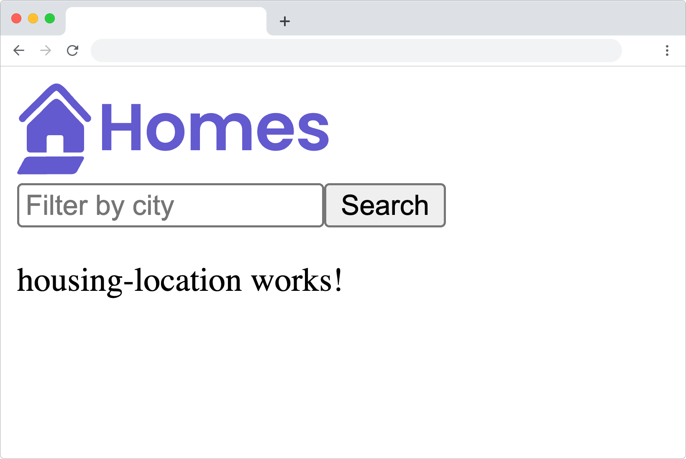

# Урок 3: Создание компонента HousingLocation

Этот урок демонстрирует, как добавить компонент `HousingLocation` в ваше приложение Angular.

**Затраты времени:** ожидайте, что на выполнение этого урока вы потратите около 10 минут.

## Перед началом

Этот урок начинается с кода из предыдущего урока, поэтому вы можете:

-   Использовать код, который вы создали в Уроке 2, в своей интегрированной среде разработки (IDE).

-   Начните с примера кода из предыдущего урока. Выберите <live-example name="first-app-lesson-02"></live-example> из Урока 1, где вы можете:

    -   Использовать [живой пример](https://angular.io/generated/live-examples/first-app-lesson-02/stackblitz.html) в StackBlitz, где интерфейс StackBlitz является вашей IDE.

    -   Использовать [download пример](https://angular.io/generated/zips/first-app-lesson-02/first-app-lesson-02.zip) и открыть его в вашей IDE.

Если вы не просмотрели введение, посетите [Введение в Angular tutorial](first-app.md), чтобы убедиться, что у вас есть все необходимое для завершения этого урока.

Если у вас возникнут трудности во время этого урока, вы можете просмотреть [готовый код](https://angular.io/generated/live-examples/first-app-lesson-03/stackblitz.html) для этого урока.

## После завершения

-   В вашем приложении появился новый компонент: `HousingLocationComponent`, и оно отображает сообщение, подтверждающее, что компонент был добавлен в ваше приложение.

## Шаги урока

Выполните эти шаги над кодом приложения в вашей IDE.

### Шаг 1 - Создание компонента `HousingLocationComponent`.

В этом шаге вы создаете новый компонент для вашего приложения.

В панели **Терминал** вашей IDE:

1.  Выполните эту команду, чтобы создать новый `HousingLocationComponent`.

    ```shell
    ng generate component housingLocation --standalone --inline-template --skip-tests
    ```

2.  Выполните эту команду, чтобы собрать и обслужить ваше приложение.

    ```shell
    ng serve
    ```

3.  Откройте браузер и перейдите по адресу `http://localhost:4200`, чтобы найти приложение.

4.  Убедитесь, что приложение создается без ошибок.

    Примечание: оно должно отображаться так же, как и в предыдущем уроке, потому что, хотя вы и добавили новый компонент, вы еще не включили его ни в один из шаблонов приложения.

5.  Оставьте `ng serve` запущенным, пока вы выполняете следующие шаги.

### Шаг 2 - Добавьте новый компонент в макет вашего приложения.

В этом шаге вы добавите новый компонент `HousingLocationComponent` к `HomeComponent` вашего приложения, чтобы он отображался в макете вашего приложения.

В панели **Редактирование** вашей IDE:

1.  Откройте `home.component.ts` в редакторе.

2.  В `home.component.ts` импортируйте `HousingLocationComponent`, добавив эту строку в импорт на уровне файла.

    ```ts
    import { HousingLocationComponent } from '../housing-location/housing-location.component';
    ```

3.  Далее обновите свойство `imports` метаданных `@Component`, добавив `HousingLocationComponent` в массив.

    ```ts
    imports: [
    	CommonModule,
    	HousingLocationComponent
    ],
    ```

4.  Теперь компонент готов к использованию в шаблоне для `HomeComponent`. Обновите свойство `template` метаданных `@Component`, чтобы включить ссылку на тег `<app-housing-location>`.

    ```ts
    template: `
    <section>
    	<form>
    	<input type="text" placeholder="Filter by city">
    	<button class="primary" type="button">Search</button>
    	</form>
    </section>
    <section class="results">
    	<app-housing-location></app-housing-location>
    </section>
    `,
    ```

### Шаг 3 - Добавление стилей для компонента

В этом шаге вы скопируете предварительно написанные стили для компонента `HousingLocationComponent` в ваше приложение, чтобы оно отображалось правильно.

1.  Откройте файл `src/app/housing-location/housing-location.css` и вставьте в него стили, приведенные ниже:

    ```css
    .listing {
        background: var(--accent-color);
        border-radius: 30px;
        padding-bottom: 30px;
    }
    .listing-heading {
        color: var(--primary-color);
        padding: 10px 20px 0 20px;
    }
    .listing-photo {
        height: 250px;
        width: 100%;
        object-fit: cover;
        border-radius: 30px 30px 0 0;
    }
    .listing-location {
        padding: 10px 20px 20px 20px;
    }
    .listing-location::before {
        content: url('/assets/location-pin.svg') / '';
    }

    section.listing a {
        padding-left: 20px;
        text-decoration: none;
        color: var(--primary-color);
    }
    section.listing a::after {
        content: '\203A';
        margin-left: 5px;
    }
    ```

2.  Сохраните код, вернитесь в браузер и убедитесь, что приложение собирается без ошибок. На экране должно появиться сообщение "housing-location works!". Исправьте все ошибки, прежде чем переходить к следующему шагу.

    

## Обзор урока

В этом уроке вы создали новый компонент для своего приложения и добавили его в макет приложения.

Если у вас возникли трудности с этим уроком, вы можете просмотреть [готовый код](https://angular.io/generated/live-examples/first-app-lesson-03/stackblitz.html) для него.

## Следующие шаги

-   [Первое приложение Angular урок 4 - Добавление в приложение интерфейса определения местоположения жилья](first-app-lesson-04.md)

## Ссылки

-   [Lesson 3: Create the application’s HousingLocation component](https://angular.io/tutorial/first-app/first-app-lesson-03)
