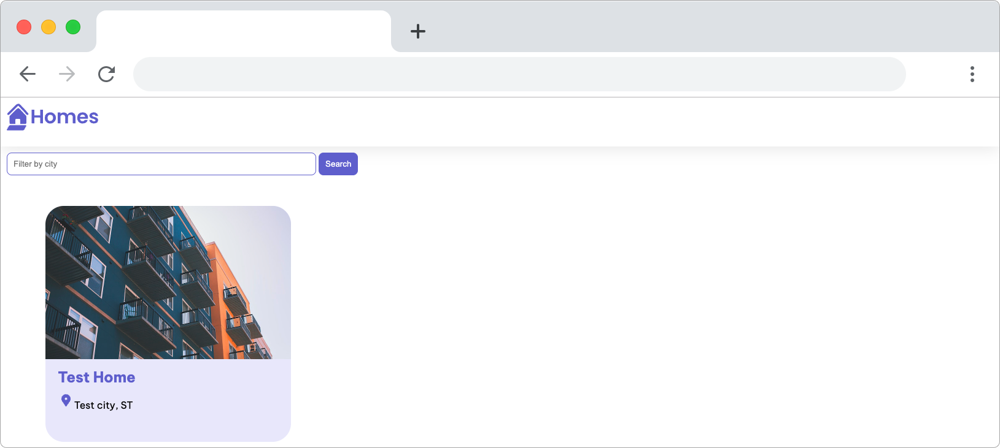

# Урок 7 - Добавление интерполяции в шаблон компонента

Этот обучающий урок демонстрирует, как добавить интерполяцию в шаблоны Angular для отображения динамических данных в шаблоне.

**Затраты времени:** ожидайте, что на выполнение этого урока вы потратите около 10 минут.

## Перед началом

Этот урок начинается с кода из предыдущего урока, поэтому вы можете:

-   Использовать код, созданный в Уроке 6, в своей интегрированной среде разработки (IDE).

-   Начните с примера кода из предыдущего урока. Выберите код из Урока 6, где вы можете:

    -   Использовать [живой пример](https://angular.io/generated/live-examples/first-app-lesson-06/stackblitz.html) в StackBlitz, где интерфейс StackBlitz является вашей IDE.

    -   Использовать [download пример](https://angular.io/generated/zips/first-app-lesson-06/first-app-lesson-06.zip) и открыть его в вашей IDE.

Если вы не просмотрели введение, посетите [Введение в Angular tutorial](first-app.md), чтобы убедиться, что у вас есть все необходимое для завершения этого урока.

Если у вас возникнут трудности во время этого урока, вы можете просмотреть [готовый код](https://angular.io/generated/live-examples/first-app-lesson-07/stackblitz.html) для этого урока.

## После завершения

-   Ваше приложение будет отображать интерполированные значения в шаблоне `HousingLocationComponent`.
-   Ваше приложение будет отображать данные о местоположении жилья в браузере.

## Концептуальный предварительный просмотр интерполяции

В уроке 6 вы добавили привязку данных к шаблону, чтобы разработчики могли передавать данные из `HomeComponent` в `HousingLocationComponent`. Следующим шагом будет отображение значений (свойств и `Input` значений) в шаблоне. Для выполнения этой задачи необходимо использовать интерполяцию.

Синтаксис [Angular template syntax](template-syntax.md) поддерживает смешивание статического содержимого шаблона с динамическими значениями и выражениями.

Используя `{{ expression }}` в шаблонах Angular, вы можете выводить значения из свойств, `Inputs` и действительных выражений JavaScript.

Для более подробного объяснения, пожалуйста, обратитесь к руководству [Отображение значений с интерполяцией](interpolation.md).

## Шаги урока

Выполните эти шаги в коде приложения в вашей IDE.

### Шаг 1 - Обновление шаблона `HousingLocationComponent` для включения интерполированных значений

Этот шаг добавляет новую HTML структуру и интерполированные значения в шаблон `HousingLocationComponent`.

В редакторе кода:

1.  Перейдите в `src/app/housing-location/housing-location.component.ts`.

2.  В свойстве template декоратора `@Component` замените существующую HTML-разметку следующим кодом:

    ```ts
    template: `
    <section class="listing">
    	
    	<h2 class="listing-heading">{{ housingLocation.name }}</h2>
    	<p class="listing-location">{{ housingLocation.city}}, {{housingLocation.state }}</p>
    </section>
    `,
    ```

    В этом обновленном коде шаблона вы использовали связывание свойств для привязки `housingLocation.photo` к атрибуту `src`. Атрибут `alt` использует интерполяцию для придания большего контекста alt-тексту изображения.

    Вы используете интерполяцию для включения значений имени, города и штата в свойство `housingLocation`.

### Шаг 2 - Подтвердите отображение изменений в браузере

1.  Сохраните все изменения.

2.  Откройте браузер, чтобы подтвердить, что приложение отображает данные образца фотографии, города и штата.

    

## Обзор урока

В этом уроке вы добавили новую HTML-структуру и использовали синтаксис шаблонов Angular для рендеринга значений в шаблоне `HousingLocation`. Теперь у вас есть два важных навыка:

-   передача данных компонентам
-   интерполяция значений в шаблон

С помощью этих навыков ваше приложение теперь может обмениваться данными и отображать динамические значения в браузере. Отличная работа.

Если у вас возникли трудности с этим уроком, вы можете просмотреть [готовый код](https://angular.io/generated/live-examples/first-app-lesson-07/stackblitz.html) для него.

## Следующие шаги

-   [Урок 8 - Использование `*ngFor` для вывода списка объектов в компоненте](first-app-lesson-08.md)

## Для получения дополнительной информации о темах, рассмотренных в этом уроке, посетите:

-   [Отображение значений с интерполяцией](interpolation.md)
-   [Синтаксис шаблонов](template-syntax.md)

## Ссылки

-   [Lesson 7 - Add an interpolation to a component’s template](https://angular.io/tutorial/first-app/first-app-lesson-07)
