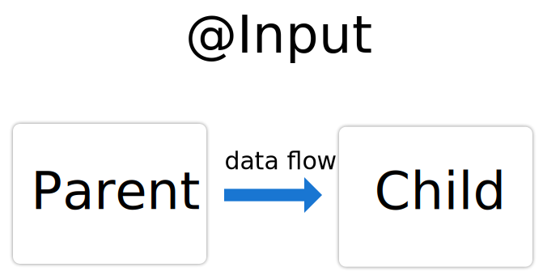
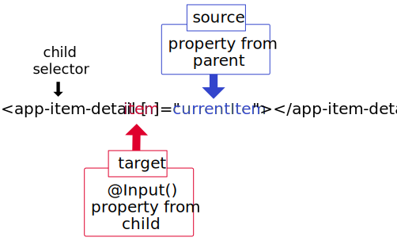
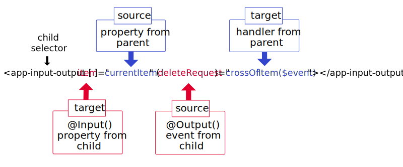

# Совместное использование данных между дочерними и родительскими директивами и компонентами

Распространенным паттерном в Angular является обмен данными между родительским компонентом и одним или несколькими дочерними компонентами. Реализуйте этот паттерн с помощью декораторов `@Input()` и `@Output()`.

!!!info ""

    Смотрите [код](https://angular.io/generated/live-examples/inputs-outputs/stackblitz.html) для рабочего примера, содержащего фрагменты кода, приведенные в этом руководстве.

Рассмотрим следующую иерархию:

```html
<parent-component>
    <child-component></child-component>
</parent-component>
```

Компонент `<родительский компонент>` служит контекстом для компонента `<детский компонент>`.

`@Input()` и `@Output()` дают дочернему компоненту возможность общаться со своим родительским компонентом. `@Input()` позволяет родительскому компоненту обновлять данные в дочернем компоненте.

И наоборот, `@Output()` позволяет дочернему компоненту отправлять данные в родительский компонент.

## Отправка данных в дочерний компонент

Декоратор `@Input()` в дочернем компоненте или директиве означает, что свойство может получать свое значение от родительского компонента.



Чтобы использовать `@Input()`, вы должны настроить родительский и дочерний компоненты.

### Настройка дочернего компонента

Чтобы использовать декоратор `@Input()` в классе дочернего компонента, сначала импортируйте `Input`, а затем украсьте свойство с помощью `@Input()`, как показано в следующем примере.

```ts title="src/app/item-detail/item-detail.component.ts"
import { Component, Input } from '@angular/core'; // First, import Input
export class ItemDetailComponent {
    @Input() item = ''; // decorate the property with @Input()
}
```

В данном случае `@Input()` украшает свойство `item`, которое имеет тип `string`, однако свойства `@Input()` могут иметь любой тип, такой как `number`, `string`, `boolean` или `object`. Значение для `item` берется из родительского компонента.

Далее, в шаблоне дочернего компонента добавьте следующее:

```html title="src/app/item-detail/item-detail.component.html"
<p>Today's item: {{item}}</p>
```

### Настройка родительского компонента

Следующим шагом будет привязка свойства в шаблоне родительского компонента. В данном примере шаблоном родительского компонента является `app.component.html`.

1.  Используйте селектор дочернего компонента, здесь `<app-item-detail>`, как директиву в шаблоне родительского компонента.

2.  Используйте [property binding](property-binding.md) для привязки свойства `item` в дочернем компоненте к свойству `currentItem` родительского компонента.

    ```html title="src/app/app.component.html"
    <app-item-detail [item]="currentItem"></app-item-detail>
    ```

3.  В классе родительского компонента определите значение для `currentItem`:

    ```ts title="src/app/app.component.ts"
    export class AppComponent {
        currentItem = 'Television';
    }
    ```

С помощью `@Input()`, Angular передает значение `currentItem` дочернему элементу, так что `item` отображается как `Television`.

На следующей диаграмме показана эта структура:



Цель в квадратных скобках, `[]`, — это свойство, которое вы украшаете с помощью `@Input()` в дочернем компоненте. Источник привязки, часть справа от знака равенства, — это данные, которые родительский компонент передает вложенному компоненту.

### Наблюдение за изменениями `@Input()`.

Чтобы следить за изменениями свойства `@Input()`, используйте `OnChanges`, один из [хуков жизненного цикла Angular](lifecycle-hooks.md). Более подробную информацию и примеры смотрите в разделе [`OnChanges`](lifecycle-hooks.md#onchanges) руководства [Lifecycle Hooks](lifecycle-hooks.md).

## Отправка данных в родительский компонент

Декоратор `@Output()` в дочернем компоненте или директиве позволяет передавать данные от дочернего компонента к родительскому.


`@Output()` помечает свойство в дочернем компоненте как дверной проем, через который данные могут перемещаться от дочернего компонента к родительскому.

Дочерний компонент использует свойство `@Output()`, чтобы вызвать событие, уведомляющее родителя об изменении. Чтобы поднять событие, `@Output()` должен иметь тип `EventEmitter`, который является классом в `@angular/core`, который вы используете для создания пользовательских событий.

В следующем примере показано, как настроить `@Output()` в дочернем компоненте, который передает данные из HTML `<input>` в массив в родительском компоненте.

Чтобы использовать `@Output()`, необходимо настроить родительский и дочерний компоненты.

### Настройка дочернего компонента

В следующем примере имеется `<input>`, где пользователь может ввести значение и нажать `<button>`, что вызывает событие. Затем `EventEmitter` передает данные родительскому компоненту.

1.  Импортируйте `Output` и `EventEmitter` в класс дочернего компонента:

    ```js
    import { Output, EventEmitter } from '@angular/core';
    ```

2.  В классе компонента украсьте свойство `@Output()`.

    Следующий пример `newItemEvent` `@Output()` имеет тип `EventEmitter`, что означает, что это событие.

    ```ts title="src/app/item-output/item-output.component.ts"
    @Output() newItemEvent = new EventEmitter<string>();
    ```

    Различные части предыдущей декларации выглядят следующим образом:

    | Части декларации             | Детали                                                                                                           |
    | :--------------------------- | :--------------------------------------------------------------------------------------------------------------- |
    | `@Output()`                  | Функция-декоратор, помечающая свойство как способ передачи данных от дочернего компонента к родительскому.       |
    | `newItemEvent`               | Имя `@Output()`.                                                                                                 |
    | `EventEmitter<string>`       | Тип `@Output()`.                                                                                                 |
    | `new EventEmitter<string>()` | Сообщает Angular о создании нового эмиттера события и о том, что данные, которые он эмитирует, имеют тип string. |

    Для получения дополнительной информации о `EventEmitter` смотрите документацию [EventEmitter API documentation](https://angular.io/api/core/EventEmitter).

3.  Create an `addNewItem()` method in the same component class:

    ```ts title="src/app/item-output/item-output.component.ts"
    export class ItemOutputComponent {
        @Output() newItemEvent = new EventEmitter<string>();

        addNewItem(value: string) {
            this.newItemEvent.emit(value);
        }
    }
    ```

    Функция `addNewItem()` использует `@Output()`, `newItemEvent`, чтобы вызвать событие со значением, которое пользователь вводит в `<input>`.

### Настройка шаблона ребенка

В дочернем шаблоне есть два элемента управления. Первый — это HTML `input` с переменной [template reference variable](template-reference-variables.md), `#newItem`, где пользователь вводит имя элемента.

Свойство `value` переменной `#newItem` хранит то, что пользователь вводит в `input`.

```html title="src/app/item-output/item-output.component.html"
<label for="item-input">Add an item:</label>
<input type="text" id="item-input" #newItem />
<button type="button" (click)="addNewItem(newItem.value)">
    Add to parent's list
</button>
```

Второй элемент — это `<кнопка>` с привязкой события `click` [event-binding](event-binding.md).

Событие `(click)` привязано к методу `addNewItem()` в классе дочернего компонента. Метод `addNewItem()` принимает в качестве аргумента значение свойства `#newItem.value`.

### Настройка родительского компонента

В этом примере `AppComponent` содержит список `элементов` в массиве и метод для добавления новых элементов в массив.

```ts title="src/app/app.component.ts"
export class AppComponent {
    items = ['item1', 'item2', 'item3', 'item4'];

    addItem(newItem: string) {
        this.items.push(newItem);
    }
}
```

Метод `addItem()` принимает аргумент в виде строки и затем добавляет эту строку в массив `items`.

### Настройка шаблона родителя

1.  В шаблоне родителя привяжите метод родителя к событию ребенка.

2.  Поместите дочерний селектор, здесь `<app-item-output>`, в шаблон родительского компонента, `app.component.html`.

    ```html title="src/app/app.component.html"
    <app-item-output
        (newItemEvent)="addItem($event)"
    ></app-item-output>
    ```

    Привязка события, `(newItemEvent)='addItem($event)'`, связывает событие в дочернем шаблоне, `newItemEvent`, с методом в родительском шаблоне, `addItem()`.

    Событие `$event` содержит данные, которые пользователь вводит в `<input>` в пользовательском интерфейсе дочернего шаблона.

    Чтобы увидеть, как работает `@Output()`, добавьте следующее в родительский шаблон:

    ```html
    <ul>
        <li *ngFor="let item of items">{{item}}</li>
    </ul>
    ```

    Метод `*ngFor` выполняет итерацию по элементам в массиве `items`.

    Когда вы вводите значение в дочерний `<input>` и нажимаете кнопку, дочерний элемент испускает событие, а родительский метод `addItem()` помещает значение в массив `items` и новый элемент отображается в списке.

## Использование `@Input()` и `@Output()` вместе

Используйте `@Input()` и `@Output()` на одном и том же дочернем компоненте следующим образом:

```html title="src/app/app.component.html"
<app-input-output
    [item]="currentItem"
    (deleteRequest)="crossOffItem($event)"
>
</app-input-output>
```

Цель, `item`, которая является свойством `@Input()` в классе дочернего компонента, получает свое значение из свойства родителя, `currentItem`. Когда вы нажимаете кнопку Delete, дочерний компонент вызывает событие `deleteRequest`, которое является аргументом для родительского метода `crossOffItem()`.

На следующей схеме показаны различные части `@Input()` и `@Output()` на дочернем компоненте `<app-input-output>`.



Дочерний селектор — `<app-input-output>`, при этом `item` и `deleteRequest` являются свойствами `@Input()` и `@Output()` в классе дочернего компонента. Свойство `currentItem` и метод `crossOffItem()` находятся в классе родительского компонента.

Чтобы объединить привязки свойств и событий с помощью синтаксиса "банана в коробке", `[()]`, смотрите [Двусторонняя привязка](two-way-binding.md).

:date: 28.02.2022
