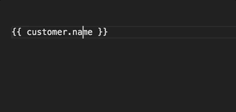

# Языковой сервис Angular

:date: 28.02.2022

Angular Language Service предоставляет редакторам кода способ получения завершений, ошибок, подсказок и навигации внутри шаблонов Angular. Он работает с внешними шаблонами в отдельных HTML-файлах, а также со встроенными шаблонами.

## Настройка параметров компилятора для Angular Language Service

Чтобы включить последние возможности Language Service, установите опцию `strictTemplates` в `tsconfig.json`, установив `strictTemplates` в `true,` как показано в следующем примере:

```json
"angularCompilerOptions": {
  "strictTemplates": true
}
```

Для получения дополнительной информации см. руководство [Angular compiler options](angular-compiler-options.md).

## Особенности

Ваш редактор автоматически определяет, что вы открываете файл Angular. Затем он использует службу Angular Language Service для чтения вашего файла `tsconfig.json`, поиска всех шаблонов, которые есть в вашем приложении, а затем предоставляет языковые службы для всех открытых вами шаблонов.

Языковые сервисы включают в себя:

-   Списки дополнений
-   Диагностические сообщения AOT
-   Быстрая информация
-   Перейти к определению

### Автодополнение

Автозавершение может ускорить время разработки, предоставляя вам контекстные возможности и подсказки по мере набора текста. В этом примере показано автозавершение в интерполяции.

По мере набора текста вы можете нажать клавишу tab для завершения.


Существуют также дополнения внутри элементов. Любые элементы, которые вы имеете в качестве селектора компонентов, будут отображаться в списке завершений.

### Проверка ошибок

Языковая служба Angular может предупредить вас об ошибках в вашем коде. В данном примере Angular не знает, что такое `orders` и откуда оно берется.


### Быстрая информация и навигация

Функция быстрой информации позволяет навести курсор, чтобы увидеть, откуда взяты компоненты, директивы и модули. Затем вы можете нажать "Перейти к определению" или клавишу F12, чтобы перейти непосредственно к определению.



## Angular Language Service в вашем редакторе

Angular Language Service в настоящее время доступен как расширение для [Visual Studio Code](https://code.visualstudio.com), [WebStorm](https://www.jetbrains.com/webstorm), [Sublime Text](https://www.sublimetext.com) и [Eclipse IDE](https://www.eclipse.org/eclipseide).

### Visual Studio Code

В [Visual Studio Code](https://code.visualstudio.com) установите расширение из [Extensions: Marketplace](https://marketplace.visualstudio.com/items?itemName=Angular.ng-template). Откройте Marketplace из редактора, используя иконку Extensions в левой панели меню, или используйте VS Quick Open (⌘+P на Mac, CTRL+P на Windows) и введите "? ext".

В маркетплейсе найдите расширение Angular Language Service и нажмите кнопку **Install**.

Интеграция Visual Studio Code с языковой службой Angular поддерживается и распространяется командой Angular.

### Visual Studio

В [Visual Studio](https://visualstudio.microsoft.com) установите расширение из [Extensions: Marketplace](https://marketplace.visualstudio.com/items?itemName=TypeScriptTeam.AngularLanguageService). Откройте Marketplace из редактора, выбрав Extensions на верхней панели меню, а затем Manage Extensions.

В marketplace найдите расширение Angular Language Service и нажмите кнопку **Install**.

Интеграция Visual Studio с языковой службой Angular поддерживается и распространяется компанией Microsoft при содействии команды Angular. Ознакомьтесь с проектом [здесь](https://github.com/microsoft/vs-ng-language-service).

### WebStorm

В [WebStorm](https://www.jetbrains.com/webstorm) включите плагин [Angular и AngularJS](https://plugins.jetbrains.com/plugin/6971-angular-and-angularjs).

Начиная с WebStorm 2019.1, `@angular/language-service` больше не требуется и должен быть удален из вашего `package.json`.

### Sublime Text

В [Sublime Text](https://www.sublimetext.com) языковая служба поддерживает только встроенные шаблоны при установке в качестве плагина. Для завершений в HTML-файлах вам потребуется пользовательский плагин Sublime (или модификации текущего плагина).

Чтобы использовать Language Service для встроенных шаблонов, необходимо сначала добавить расширение, разрешающее TypeScript, а затем установить плагин Angular Language Service. Начиная с TypeScript 2.3, TypeScript имеет модель подключаемого модуля, которую может использовать языковая служба.

1.  Установите последнюю версию TypeScript в локальный каталог `node_modules`:

    ```shell
    npm install --save-dev typescript
    ```

2.  Установите пакет Angular Language Service в том же месте:

    ```shell
    npm install --save-dev @angular/language-service
    ```

3.  После установки пакета добавьте следующее в раздел `"compilerOptions"` вашего проекта `tsconfig.json`.

    ```json
    "plugins": [
    	{"name": "@angular/language-service"}
    ]
    ```

4.  В пользовательских настройках вашего редактора \(`Cmd+,` или `Ctrl+,`\), добавьте следующее:

    ```json
    "typescript-tsdk": "<path to your folder>/node_modules/typescript/lib"
    ```

Это позволяет Angular Language Service предоставлять диагностику и дополнения в файлах `.ts`.

### Eclipse IDE

Либо непосредственно установите пакет "Eclipse IDE for Web and JavaScript developers", который поставляется с включенным Angular Language Server, либо из других пакетов Eclipse IDE, используйте Help &gt; Eclipse Marketplace, чтобы найти и установить [Eclipse Wild Web Developer](https://marketplace.eclipse.org/content/wild-web-developer-html-css-javascript-typescript-nodejs-angular-json-yaml-kubernetes-xml).

## Как работает языковая служба

Когда вы используете редактор с языковой службой, редактор запускает отдельный процесс языковой службы и взаимодействует с ним через [RPC](https://ru.wikipedia.org/wiki/%D0%A3%D0%B4%D0%B0%D0%BB%D1%91%D0%BD%D0%BD%D1%8B%D0%B9_%D0%B2%D1%8B%D0%B7%D0%BE%D0%B2_%D0%BF%D1%80%D0%BE%D1%86%D0%B5%D0%B4%D1%83%D1%80), используя [Language Server Protocol](https://microsoft.github.io/language-server-protocol). Когда вы набираете текст в редакторе, редактор отправляет информацию в процесс службы языка для отслеживания состояния вашего проекта.

Когда вы вызываете список завершения в шаблоне, редактор сначала разбирает шаблон в HTML [абстрактное синтаксическое дерево (AST)](https://ru.wikipedia.org/wiki/%D0%90%D0%B1%D1%81%D1%82%D1%80%D0%B0%D0%BA%D1%82%D0%BD%D0%BE%D0%B5_%D1%81%D0%B8%D0%BD%D1%82%D0%B0%D0%BA%D1%81%D0%B8%D1%87%D0%B5%D1%81%D0%BA%D0%BE%D0%B5_%D0%B4%D0%B5%D1%80%D0%B5%D0%B2%D0%BE). Компилятор Angular интерпретирует это дерево, чтобы определить контекст: частью какого модуля является шаблон, текущую область видимости, селектор компонента и место, где находится ваш курсор в AST шаблона.

Затем он может определить символы, которые потенциально могут находиться в этой позиции.

Это немного сложнее, если вы находитесь в интерполяции. Если у вас есть интерполяция `{{data.---}}` внутри `div` и вам нужен список завершения после `data.---`, компилятор не может использовать HTML AST для поиска ответа.

HTML AST может только сообщить компилятору, что есть текст с символами "`{{data.---}}`".

Тогда парсер шаблонов создает выражение AST, которое находится внутри AST шаблона.

Затем языковая служба Angular рассматривает `data.---` в своем контексте, спрашивает языковую службу TypeScript, какими членами `data` являются, и возвращает список возможных вариантов.

## Дополнительная информация

-   Более подробную информацию о реализации см. в [Angular Language Service API](https://github.com/angular/angular/blob/main/packages/language-service/src/types.ts).
-   Более подробную информацию о соображениях и замыслах разработчиков см. в [проектной документации здесь](https://github.com/angular/vscode-ng-language-service/wiki/Design).

-   См. также [презентацию Чака Язджевски](https://www.youtube.com/watch?v=ez3R0Gi4z5A&t=368s) о языковой службе Angular Language Service с конференции [ng-conf](https://www.ng-conf.org) 2017 года.

<!-- links -->

<!-- external links -->

<!-- end links -->

## Ссылки

-   [Angular Language Service](https://angular.io/guide/language-service)
