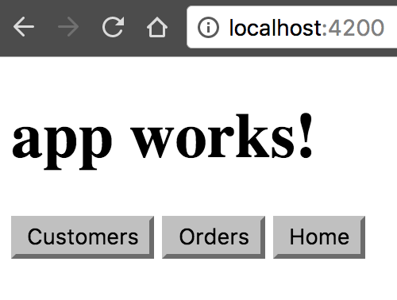
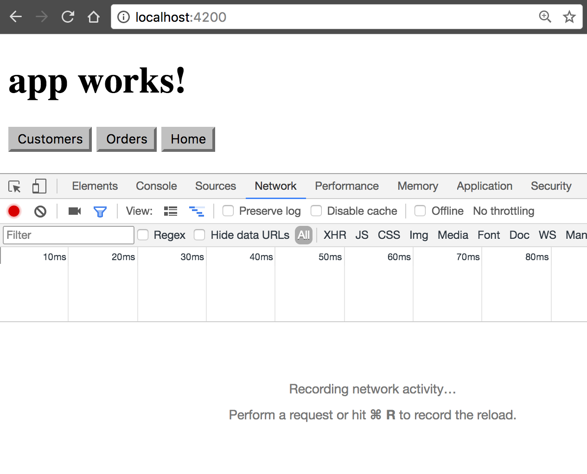

# Ленивая загрузка функциональных модулей

:date: 7.05.2022

По умолчанию NgModules загружаются с нетерпением. Это означает, что как только приложение загружается, загружаются и все модули NgModules, независимо от того, нужны они сразу или нет. Для больших приложений с большим количеством маршрутов рассмотрите вариант ленивой загрузки &mdash; шаблон проектирования, который загружает NgModules по мере необходимости.

Ленивая загрузка помогает уменьшить размер начальных пакетов, что, в свою очередь, сокращает время загрузки.

!!!note ""

    Окончательный пример приложения с двумя лениво загружаемыми модулями, который описан на этой странице, смотрите в [коде](https://angular.io/generated/live-examples/lazy-loading-ngmodules/stackblitz.html).

## Основы ленивой загрузки {: #lazy-loading}

В этом разделе представлена основная процедура настройки маршрута с ленивой загрузкой. Пошаговый пример смотрите в разделе [пошаговая настройка](#step-by-step) на этой странице.

Для ленивой загрузки модулей Angular используйте `loadChildren` (вместо `component`) в конфигурации `маршрутов` вашего `AppRoutingModule` следующим образом.

```ts
const routes: Routes = [
    {
        path: 'items',
        loadChildren: () =>
            import('./items/items.module').then(
                (m) => m.ItemsModule
            ),
    },
];
```

В модуле маршрутизации модуля lazy-loaded добавьте маршрут для компонента.

```ts
const routes: Routes = [
    {
        path: '',
        component: ItemsComponent,
    },
];
```

Также не забудьте удалить `ItemsModule` из `AppModule`. Для получения пошаговых инструкций по ленивой загрузке модулей, продолжите следующие разделы этой страницы.

## Пошаговая настройка {: #step-by-step}

Установка функционального модуля с ленивой загрузкой требует двух основных шагов:

1.  Создайте функциональный модуль с помощью Angular CLI, используя флаг `--route`.

2.  Настройте маршруты.

### Настройка приложения

Если у вас еще нет приложения, выполните следующие шаги, чтобы создать его с помощью Angular CLI. Если у вас уже есть приложение, перейдите к разделу [Настройка маршрутов](#config-routes).

Введите следующую команду, где `customer-app` — имя вашего приложения:

```shell
ng new customer-app --routing
```

Это создает приложение под названием `customer-app`, а флаг `--routing` создает файл `app-routing.module.ts`. Это один из файлов, необходимых для настройки ленивой загрузки для вашего функционального модуля. Перейдите в проект, выполнив команду `cd customer-app`.

!!!note ""

    Опция `--routing` требует Angular CLI версии 8.1 или выше. Смотрите [Keeping Up to Date](updating.md).

### Создание функционального модуля с маршрутизацией

Далее вам понадобится функциональный модуль с компонентом для маршрутизации. Чтобы создать такой модуль, введите в командной строке следующую команду, где `customers` — имя функционального модуля.

Путь для загрузки функциональных модулей `customers` также `customers`, поскольку он указан с опцией `--route`:

```shell
ng generate module customers --route customers --module app.module
```

Это создаст директорию `customers`, содержащую новый функциональный модуль `CustomersModule`, определяемый в файле `customers.module.ts`, и модуль маршрутизации `CustomersRoutingModule`, определяемый в файле `customers-routing.module.ts`. Команда автоматически объявляет `CustomersComponent` и импортирует `CustomersRoutingModule` внутри нового функционального модуля.

Поскольку новый модуль предназначен для ленивой загрузки, команда **не** добавляет ссылку на него в файл корневого модуля приложения, `app.module.ts`. Вместо этого она добавляет объявленный маршрут `customers` в массив `routes`, объявленный в модуле, предоставленном в качестве опции `--module`.

```ts
const routes: Routes = [
    {
        path: 'customers',
        loadChildren: () =>
            import('./customers/customers.module').then(
                (m) => m.CustomersModule
            ),
    },
];
```

Обратите внимание, что синтаксис ленивой загрузки использует `loadChildren`, за которым следует функция, использующая встроенный в браузер синтаксис `import('...')` для динамического импорта. Путь импорта — это относительный путь к модулю.

!!!note "Ленивая загрузка на основе строк"

    В версии 8 Angular строковый синтаксис для спецификации маршрута `loadChildren` [был устаревшим](https://angular.io/guide/deprecations#loadchildren-string-syntax) в пользу синтаксиса `import()`. Вы можете отказаться от использования строковой ленивой загрузки (`loadChildren: './path/to/module#Module'`), включив маршруты с ленивой загрузкой в ваш файл `tsconfig`, который включает файлы с ленивой загрузкой в компиляцию.

    По умолчанию Angular CLI генерирует проекты с более строгими включениями файлов, предназначенными для использования с синтаксисом `import()`.

### Добавьте еще один функциональный модуль

Используйте ту же команду для создания второго функционального модуля с ленивой загрузкой и маршрутизацией, а также его компонента-заглушки.

```shell
ng generate module orders --route orders --module app.module
```

Это создает новый каталог `orders`, содержащий `OrdersModule` и `OrdersRoutingModule`, а также новые исходные файлы `OrdersComponent`. Маршрут `orders`, указанный с помощью опции `--route`, добавляется в массив `routes` внутри файла `app-routing.module.ts`, используя синтаксис ленивой загрузки.

```ts
const routes: Routes = [
    {
        path: 'customers',
        loadChildren: () =>
            import('./customers/customers.module').then(
                (m) => m.CustomersModule
            ),
    },
    {
        path: 'orders',
        loadChildren: () =>
            import('./orders/orders.module').then(
                (m) => m.OrdersModule
            ),
    },
];
```

### Настройте пользовательский интерфейс

Хотя вы можете ввести URL в адресную строку, навигационный пользовательский интерфейс более прост для пользователя и более распространен. Замените стандартную разметку placeholder в `app.component.html` на пользовательскую навигацию, чтобы вы могли переходить к своим модулям в браузере:

```html
<h1>{{title}}</h1>

<button type="button" routerLink="/customers">
    Customers
</button>
<button type="button" routerLink="/orders">Orders</button>
<button type="button" routerLink="">Home</button>

<router-outlet></router-outlet>
```

Чтобы увидеть ваше приложение в браузере, введите следующую команду в окне инструмента командной строки:

```shell
ng serve
```

Затем перейдите на `localhost:4200`, где вы должны увидеть "customer-app" и три кнопки.



Эти кнопки работают, потому что Angular CLI автоматически добавил маршруты к модулям функций в массив `routes` в файле `app-routing.module.ts`.

### Импорт и конфигурация маршрутов {: #config-routes}

Angular CLI автоматически добавил каждый функциональный модуль в карту маршрутов на уровне приложения. Завершите это добавлением маршрута по умолчанию.

В файле `app-routing.module.ts` обновите массив `routes` следующим образом:

```ts
const routes: Routes = [
    {
        path: 'customers',
        loadChildren: () =>
            import('./customers/customers.module').then(
                (m) => m.CustomersModule
            ),
    },
    {
        path: 'orders',
        loadChildren: () =>
            import('./orders/orders.module').then(
                (m) => m.OrdersModule
            ),
    },
    {
        path: '',
        redirectTo: '',
        pathMatch: 'full',
    },
];
```

Первые два пути — это маршруты к `CustomersModule` и `OrdersModule`. Последняя запись определяет маршрут по умолчанию.

Пустой путь соответствует всему, что не соответствует предыдущему пути.

### Внутри функционального модуля

Далее посмотрите на файл `customers.module.ts`. Если вы используете Angular CLI и следуете шагам, описанным на этой странице, вам не нужно ничего здесь делать.

```ts
import { NgModule } from '@angular/core';
import { CommonModule } from '@angular/common';
import { CustomersRoutingModule } from './customers-routing.module';
import { CustomersComponent } from './customers.component';

@NgModule({
    imports: [CommonModule, CustomersRoutingModule],
    declarations: [CustomersComponent],
})
export class CustomersModule {}
```

Файл `customers.module.ts` импортирует файлы `customers-routing.module.ts` и `customers.component.ts`. `CustomersRoutingModule` указан в массиве `@NgModule` `imports`, что дает `CustomersModule` доступ к собственному модулю маршрутизации.

`CustomersComponent` находится в массиве `declarations`, что означает, что `CustomersComponent` принадлежит `CustomersModule`.

Затем `app-routing.module.ts` импортирует функциональный модуль `customers.module.ts`, используя динамический импорт JavaScript.

Файл определения маршрута для конкретной функции `customers-routing.module.ts` импортирует свой компонент функции, определенный в файле `customers.component.ts`, вместе с другими операторами импорта JavaScript. Затем он сопоставляет пустой путь с `CustomersComponent`.

```ts
import { NgModule } from '@angular/core';
import { Routes, RouterModule } from '@angular/router';

import { CustomersComponent } from './customers.component';

const routes: Routes = [
    {
        path: '',
        component: CustomersComponent,
    },
];

@NgModule({
    imports: [RouterModule.forChild(routes)],
    exports: [RouterModule],
})
export class CustomersRoutingModule {}
```

Здесь `path` установлен в пустую строку, потому что путь в `AppRoutingModule` уже установлен в `customers`, поэтому этот маршрут в `CustomersRoutingModule` уже находится в контексте `customers`. Каждый маршрут в этом модуле маршрутизации является дочерним маршрутом.

Модуль маршрутизации другого функционального модуля настроен аналогично.

```ts
import { OrdersComponent } from './orders.component';

const routes: Routes = [
    {
        path: '',
        component: OrdersComponent,
    },
];
```

### Проверить ленивую загрузку

Вы можете проверить, действительно ли модуль загружается в ленивом режиме, с помощью инструментов разработчика Chrome. В Chrome откройте инструменты разработчика, нажав ++cmd+option+i++ на Mac или ++ctrl+shift+j++ на PC, и перейдите на вкладку Network.



Нажмите на кнопку "Заказы" или "Клиенты". Если появится фрагмент, значит, все подключено правильно и функциональный модуль загружается в ленивом режиме.

Кусок должен появиться для Заказов и для Клиентов, но только один раз для каждого.


Чтобы увидеть его снова или проверить после внесения изменений, нажмите на круг с линией в верхней левой части вкладки Сеть:


Затем перезагрузите с помощью ++cmd+r++ или ++ctrl+r++, в зависимости от вашей платформы.

## `forRoot()` и `forChild()`

Вы могли заметить, что Angular CLI добавляет `RouterModule.forRoot(routes)` в массив `импортов` модуля `AppRoutingModule`. Это дает Angular знать, что `AppRoutingModule` является модулем маршрутизации, а `forRoot()` указывает, что это корневой модуль маршрутизации.

Он настраивает все маршруты, которые вы ему передаете, дает вам доступ к директивам маршрутизации и регистрирует службу `Router`.

Используйте `forRoot()` только один раз в приложении, внутри `AppRoutingModule`.

Angular CLI также добавляет функцию `RouterModule.forChild(routes)` к модулям маршрутизации. Таким образом, Angular знает, что список маршрутов отвечает только за предоставление дополнительных маршрутов и предназначен для функциональных модулей.

Вы можете использовать `forChild()` в нескольких модулях.

Метод `forRoot()` заботится о конфигурации _глобального_ инжектора для маршрутизатора. Метод `forChild()` не имеет конфигурации инжектора.

Он использует такие директивы, как `RouterOutlet` и `RouterLink`.

Дополнительную информацию см. в разделе [шаблон `forRoot()`](singleton-services.md#forRoot) руководства [Singleton Services](singleton-services.md).

## Предварительная загрузка {: #preloading}

Предварительная загрузка улучшает UX, загружая части вашего приложения в фоновом режиме. Вы можете предварительно загружать модули, отдельные компоненты или данные компонента.

### Предварительная загрузка модулей и отдельных компонентов

Предварительная загрузка модулей и отдельных компонентов улучшает UX, загружая части вашего приложения в фоновом режиме. Благодаря этому пользователям не нужно ждать загрузки элементов при активации маршрута.

Чтобы включить предварительную загрузку всех лениво загруженных модулей и автономных компонентов, импортируйте маркер `PreloadAllModules` из Angular `router`.

### Приложение на основе модулей

```ts
import { PreloadAllModules } from '@angular/router';
```

Все еще в `AppRoutingModule`, укажите стратегию предварительной загрузки в `forRoot()`.

```ts
RouterModule.forRoot(appRoutes, {
    preloadingStrategy: PreloadAllModules,
});
```

### Автономное приложение

Для автономных приложений настройте стратегии предварительной загрузки, добавив `withPreloading` к `provideRouter`s RouterFeatures в `app.config.ts`.

```ts
import { ApplicationConfig } from '@angular/core';
import {
  PreloadAllModules,
  provideRouter
  withPreloading,
} from '@angular/router';

import { routes } from './app.routes';

export const appConfig: ApplicationConfig = {
  providers: [
    provideRouter(
      routes,
      withPreloading(PreloadAllModules)
    ),
  ],
};
```

### Предварительная загрузка данных компонента

Чтобы предварительно загрузить данные компонента, используйте `резольвер`. Резольверы улучшают UX, блокируя загрузку страницы до тех пор, пока не будут доступны все необходимые данные для полного отображения страницы.

#### Резольверы

Создайте службу резольвера. С помощью Angular CLI команда для создания службы выглядит следующим образом:

```shell
ng generate service <service-name>
```

Во вновь созданном сервисе реализуйте интерфейс `Resolve`, предоставляемый пакетом `@angular/router`:

```ts
import { Resolve } from '@angular/router';

/* … */

/* An interface that represents your data model */
export interface Crisis {
    id: number;
    name: string;
}

export class CrisisDetailResolverService
    implements Resolve<Crisis> {
    resolve(
        route: ActivatedRouteSnapshot,
        state: RouterStateSnapshot
    ): Observable<Crisis> {
        // your logic goes here
    }
}
```

Импортируйте этот резольвер в модуль маршрутизации вашего модуля.

```ts
import { CrisisDetailResolverService } from './crisis-detail-resolver.service';
```

Добавьте объект `resolve` в конфигурацию `route` компонента.

```ts
{
  path: '/your-path',
  component: YourComponent,
  resolve: {
    crisis: CrisisDetailResolverService
  }
}
```

В конструкторе компонента введите экземпляр класса `ActivatedRoute`, который представляет текущий маршрут.

```ts
import { ActivatedRoute } from '@angular/router';

@Component({ … })
class YourComponent {
  constructor(private route: ActivatedRoute) {}
}
```

Используйте инжектированный экземпляр класса `ActivatedRoute` для доступа к `данным`, связанным с данным маршрутом.

```ts
import { ActivatedRoute } from '@angular/router';

@Component({ … })
class YourComponent {
  constructor(private route: ActivatedRoute) {}

  ngOnInit() {
    this.route.data
      .subscribe(data => {
        const crisis: Crisis = data.crisis;
        // …
      });
  }
}
```

Для получения дополнительной информации и рабочего примера смотрите раздел [учебника по маршрутизации, посвященный предварительной загрузке](router-tutorial-toh.md#preloading-background-loading-of-feature-areas).

## Устранение неполадок при ленивой загрузке модулей

Распространенной ошибкой при ленивой загрузке модулей является импорт общих модулей в несколько мест в приложении. Для проверки этого условия сначала создайте модуль с помощью Angular CLI и включите параметр `--route route-name`, где `route-name` — это имя вашего модуля.

Затем создайте модуль без параметра `--route`.

Если `ng generate module` с параметром `--route` возвращает ошибку, а без него работает правильно, возможно, вы импортировали один и тот же модуль в нескольких местах.

Помните, что многие общие модули Angular должны быть импортированы в основу вашего приложения.

Для получения дополнительной информации о модулях Angular смотрите [NgModules](ngmodules.md).

## Подробнее о NgModules и маршрутизации

Вам также может быть интересно следующее:

-   [Маршрутизация и навигация](router.md)
-   [Провайдеры](providers.md)
-   [Типы модулей функций](module-types.md)
-   [Разделение кода на уровне маршрутов в Angular](https://web.dev/route-level-code-splitting-in-angular)
-   [Стратегии предварительной загрузки маршрутов в Angular](https://web.dev/route-preloading-in-angular)
