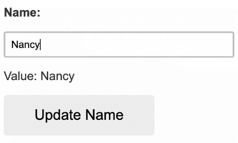
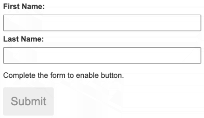
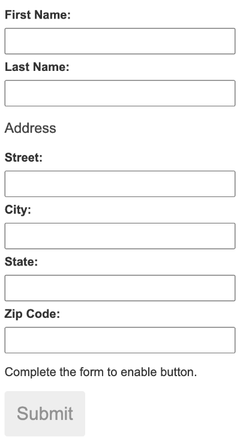
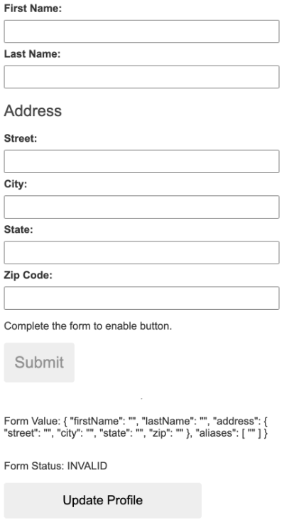

# Реактивные формы

:date: 28.02.2022

Реактивные формы обеспечивают модельно-ориентированный подход к обработке входов формы, значения которых меняются с течением времени. В этом руководстве показано, как создать и обновить базовый элемент управления формы, перейти к использованию нескольких элементов управления в группе, проверять значения формы и создавать динамические формы, в которых можно добавлять или удалять элементы управления во время выполнения.

!!!note ""

    Попробуйте этот [Reactive Forms живой пример](https://angular.io/generated/live-examples/reactive-forms/stackblitz.html).

## Предварительные условия

Прежде чем углубляться в реактивные формы, вы должны иметь базовое представление о следующем:

-   [TypeScript](https://www.typescriptlang.org/) программирование
-   основы дизайна приложений Angular, описанные в [Angular Concepts](architecture.md)
-   концепции дизайна форм, представленные в [Introduction to Forms](forms-overview.md)

## Обзор реактивных форм {: #intro}

Реактивные формы используют явный и неизменяемый подход к управлению состоянием формы в определенный момент времени. Каждое изменение состояния формы возвращает новое состояние, что сохраняет целостность модели между изменениями.

Реактивные формы построены на потоках [observable](glossary.md#observable), где входы и значения формы предоставляются в виде потоков входных значений, к которым можно получить синхронный доступ.

Реактивные формы также обеспечивают прямой путь к тестированию, поскольку вы уверены, что ваши данные последовательны и предсказуемы при запросе. Любые потребители потоков имеют доступ для безопасного манипулирования этими данными.

Реактивные формы отличаются от [template-driven forms](forms.md) различными способами. Реактивные формы обеспечивают синхронный доступ к модели данных, неизменяемость с помощью наблюдаемых операторов и отслеживание изменений с помощью наблюдаемых потоков.

Формы, управляемые шаблонами, позволяют напрямую изменять данные в вашем шаблоне, но они менее явные, чем реактивные формы, поскольку полагаются на директивы, встроенные в шаблон, а также на изменяемые данные для асинхронного отслеживания изменений. Подробное сравнение двух парадигм см. в [Forms Overview](forms-overview.md).

## Добавление базового элемента управления формой

Использование элементов управления формами состоит из трех этапов.

1.  Зарегистрируйте модуль reactive forms в вашем приложении.

    Этот модуль объявляет директивы reactive-form, которые необходимы для использования реактивных форм.

2.  Создайте новый компонент и инстанцируйте новый `FormControl`.

3.  Зарегистрируйте `FormControl` в шаблоне.

Затем вы можете отобразить форму, добавив компонент в шаблон.

В следующих примерах показано, как добавить один элемент управления формой. В примере пользователь вводит свое имя в поле ввода, фиксируется значение ввода и отображается текущее значение элемента управления формой.

**Регистрация модуля реактивных форм**.

Чтобы использовать элементы управления реактивными формами, импортируйте `ReactiveFormsModule` из пакета `@angular/forms` и добавьте его в массив `imports` вашего NgModule.

```ts
import { ReactiveFormsModule } from '@angular/forms';

@NgModule({
    imports: [
        // other imports ...
        ReactiveFormsModule,
    ],
})
export class AppModule {}
```

**Сгенерируйте новый `FormControl`**.

Используйте [команду CLI](https://angular.io/cli/generate#component-command) `ng generate` для создания компонента в вашем проекте для размещения элемента управления.

```ts
import { Component } from '@angular/core';
import { FormControl } from '@angular/forms';

@Component({
    selector: 'app-name-editor',
    templateUrl: './name-editor.component.html',
    styleUrls: ['./name-editor.component.css'],
})
export class NameEditorComponent {
    name = new FormControl('');
}
```

Используйте конструктор `FormControl` для установки его начального значения, которое в данном случае является пустой строкой. Создавая эти элементы управления в классе вашего компонента, вы получаете немедленный доступ к прослушиванию, обновлению и проверке состояния ввода формы.

**Регистрация элемента управления в шаблоне**.

После создания элемента управления в классе компонента необходимо связать его с элементом управления формы в шаблоне. Обновите шаблон с элементом управления формой, используя привязку `formControl`, предоставляемую `FormControlDirective`, которая также включена в `ReactiveFormsModule`.

```html
<label for="name">Name: </label>
<input id="name" type="text" [formControl]="name" />
```

-   Краткое описание классов и директив, предоставляемых `ReactiveFormsModule`, см. в следующем разделе [Reactive forms API](#reactive-forms-api 'API summary').
-   Полную информацию о синтаксисе этих классов и директив см. в справочной документации по API для пакета [Forms](https://angular.io/api/forms).

Используя синтаксис привязки шаблона, элемент управления формой теперь зарегистрирован для элемента ввода `name` в шаблоне. Элемент управления формой и DOM-элемент взаимодействуют друг с другом: представление отражает изменения в модели, а модель отражает изменения в представлении.

**Отображение компонента**.

Компонент `FormControl`, назначенный свойству `name`, отображается, когда компонент-хост свойства добавляется в шаблон.

```html
<app-name-editor></app-name-editor>
```


### Отображение значения элемента управления формы {: #display-value}

Вы можете отобразить значение следующими способами.

-   Через наблюдаемую `valueChanges`, где вы можете прослушивать изменения значения формы в шаблоне с помощью `AsyncPipe` или в классе компонента с помощью метода `subscribe()`.

-   с помощью свойства `value`, которое дает вам снимок текущего значения.

В следующем примере показано, как отобразить текущее значение с помощью интерполяции в шаблоне.

```html
<p>Value: {{ name.value }}</p>
```

Отображаемое значение изменяется при обновлении элемента управления формы.

Реактивные формы предоставляют доступ к информации о данном элементе управления через свойства и методы, предоставляемые каждому экземпляру. Эти свойства и методы базового класса [AbstractControl](https://angular.io/api/forms/AbstractControl) используются для управления состоянием формы и определения времени отображения сообщений при обработке [валидации ввода](#basic-form-validation 'Подробнее о валидации ввода формы').

О других свойствах и методах `FormControl` читайте в [API Reference](https://angular.io/api/forms/FormControl).

### Замена значения элемента управления формы

Реактивные формы имеют методы для изменения значения элемента управления программно, что дает вам гибкость для обновления значения без участия пользователя. Экземпляр элемента управления формы предоставляет метод `setValue()`, который обновляет значение элемента управления формы и проверяет структуру предоставленного значения на соответствие структуре элемента управления.

Например, при получении данных формы из внутреннего API или сервиса, используйте метод `setValue()` для обновления элемента управления до нового значения, полностью заменяя старое значение.

Следующий пример добавляет метод в класс компонента для обновления значения элемента управления до _Nancy_ с помощью метода `setValue()`.

```ts
updateName() {
  this.name.setValue('Nancy');
}
```

Обновление шаблона с помощью кнопки для имитации обновления имени. Когда вы нажимаете кнопку **Update Name**, значение, введенное в элемент управления формы, отражается как его текущее значение.

```html
<button type="button" (click)="updateName()">
    Update Name
</button>
```

Модель формы является источником истины для элемента управления, поэтому, когда вы нажимаете на кнопку, значение ввода изменяется в классе компонента, переопределяя его текущее значение.



!!!note ""

    В этом примере вы используете один элемент управления.
    При использовании метода `setValue()` с экземпляром [form group](#grouping-form-controls) или [form array](#creating-dynamic-forms) значение должно соответствовать структуре группы или массива.

## Группировка элементов управления формы

Формы обычно содержат несколько связанных элементов управления. Реактивные формы предоставляют два способа группировки нескольких связанных элементов управления в одну форму ввода.

| Группы форм | Подробности                                                                                                                                                                                                                                                   |
| :---------- | :------------------------------------------------------------------------------------------------------------------------------------------------------------------------------------------------------------------------------------------------------------ |
| Группа форм | Определяет форму с фиксированным набором элементов управления, которыми можно управлять совместно. В этом разделе рассматриваются основы работы с группами форм. Вы также можете [вложить группы форм](#nested-groups) для создания более сложных форм.       |
| Массив форм | Определяет динамическую форму, в которую можно добавлять и удалять элементы управления во время выполнения. Вы также можете вложить массивы форм для создания более сложных форм. Подробнее об этой опции см. в [Создание динамических форм](#dynamic-forms). |

Подобно тому, как экземпляр элемента управления формы дает вам контроль над одним полем ввода, экземпляр группы форм отслеживает состояние формы группы экземпляров элементов управления формы(например, формы). Каждый элемент управления в экземпляре группы форм отслеживается по имени при создании группы форм.

В следующем примере показано, как управлять несколькими экземплярами элементов управления формы в одной группе.

Создайте компонент `ProfileEditor` и импортируйте классы `FormGroup` и `FormControl` из пакета `@angular/forms`.

```shell
ng generate component ProfileEditor
```

```ts
import { FormGroup, FormControl } from '@angular/forms';
```

Чтобы добавить группу форм в этот компонент, выполните следующие действия.

1.  Создайте экземпляр `FormGroup`.

2.  Ассоциируйте модель `FormGroup` и представление.

3.  Сохраните данные формы.

**Создайте экземпляр `FormGroup`**.

Создайте свойство в классе компонента с именем `profileForm` и установите это свойство на новый экземпляр группы форм. Чтобы инициализировать группу форм, предоставьте конструктору объект именованных ключей, сопоставленных с их элементами управления.

Для формы профиля добавьте два экземпляра элемента управления формы с именами `firstName` и `lastName`.

```ts
import { Component } from '@angular/core';
import { FormGroup, FormControl } from '@angular/forms';

@Component({
    selector: 'app-profile-editor',
    templateUrl: './profile-editor.component.html',
    styleUrls: ['./profile-editor.component.css'],
})
export class ProfileEditorComponent {
    profileForm = new FormGroup({
        firstName: new FormControl(''),
        lastName: new FormControl(''),
    });
}
```

Отдельные элементы управления формы теперь собираются в группу. Экземпляр `FormGroup` предоставляет значение своей модели в виде объекта, собранного из значений каждого элемента управления в группе. Экземпляр группы форм имеет те же свойства (такие как `value` и `untouched`) и методы (такие как `setValue()`), что и экземпляр элемента управления формы.

**Ассоциируйте модель `FormGroup` и представление**.

Группа форм отслеживает статус и изменения для каждого из своих элементов управления, поэтому если один из элементов управления изменяется, родительский элемент управления также выдает новое изменение статуса или значения. Модель для группы поддерживается из ее членов. После определения модели необходимо обновить шаблон, чтобы отразить модель в представлении.

```html
<form [formGroup]="profileForm">
    <label for="first-name">First Name: </label>
    <input
        id="first-name"
        type="text"
        formControlName="firstName"
    />

    <label for="last-name">Last Name: </label>
    <input
        id="last-name"
        type="text"
        formControlName="lastName"
    />
</form>
```

!!!note ""

    Так же, как группа форм содержит группу элементов управления, _profileForm_ `FormGroup` привязывается к элементу `form` с помощью директивы `FormGroup`, создавая коммуникационный уровень между моделью и формой, содержащей входы.

Ввод `formControlName`, обеспечиваемый директивой `FormControlName`, связывает каждый отдельный вход с элементом управления формы, определенным в `FormGroup`. Элементы управления формы взаимодействуют с соответствующими элементами. Они также передают изменения экземпляру группы форм, который является источником истины для значения модели.

**Сохранение данных формы**

Компонент `ProfileEditor` принимает ввод от пользователя, но в реальном сценарии вы хотите захватить значение формы и сделать его доступным для дальнейшей обработки вне компонента. Директива `FormGroup` слушает событие `submit`, испускаемое элементом `form`, и испускает событие `ngSubmit`, которое вы можете связать с функцией обратного вызова. Добавьте слушателя события `ngSubmit` к тегу `form` с помощью метода обратного вызова `onSubmit()`.

```html
<form
    [formGroup]="profileForm"
    (ngSubmit)="onSubmit()"
></form>
```

Метод `onSubmit()` в компоненте `ProfileEditor` фиксирует текущее значение `profileForm`. Используйте `EventEmitter`, чтобы сохранить форму инкапсулированной и предоставить значение формы вне компонента. В следующем примере используется `console.warn` для записи сообщения в консоль браузера.

```ts
onSubmit() {
  // TODO: Use EventEmitter with form value
  console.warn(this.profileForm.value);
}
```

Событие `submit` генерируется тегом `form` с помощью встроенного события DOM. Вы вызываете это событие, нажав на кнопку с типом `submit`. Это позволяет пользователю нажать клавишу **Enter** для отправки заполненной формы.

Используйте элемент `button`, чтобы добавить кнопку в нижнюю часть формы для запуска отправки формы.

```html
<p>Complete the form to enable button.</p>
<button type="submit" [disabled]="!profileForm.valid">
    Submit
</button>
```

!!!note ""

    Кнопка в предыдущем фрагменте также имеет привязку `disabled`, чтобы отключить кнопку, когда `profileForm` недействительна. Вы пока не проводите никакой валидации, поэтому кнопка всегда включена. Базовая проверка формы рассматривается в разделе [Проверка ввода формы](#basic-form-validation).

**Отображение компонента**

Чтобы отобразить компонент `ProfileEditor`, содержащий форму, добавьте его в шаблон компонента.

```html
<app-profile-editor></app-profile-editor>
```

`ProfileEditor` позволяет управлять экземплярами элементов управления формы для элементов управления `firstName` и `lastName` в экземпляре группы форм.



### Создание вложенных групп форм {: #nested-groups}

Группы форм могут принимать в качестве дочерних как отдельные экземпляры элементов управления формы, так и другие экземпляры групп форм. Это облегчает создание сложных моделей форм и логически объединяет их в группы.

При создании сложных форм управлять различными областями информации проще в небольших разделах. Использование вложенных экземпляров групп форм позволяет разбивать большие группы форм на более мелкие, более управляемые.

Чтобы создать более сложные формы, выполните следующие действия.

1.  Создайте вложенную группу.
2.  Сгруппируйте вложенную форму в шаблоне.

Некоторые типы информации естественным образом попадают в одну группу. Имя и адрес являются типичными примерами таких вложенных групп и используются в следующих примерах.

**Создание вложенной группы**

Чтобы создать вложенную группу в `profileForm`, добавьте вложенный элемент `address` к экземпляру группы формы.

```ts
import { Component } from '@angular/core';
import { FormGroup, FormControl } from '@angular/forms';

@Component({
    selector: 'app-profile-editor',
    templateUrl: './profile-editor.component.html',
    styleUrls: ['./profile-editor.component.css'],
})
export class ProfileEditorComponent {
    profileForm = new FormGroup({
        firstName: new FormControl(''),
        lastName: new FormControl(''),
        address: new FormGroup({
            street: new FormControl(''),
            city: new FormControl(''),
            state: new FormControl(''),
            zip: new FormControl(''),
        }),
    });
}
```

В этом примере `address group` объединяет текущие элементы управления `firstName` и `lastName` с новыми элементами управления `street`, `city`, `state` и `zip`. Несмотря на то, что элемент `address` в группе форм является дочерним элементом общего элемента `profileForm` в группе форм, при изменении значения и статуса действуют те же правила. Изменения статуса и значения из группы вложенных форм распространяются на группу родительских форм, поддерживая согласованность с общей моделью.

**Группировать вложенную форму в шаблоне**.

После обновления модели в классе компонента обновите шаблон, чтобы связать экземпляр группы форм и ее элементы ввода. Добавьте группу форм `address`, содержащую поля `street`, `city`, `state` и `zip`, в шаблон `ProfileEditor`.

```html
<div formGroupName="address">
    <h2>Address</h2>

    <label for="street">Street: </label>
    <input
        id="street"
        type="text"
        formControlName="street"
    />

    <label for="city">City: </label>
    <input id="city" type="text" formControlName="city" />

    <label for="state">State: </label>
    <input id="state" type="text" formControlName="state" />

    <label for="zip">Zip Code: </label>
    <input id="zip" type="text" formControlName="zip" />
</div>
```

Форма `ProfileEditor` отображается как одна группа, но модель разбита далее, чтобы представить логические области группировки.



!!!tip ""

    Отображение значения для экземпляра группы форм в шаблоне компонента с помощью свойства `value` и `JsonPipe`.

### Обновление частей модели данных

При обновлении значения для экземпляра группы форм, содержащей несколько элементов управления, вы можете захотеть обновить только часть модели. В этом разделе рассматривается, как обновлять определенные части модели данных элемента управления формы.

Существует два способа обновления значения модели:

| Методы         | Подробности                                                                                                                                                                   |
| :------------- | :---------------------------------------------------------------------------------------------------------------------------------------------------------------------------- |
| `setValue()`   | Установка нового значения для отдельного элемента управления. Метод `setValue()` строго придерживается структуры группы форм и заменяет все значение для элемента управления. |
| `patchValue()` | Заменяет все свойства, определенные в объекте, которые изменились в модели формы.                                                                                             |

Строгие проверки метода `setValue()` помогают выявить ошибки вложенности в сложных формах, в то время как `patchValue()` при таких ошибках молча терпит неудачу.

В `ProfileEditorComponent` используйте метод `updateProfile` со следующим примером для обновления имени и адреса улицы пользователя.

```ts
updateProfile() {
  this.profileForm.patchValue({
    firstName: 'Nancy',
    address: {
      street: '123 Drew Street'
    }
  });
}
```

Имитируйте обновление, добавив в шаблон кнопку для обновления профиля пользователя по требованию.

```html
<button type="button" (click)="updateProfile()">
    Update Profile
</button>
```

Когда пользователь нажимает на кнопку, модель `profileForm` обновляется новыми значениями для `firstName` и `street`. Обратите внимание, что `street` предоставляется в виде объекта внутри свойства `address`.

Это необходимо, потому что метод `patchValue()` применяет обновление к структуре модели.

Метод `PatchValue()` обновляет только те свойства, которые определены моделью формы.

## Использование службы FormBuilder для генерации элементов управления

Создание экземпляров элементов управления формы вручную может стать утомительным при работе с несколькими формами. Служба `FormBuilder` предоставляет удобные методы для генерации элементов управления.

Используйте следующие шаги, чтобы воспользоваться преимуществами этой службы.

1.  Импортируйте класс `FormBuilder`.
2.  Инжектируйте службу `FormBuilder`.
3.  Сгенерируйте содержимое формы.

В следующих примерах показано, как рефакторить компонент `ProfileEditor`, чтобы использовать службу конструктора форм для создания экземпляров элементов управления формами и групп форм.

**Импортируйте класс FormBuilder**

Импортируйте класс `FormBuilder` из пакета `@angular/forms`.

```ts
import { FormBuilder } from '@angular/forms';
```

**Инжектирование службы FormBuilder**.

Служба `FormBuilder` является инжектируемым провайдером, который поставляется вместе с модулем реактивных форм. Инжектируйте эту зависимость, добавив ее в конструктор компонента.

```ts
constructor(private fb: FormBuilder) { }
```

**Генерирование элементов управления формы**

Служба `FormBuilder` имеет три метода: `control()`, `group()` и `array()`. Это фабричные методы для создания экземпляров ваших классов компонентов, включая элементы управления формы, группы форм и массивы форм. Используйте метод `group` для создания элементов управления `profileForm`.

```ts
import { Component } from '@angular/core';
import { FormBuilder } from '@angular/forms';

@Component({
    selector: 'app-profile-editor',
    templateUrl: './profile-editor.component.html',
    styleUrls: ['./profile-editor.component.css'],
})
export class ProfileEditorComponent {
    profileForm = this.fb.group({
        firstName: [''],
        lastName: [''],
        address: this.fb.group({
            street: [''],
            city: [''],
            state: [''],
            zip: [''],
        }),
    });

    constructor(private fb: FormBuilder) {}
}
```

В предыдущем примере вы используете метод `group()` с тем же объектом для определения свойств в модели. Значение для каждого имени элемента управления представляет собой массив, содержащий начальное значение в качестве первого элемента массива.

!!!tip ""

    Вы можете определить элемент управления только с начальным значением, но если вашим элементам управления требуется синхронная или асинхронная проверка, добавьте валидаторы синхронной и асинхронной проверки в качестве второго и третьего элементов массива.

Сравните использование конструктора форм с созданием экземпляров вручную.

=== "src/app/profile-editor/profile-editor.component.ts (instances)"

    ```ts
    profileForm = new FormGroup({
    	firstName: new FormControl(''),
    	lastName: new FormControl(''),
    	address: new FormGroup({
    		street: new FormControl(''),
    		city: new FormControl(''),
    		state: new FormControl(''),
    		zip: new FormControl(''),
    	}),
    });
    ```

=== "src/app/profile-editor/profile-editor.component.ts (form builder)"

    ```ts
    profileForm = this.fb.group({
    	firstName: [''],
    	lastName: [''],
    	address: this.fb.group({
    		street: [''],
    		city: [''],
    		state: [''],
    		zip: [''],
    	}),
    });
    ```

## Валидация ввода формы {: #basic-form-validation}

Валидация формы используется для обеспечения полноты и правильности вводимых пользователем данных. В этом разделе рассматривается добавление одного валидатора к элементу управления формы и отображение общего состояния формы.

Более подробно валидация формы рассматривается в руководстве [Form Validation](form-validation.md).

Для добавления валидации формы выполните следующие действия.

1.  Импортируйте функцию валидатора в компонент формы.
2.  Добавьте валидатор к полю в форме.
3.  Добавьте логику для обработки статуса валидации.

Наиболее распространенная валидация - сделать поле обязательным для заполнения. В следующем примере показано, как добавить обязательную проверку к элементу управления `firstName` и отобразить результат проверки.

**Импортировать функцию валидатора**

Реактивные формы включают набор функций валидатора для распространенных случаев использования. Эти функции получают элемент управления для проверки и возвращают объект ошибки или нулевое значение в зависимости от проверки.

Импортируйте класс `Validators` из пакета `@angular/forms`.

```ts
import { Validators } from '@angular/forms';
```

**Сделать поле обязательным**

В компоненте `ProfileEditor` добавьте статический метод `Validators.required` в качестве второго элемента массива для элемента управления `firstName`.

```ts
profileForm = this.fb.group({
    firstName: ['', Validators.required],
    lastName: [''],
    address: this.fb.group({
        street: [''],
        city: [''],
        state: [''],
        zip: [''],
    }),
});
```

**Отображение состояния формы**

Когда вы добавляете обязательное поле в элемент управления формой, его начальный статус становится недействительным. Этот недействительный статус распространяется на родительский элемент группы форм, делая его статус недействительным. Получить доступ к текущему статусу экземпляра группы форм можно через его свойство `status`.

Отобразите текущий статус `profileForm` с помощью интерполяции.

```ts
<p>Form Status: {{ profileForm.status }}</p>
```



Кнопка **Submit** отключена, потому что `profileForm` недействительна из-за обязательного элемента управления формы `firstName`. После того как вы заполните вход `firstName`, форма станет действительной и кнопка **Submit** будет включена.

Подробнее о валидации форм читайте в руководстве [Form Validation](form-validation.md).

## Создание динамических форм {: #dynamic-forms}

`FormArray` - это альтернатива `FormGroup` для управления любым количеством неименованных элементов управления. Как и в случае с экземплярами групп форм, вы можете динамически вставлять и удалять элементы управления из экземпляров массива форм, а значение экземпляра массива форм и статус проверки вычисляются из его дочерних элементов управления.

Однако вам не нужно определять ключ для каждого элемента управления по имени, поэтому это отличный вариант, если вы заранее не знаете количество дочерних значений.

Чтобы определить динамическую форму, выполните следующие действия.

1.  Импортируйте класс `FormArray`.
2.  Определите элемент управления `FormArray`.
3.  Получите доступ к элементу управления `FormArray` с помощью метода getter.
4.  Отображение массива форм в шаблоне.

В следующем примере показано, как управлять массивом _aliases_ в `ProfileEditor`.

**Импортируйте класс `FormArray`**

Импортируйте класс `FormArray` из `@angular/forms` для использования информации о типе. Сервис `FormBuilder` готов к созданию экземпляра `FormArray`.

```ts
import { FormArray } from '@angular/forms';
```

**Определение элемента управления `FormArray`**.

Вы можете инициализировать массив форм любым количеством элементов управления, от нуля до многих, определив их в массиве. Добавьте свойство `aliases` к экземпляру группы форм для `profileForm`, чтобы определить массив форм.

Используйте метод `FormBuilder.array()` для определения массива и метод `FormBuilder.control()` для заполнения массива начальным элементом управления.

```ts
profileForm = this.fb.group({
    firstName: ['', Validators.required],
    lastName: [''],
    address: this.fb.group({
        street: [''],
        city: [''],
        state: [''],
        zip: [''],
    }),
    aliases: this.fb.array([this.fb.control('')]),
});
```

Элемент управления псевдонимами в экземпляре группы форм теперь заполняется одним элементом управления, пока другие элементы управления не будут добавлены динамически.

**Доступ к элементу управления `FormArray`**.

Геттер обеспечивает доступ к псевдонимам в экземпляре массива форм по сравнению с повторением метода `profileForm.get()` для получения каждого экземпляра. Экземпляр массива форм представляет собой неопределенное количество элементов управления в массиве. Удобно обращаться к элементу управления через геттер, и этот подход легко повторить для дополнительных элементов управления.

Используйте синтаксис getter для создания свойства класса `aliases`, чтобы получить элемент управления массива форм псевдонима из группы родительских форм.

```ts
get aliases() {
  return this.profileForm.get('aliases') as FormArray;
}
```

!!!note ""

    Поскольку возвращаемый элемент управления имеет тип `AbstractControl`, вам необходимо указать явный тип для доступа к синтаксису метода для экземпляра массива формы.

Определите метод для динамической вставки элемента управления псевдонима в массив форм псевдонима. Метод `FormArray.push()` вставляет элемент управления как новый элемент в массив.

```ts
addAlias() {
  this.aliases.push(this.fb.control(''));
}
```

В шаблоне каждый элемент управления отображается как отдельное поле ввода.

**Отображение массива формы в шаблоне**.

Чтобы присоединить псевдонимы из вашей модели формы, вы должны добавить ее в шаблон. Подобно вводу `formGroupName`, предоставляемому `FormGroupNameDirective`, `formArrayName` привязывает связь от экземпляра массива формы к шаблону с помощью `FormArrayNameDirective`.

Добавьте следующий HTML шаблона после `div`, закрывающего элемент `formGroupName`.

```html
<div formArrayName="aliases">
    <h2>Aliases</h2>
    <button type="button" (click)="addAlias()">
        + Add another alias
    </button>

    <div
        *ngFor="let alias of aliases.controls; let i=index"
    >
        <!-- The repeated alias template -->
        <label for="alias-{{ i }}">Alias:</label>
        <input
            id="alias-{{ i }}"
            type="text"
            [formControlName]="i"
        />
    </div>
</div>
```

Директива `*ngFor` выполняет итерацию по каждому экземпляру элемента управления формы, предоставленному экземпляром массива псевдонимов формы. Поскольку элементы массива форм не имеют имен, вы присваиваете индекс переменной `i` и передаете его каждому элементу управления, чтобы привязать его к входу `formControlName`.


Каждый раз, когда добавляется новый экземпляр псевдонима, новый экземпляр массива форм получает свой элемент управления на основе индекса. Это позволяет отслеживать каждый отдельный элемент управления при вычислении состояния и значения корневого элемента управления.

**Добавление псевдонима**

Изначально форма содержит одно поле `Alias`. Чтобы добавить еще одно поле, нажмите кнопку **Добавить псевдоним**. Вы также можете проверить массив псевдонимов, о которых сообщает модель формы, отображаемая `Form Value` в нижней части шаблона.

!!!note ""

    Вместо экземпляра элемента управления формы для каждого псевдонима можно составить другой экземпляр группы форм с дополнительными полями. Процесс определения элемента управления для каждого элемента такой же.

## Краткое описание API реактивных форм {: #reactive-forms-api}

В следующей таблице перечислены базовые классы и службы, используемые для создания и управления элементами управления реактивных форм. Полную информацию о синтаксисе см. в справочной документации по API для пакета [Forms](https://angular.io/api/forms).

#### Классы

| Класс             | Подробности                                                                                                                                                                                                 |
| :---------------- | :---------------------------------------------------------------------------------------------------------------------------------------------------------------------------------------------------------- |
| `AbstractControl` | Абстрактный базовый класс для конкретных классов управления формами `FormControl`, `FormGroup` и `FormArray`. Он обеспечивает их общее поведение и свойства.                                                |
| `FormControl`     | Управляет значением и статусом валидности отдельного элемента управления формы. Он соответствует элементу управления HTML-формы, такому как `input` или `select`.                                           |
| `FormGroup`       | Управляет значением и состоянием валидности группы экземпляров `AbstractControl`. Свойства группы включают ее дочерние элементы управления. Формой верхнего уровня в вашем компоненте является `FormGroup`. |
| `FormArray`       | Управляет значением и состоянием валидности числового индексированного массива экземпляров `AbstractControl`.                                                                                               |
| `FormBuilder`     | Инжектируемый сервис, предоставляющий фабричные методы для создания экземпляров элементов управления.                                                                                                       |
| `FormRecord`      | Отслеживает значение и состояние валидности коллекции экземпляров `FormControl`, каждый из которых имеет один и тот же тип значения.                                                                        |

#### Директивы

| Директивы              | Подробности                                                                                               |
| :--------------------- | :-------------------------------------------------------------------------------------------------------- |
| `FormControlDirective` | Синхронизирует отдельный экземпляр `FormControl` с элементом управления формой.                           |
| `FormControlName`      | Синхронизирует `FormControl` в существующем экземпляре `FormGroup` с элементом управления формы по имени. |
| `FormGroupDirective`   | Синхронизирует существующий экземпляр `FormGroup` с элементом DOM.                                        |
| `FormGroupName`        | Синхронизирует вложенный экземпляр `FormGroup` с элементом DOM.                                           |
| `FormArrayName`        | Синхронизирует вложенный экземпляр `FormArray` с элементом DOM.                                           |
