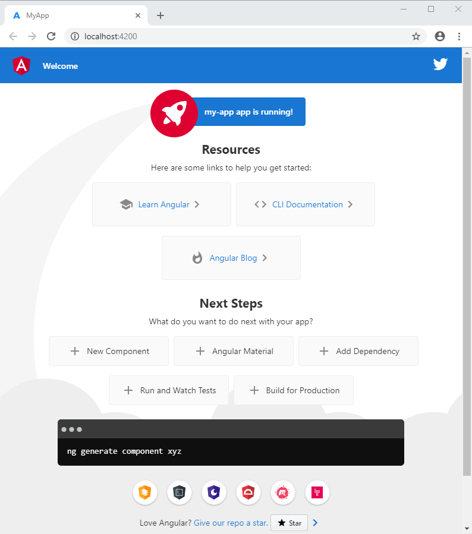

# Настройка локального окружения и рабочего пространства

Это руководство объясняет, как настроить среду для разработки Angular с помощью [инструмента Angular CLI](cli.md). Оно включает информацию о предварительных требованиях, установке CLI, создании начального рабочего пространства и стартового приложения, а также о локальном запуске этого приложения для проверки настроек.

!!!info "Попробуйте Angular без локальной настройки"

    Если вы новичок в Angular, вам лучше начать с [Try it now!](start.md), который знакомит с основами Angular в контексте готового базового приложения интернет-магазина, которое вы можете изучить и изменить. Этот отдельный учебник использует преимущества интерактивной среды [StackBlitz](https://stackblitz.com) для онлайн-разработки.

    Вам не нужно настраивать локальную среду, пока вы не будете готовы.

## Предварительные условия

Чтобы использовать фреймворк Angular, вы должны быть знакомы со следующим:

-   [JavaScript](https://developer.mozilla.org/docs/Web/JavaScript/A_re-introduction_to_JavaScript)
-   [HTML](https://developer.mozilla.org/docs/Learn/HTML/Introduction_to_HTML)
-   [CSS](https://developer.mozilla.org/docs/Learn/CSS/First_steps)

Знание [TypeScript](https://www.typescriptlang.org) полезно, но не обязательно.

Для установки Angular на локальную систему вам потребуется следующее:

| Требования | Подробности                                                                                                                                                                                                                                                                                                                                                                                                                                                                            |
| :--------- | :------------------------------------------------------------------------------------------------------------------------------------------------------------------------------------------------------------------------------------------------------------------------------------------------------------------------------------------------------------------------------------------------------------------------------------------------------------------------------------- |
| Node.js    | Для работы Angular требуется [активная LTS или maintenance LTS](https://nodejs.org/about/releases) версия Node.js. Для получения информации см. руководство [совместимость версий](versions.md). Для получения дополнительной информации об установке Node.js смотрите [nodejs.org](https://nodejs.org 'Nodejs.org'). Если вы не знаете, какая версия Node.js работает в вашей системе, выполните команду `node -v` в окне терминала.                                                  |
| NPM        | Многие возможности и функции Angular, Angular CLI и приложений Angular зависят от [npm packages](https://docs.npmjs.com/getting-started/what-is-npm). Чтобы загрузить и установить пакеты npm, вам нужен менеджер пакетов npm. В этом руководстве используется интерфейс командной строки [npm client](https://docs.npmjs.com/cli/install), который по умолчанию установлен с `Node.js`. Чтобы проверить, установлен ли у вас клиент npm, запустите в окне терминала команду `npm -v`. |

## Установите Angular CLI

Вы можете использовать Angular CLI для создания проектов, генерации кода приложений и библиотек, а также для выполнения различных текущих задач разработки, таких как тестирование, комплектация и развертывание.

Чтобы установить Angular CLI, откройте окно терминала и выполните следующую команду:

```shell
npm install -g @angular/cli
```

!!!info ""

    На клиентских компьютерах Windows выполнение сценариев PowerShell по умолчанию отключено. Чтобы разрешить выполнение сценариев PowerShell, что необходимо для глобальных двоичных файлов npm, необходимо установить следующую [политику выполнения](https://docs.microsoft.com/en-us/powershell/module/microsoft.powershell.core/about/about_execution_policies):

    ```shell
    Set-ExecutionPolicy -Scope CurrentUser -ExecutionPolicy RemoteSigned
    ```

    Внимательно прочитайте сообщение, отображаемое после выполнения команды, и следуйте инструкциям. Убедитесь, что вы понимаете последствия установки политики выполнения.

## Создание рабочего пространства и начального приложения

Вы разрабатываете приложения в контексте [**workspace**](glossary.md#workspace) Angular.

Чтобы создать новое рабочее пространство и начальное приложение, выполните следующие действия:

1.  Выполните команду CLI `ng new` и укажите имя `my-app`, как показано здесь:

    ```shell
    ng new my-app
    ```

2.  Команда `ng new` запрашивает информацию о функциях, которые необходимо включить в первоначальное приложение.

    Примите значения по умолчанию, нажав клавишу Enter или Return.

Angular CLI устанавливает необходимые пакеты Angular npm и другие зависимости. Это может занять несколько минут.

CLI создает новое рабочее пространство и простое приложение Welcome, готовое к запуску.

## Запуск приложения

В состав Angular CLI входит сервер, с помощью которого вы можете создавать и обслуживать свое приложение локально.

1.  Перейдите в папку рабочего пространства, например `my-app`.

2.  Выполните следующую команду:

    ```shell
    cd my-app
    ng serve --open
    ```

Команда `ng serve` запускает сервер, следит за вашими файлами и перестраивает приложение, когда вы вносите изменения в эти файлы.

Опция `--open` (или просто `-o`) автоматически открывает ваш браузер на `http://localhost:4200/`.

Если установка и настройка прошли успешно, вы должны увидеть страницу, похожую на следующую.



## Следующие шаги

-   Для более подробного ознакомления с фундаментальными концепциями и терминологией архитектуры и принципов проектирования одностраничных приложений Angular прочтите раздел [Angular Concepts](architecture.md).
-   Проработайте [Tour of Heroes Tutorial](toh.md), полное практическое упражнение, которое познакомит вас с процессом разработки приложений с использованием Angular CLI и проведет по важным подсистемам.
-   Помимо создания начального рабочего пространства и каркаса приложения, используйте CLI для создания кода Angular, такого как компоненты и сервисы. CLI поддерживает полный цикл разработки, включая сборку, тестирование, комплектацию и развертывание.
-   Для получения дополнительной информации о файлах Angular, создаваемых `ng new`.

:date: 28.02.2022
