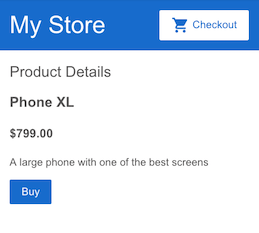
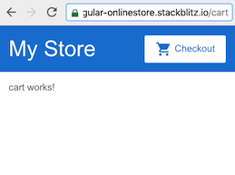
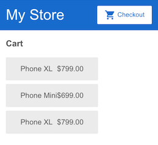
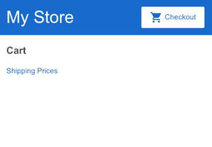
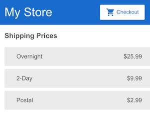

# Управление данными

Это руководство основано на втором этапе руководства [Начало работы с базовым приложением Angular](start.md), [Добавление навигации](start-routing.md). На данном этапе разработки приложение магазина имеет каталог товаров с двумя представлениями: список товаров и подробная информация о товарах.

Пользователи могут нажать на название товара из списка, чтобы увидеть подробности в новом представлении с отдельным URL-адресом или маршрутом.

Этот шаг руководства поможет вам создать корзину для покупок на следующих этапах:

-   Обновите представление подробностей о продукте, чтобы включить кнопку **Купить**, которая добавляет текущий продукт в список продуктов, которыми управляет служба корзины.
-   Добавьте компонент корзины, который отображает товары в корзине.
-   Добавление компонента доставки, который извлекает цены доставки для товаров в корзине, используя `HttpClient` от Angular для получения данных о доставке из файла `.json`.

## Создайте сервис корзины

В Angular сервис - это экземпляр класса, который вы можете сделать доступным для любой части вашего приложения, используя [систему инъекции зависимостей](glossary.md#dependency-injection-di).

В настоящее время пользователи могут просматривать информацию о продукте, а приложение может имитировать обмен информацией и уведомления об изменениях продукта.

Следующим шагом будет создание способа добавления товаров в корзину. В этом разделе мы рассмотрим добавление кнопки **Купить** и настройку службы корзины для хранения информации о товарах в корзине.

### Определение сервиса корзины

В этом разделе мы рассмотрим создание `CartService`, который отслеживает товары, добавленные в корзину.

**1.** В терминале создайте новый сервис `cart`, выполнив следующую команду:

```console
ng generate service cart
```

**2.** Импортируйте интерфейс `Product` из `./products.ts` в файл `cart.service.ts`, а в классе `CartService` определите свойство `items` для хранения массива текущих товаров в корзине.

```ts
import { Product } from './products';
import { Injectable } from '@angular/core';
/* . . . */
@Injectable({
    providedIn: 'root',
})
export class CartService {
    items: Product[] = [];
    /* . . . */
}
```

**3.** Определите методы для добавления товаров в корзину, возврата товаров из корзины и очистки корзины.

```ts
@Injectable({
    providedIn: 'root',
})
export class CartService {
    items: Product[] = [];
    /* . . . */

    addToCart(product: Product) {
        this.items.push(product);
    }

    getItems() {
        return this.items;
    }

    clearCart() {
        this.items = [];
        return this.items;
    }
    /* . . . */
}
```

-   Метод `addToCart()` добавляет товар в массив `items`.
-   Метод `getItems()` собирает товары, которые пользователи добавляют в корзину, и возвращает каждый товар с его количеством.
-   Метод `clearCart()` возвращает пустой массив товаров, который опустошает корзину.

### Использование сервиса корзины

В этом разделе рассказывается об использовании `CartService` для добавления товара в корзину.

**1.** В `product-details.component.ts` импортируйте сервис корзины.

```ts
import { Component, OnInit } from '@angular/core';
import { ActivatedRoute } from '@angular/router';

import { Product, products } from '../products';
import { CartService } from '../cart.service';
```

**2.** Внедрите сервис cart, добавив его в `constructor()`.

```ts
export class ProductDetailsComponent implements OnInit {
    constructor(
        private route: ActivatedRoute,
        private cartService: CartService
    ) {}
}
```

**3.** Определите метод `addToCart()`, который добавляет текущий товар в корзину.

```ts
export class ProductDetailsComponent implements OnInit {
    addToCart(product: Product) {
        this.cartService.addToCart(product);
        window.alert(
            'Your product has been added to the cart!'
        );
    }
}
```

Метод `addToCart()` делает следующее:

-   Принимает текущий `продукт` в качестве аргумента.
-   Использует метод `CartService` `addToCart()` для добавления товара в корзину
-   Выводит сообщение о том, что вы добавили товар в корзину.

**4.** В `product-details.component.html` добавьте кнопку с надписью **Купить** и привяжите событие `click()` к методу `addToCart()`.

Этот код обновляет шаблон сведений о продукте с кнопкой **Купить**, которая добавляет текущий продукт в корзину.

```html
<h2>Product Details</h2>

<div *ngIf="product">
    <h3>{{ product.name }}</h3>
    <h4>{{ product.price | currency }}</h4>
    <p>{{ product.description }}</p>
    <button type="button" (click)="addToCart(product)">
        Buy
    </button>
</div>
```

**5.** Убедитесь, что новая кнопка **Купить** отображается так, как ожидалось, обновив приложение и нажав на название продукта, чтобы отобразить его подробную информацию.



**6.** Нажмите кнопку **Купить**, чтобы добавить товар в сохраненный список товаров в корзине и вывести сообщение с подтверждением.


## Создание представления корзины

Чтобы клиенты могли видеть свою корзину, вы можете создать представление корзины в два этапа:

1.  Создайте компонент корзины и настройте маршрутизацию к новому компоненту.
2.  Отображение элементов корзины.

### Настройка компонента корзины

Чтобы создать представление корзины, выполните те же шаги, что и при создании компонента `ProductDetailsComponent`, и настройте маршрутизацию для нового компонента.

**1.** Создайте новый компонент с именем `cart` в терминале, выполнив следующую команду:

```console
ng generate component cart
```

Эта команда сгенерирует файл `cart.component.ts` и связанные с ним файлы шаблонов и стилей.

```ts
import { Component } from '@angular/core';

@Component({
    selector: 'app-cart',
    templateUrl: './cart.component.html',
    styleUrls: ['./cart.component.css'],
})
export class CartComponent {}
```

**2.** Обратите внимание, что вновь созданный `CartComponent` добавлен в `declarations` модуля в `app.module.ts`.

```ts
import { CartComponent } from './cart/cart.component';

@NgModule({
  declarations: [
    AppComponent,
    TopBarComponent,
    ProductListComponent,
    ProductAlertsComponent,
    ProductDetailsComponent,
    CartComponent,
  ],
})
```

**3.** Все еще в `app.module.ts` добавьте маршрут для компонента `CartComponent`, с `путем` `cart`.

```ts
@NgModule({
  imports: [
    BrowserModule,
    ReactiveFormsModule,
    RouterModule.forRoot([
      { path: '', component: ProductListComponent },
      { path: 'products/:productId', component: ProductDetailsComponent },
      { path: 'cart', component: CartComponent },
    ])
  ],
})
```

**4.** Обновите кнопку **Checkout** так, чтобы она маршрутизировалась на URL `/cart`.

В `top-bar.component.html` добавьте директиву `routerLink`, указывающую на `/cart`.

```html
<a routerLink="/cart" class="button fancy-button">
    <em class="material-icons">shopping_cart</em>Checkout
</a>
```

**5.** Убедитесь, что новый `CartComponent` работает как ожидалось, нажав на кнопку **Checkout**.

Вы можете увидеть текст по умолчанию "Корзина работает!", а URL имеет шаблон `https://getting-started.stackblitz.io/cart`, где `getting-started.stackblitz.io` может быть другим для вашего проекта StackBlitz.



### Отображение товаров в корзине

В этом разделе показано, как использовать службу корзины для отображения товаров в корзине.

**1.** В `cart.component.ts` импортируйте `CartService` из файла `cart.service.ts`.

```ts title="src/app/cart/cart.component.ts"
import { Component } from '@angular/core';
import { CartService } from '../cart.service';
```

**2.** Инжектируйте `CartService`, чтобы `CartComponent` мог его использовать, добавив его в `constructor()`.

```ts title="src/app/cart/cart.component.ts"
export class CartComponent {
    constructor(private cartService: CartService) {}
}
```

**3.** Определите свойство `items` для хранения товаров в корзине.

```ts title="src/app/cart/cart.component.ts"
export class CartComponent {
    items = this.cartService.getItems();

    constructor(private cartService: CartService) {}
}
```

Этот код устанавливает элементы с помощью метода `CartService` `getItems()`. Вы определили этот метод при создании `cart.service.ts`.

**4.** Обновите шаблон корзины с заголовком и используйте `<div>` с `*ngFor` для отображения каждого из товаров корзины с его названием и ценой. Полученный шаблон `CartComponent` выглядит следующим образом.

```ts title="src/app/cart/cart.component.html"
<h3>Cart</h3>

<div class="cart-item" *ngFor="let item of items">
  <span>{{ item.name }}</span>
  <span>{{ item.price | currency }}</span>
</div>
```

**5.** Убедитесь, что ваша корзина работает так, как ожидалось:

-   Нажмите **Мой магазин**.
-   Нажмите на название товара, чтобы отобразить его подробную информацию.
-   Нажмите **Купить**, чтобы добавить товар в корзину.
-   Нажмите **Оформить заказ**, чтобы просмотреть корзину.



Для получения дополнительной информации о сервисах смотрите [Введение в сервисы и инъекцию зависимостей](architecture-services.md).

## Получение цен на доставку

Серверы часто возвращают данные в виде потока. Потоки полезны, поскольку они позволяют легко преобразовывать возвращаемые данные и вносить изменения в способ запроса этих данных.
Angular `HttpClient` - это встроенный способ получения данных из внешних API и предоставления их вашему приложению в виде потока.

В этом разделе показано, как использовать `HttpClient` для получения цен на доставку из внешнего файла.

Приложение, которое StackBlitz создает для этого руководства, поставляется с предопределенными данными о доставке в файле `assets/shipping.json`. Используйте эти данные для добавления цен доставки для товаров в корзине.

```json title="src/assets/shipping.json"
[
    {
        "type": "Overnight",
        "price": 25.99
    },
    {
        "type": "2-Day",
        "price": 9.99
    },
    {
        "type": "Postal",
        "price": 2.99
    }
]
```

### Настройте `AppModule` для использования `HttpClient`.

Чтобы использовать `HttpClient` от Angular, вы должны настроить ваше приложение на использование `HttpClientModule`.

Angular `HttpClientModule` регистрирует провайдеров, необходимых вашему приложению для использования сервиса `HttpClient` в вашем приложении.

**1.** В файле `app.module.ts` импортируйте `HttpClientModule` из пакета `@angular/common/http` в верхней части файла вместе с другими импортами. Поскольку существует ряд других импортов, в данном фрагменте кода они опущены для краткости. Обязательно оставьте существующие импорты на месте.

```ts title="src/app/app.module.ts"
import { HttpClientModule } from '@angular/common/http';
```

**2.** Чтобы глобально зарегистрировать провайдеры Angular [`HttpClient`](https://angular.io/api/common/http/HttpClient), добавьте [`HttpClientModule`](https://angular.io/api/common/http/HttpClientModule) в массив `AppModule` [`@NgModule()`](https://angular.io/api/core/NgModule) `imports`.

```ts title="src/app/app.module.ts"
@NgModule({
    imports: [
        BrowserModule,
        HttpClientModule,
        ReactiveFormsModule,
        RouterModule.forRoot([
            { path: '', component: ProductListComponent },
            {
                path: 'products/:productId',
                component: ProductDetailsComponent,
            },
            { path: 'cart', component: CartComponent },
        ]),
    ],
    declarations: [
        AppComponent,
        TopBarComponent,
        ProductListComponent,
        ProductAlertsComponent,
        ProductDetailsComponent,
        CartComponent,
    ],
    bootstrap: [AppComponent],
})
export class AppModule {}
```

### Настройте `CartService` на использование `HttpClient`.

Следующим шагом будет внедрение сервиса `HttpClient` в ваш сервис, чтобы ваше приложение могло получать данные и взаимодействовать с внешними API и ресурсами.

**1.** В `cart.service.ts` импортируйте `HttpClient` из пакета `@angular/common/http`.

```ts title="src/app/cart.service.ts"
import { HttpClient } from '@angular/common/http';
import { Product } from './products';
import { Injectable } from '@angular/core';
```

**2.** Вставьте `HttpClient` в `конструктор()` сервиса `CartService`.

```ts title="src/app/cart.service.ts"
@Injectable({
    providedIn: 'root',
})
export class CartService {
    items: Product[] = [];

    constructor(private http: HttpClient) {}
    /* . . . */
}
```

### Настройте `CartService` для получения цен доставки

Чтобы получить данные о доставке из файла `shipping.json`, вы можете использовать метод `HttpClient` `get()`.

**1.** В `cart.service.ts`, ниже метода `clearCart()`, определите новый метод `getShippingPrices()`, который использует метод `HttpClient` `get()`.

```ts title="src/app/cart.service.ts"
@Injectable({
    providedIn: 'root',
})
export class CartService {
    /* . . . */
    getShippingPrices() {
        return this.http.get<
            { type: string; price: number }[]
        >('/assets/shipping.json');
    }
}
```

Для получения дополнительной информации о `HttpClient` в Angular, смотрите руководство [Взаимодействие клиента и сервера](understanding-communicating-with-http.md).

## Создание компонента доставки

Теперь, когда вы настроили свое приложение на получение данных о доставке, вы можете создать место для отображения этих данных.

**1.** Создайте компонент корзины с именем `shipping` в терминале, выполнив следующую команду:

```shell
ng generate component shipping
```

Эта команда создаст файл `shipping.component.ts` и связанные с ним файлы шаблонов и стилей.

```ts title="src/app/shipping/shipping.component.ts"
import { Component } from '@angular/core';

@Component({
    selector: 'app-shipping',
    templateUrl: './shipping.component.html',
    styleUrls: ['./shipping.component.css'],
})
export class ShippingComponent {}
```

**2.** В `app.module.ts` добавьте маршрут для доставки.

Укажите `path` `shipping` и компонент `ShippingComponent`.

```ts title="src/app/app.module.ts"
@NgModule({
    imports: [
        BrowserModule,
        HttpClientModule,
        ReactiveFormsModule,
        RouterModule.forRoot([
            { path: '', component: ProductListComponent },
            {
                path: 'products/:productId',
                component: ProductDetailsComponent,
            },
            { path: 'cart', component: CartComponent },
            {
                path: 'shipping',
                component: ShippingComponent,
            },
        ]),
    ],
    declarations: [
        AppComponent,
        TopBarComponent,
        ProductListComponent,
        ProductAlertsComponent,
        ProductDetailsComponent,
        CartComponent,
        ShippingComponent,
    ],
    bootstrap: [AppComponent],
})
export class AppModule {}
```

Пока нет ссылки на новый компонент доставки, но вы можете увидеть его шаблон в панели предварительного просмотра, введя URL, указанный в его маршруте.

URL имеет шаблон: `https://angular-ynqttp--4200.local.webcontainer.io/shipping`, где часть `angular-ynqttp--4200.local.webcontainer.io` может быть другой для вашего проекта StackBlitz.

### Настройка `ShippingComponent` для использования `CartService`.

Этот раздел поможет вам модифицировать `ShippingComponent` для получения данных о доставке по HTTP из файла `shipping.json`.

**1.** В `shipping.component.ts` импортируйте `CartService`.

```ts title="src/app/shipping/shipping.component.ts"
import { Component, OnInit } from '@angular/core';

import { Observable } from 'rxjs';
import { CartService } from '../cart.service';
```

**2.** Вставьте сервис корзины в `ShippingComponent` `constructor()`.

```ts title="src/app/shipping/shipping.component.ts"
constructor(private cartService: CartService) { }
```

**3.** Определите свойство `shippingCosts`, которое устанавливает свойство `shippingCosts` с помощью метода `getShippingPrices()` из `CartService`. Инициализируйте свойство `shippingCosts` в методе `ngOnInit()`.

```ts title="src/app/shipping/shipping.component.ts"
export class ShippingComponent implements OnInit {
    shippingCosts!: Observable<
        { type: string; price: number }[]
    >;

    ngOnInit(): void {
        this.shippingCosts = this.cartService.getShippingPrices();
    }
}
```

**4.** Обновите шаблон `ShippingComponent` для отображения типов доставки и цен с помощью пайпа [`async`](https://angular.io/api/common/AsyncPipe).

```html title="src/app/shipping/shipping.component.html"
<h3>Shipping Prices</h3>

<div
    class="shipping-item"
    *ngFor="let shipping of shippingCosts | async"
>
    <span>{{ shipping.type }}</span>
    <span>{{ shipping.price | currency }}</span>
</div>
```

Пайп `async` возвращает последнее значение из потока данных и продолжает делать это в течение всего времени существования данного компонента. Когда Angular уничтожает этот компонент, пайп `async` автоматически останавливается. Подробную информацию о пайпе `async` смотрите в документации [AsyncPipe API](https://angular.io/api/common/AsyncPipe).

**5.** Добавьте ссылку из представления `CartComponent` на представление `ShippingComponent`.

```html title="src/app/cart/cart.component.html"
<h3>Cart</h3>

<p>
    <a routerLink="/shipping">Shipping Prices</a>
</p>

<div class="cart-item" *ngFor="let item of items">
    <span>{{ item.name }}</span>
    <span>{{ item.price | currency }}</span>
</div>
```

**6.** Нажмите кнопку **Checkout**, чтобы увидеть обновленную корзину. Помните, что изменение приложения приводит к обновлению предварительного просмотра, что опустошает корзину.



Нажмите на ссылку, чтобы перейти к ценам на доставку.



## Что дальше

Теперь у вас есть приложение магазина с каталогом товаров, корзиной и возможностью поиска цен на доставку.

Чтобы продолжить знакомство с Angular:

-   Перейдите к разделу [Формы для пользовательского ввода](start-forms.md), чтобы завершить приложение, добавив представление корзины и форму оформления заказа.
-   Перейдите к [Развертывание](start-deployment.md), чтобы перейти к локальной разработке или развернуть приложение на Firebase или собственном сервере.

:date: 28.02.2022
