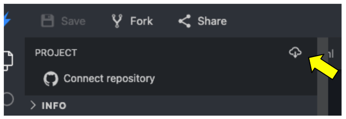

# Развертывание приложения

Развертывание приложения — это процесс компиляции, или сборки, вашего кода и размещения JavaScript, CSS и HTML на веб-сервере.

Этот раздел основывается на предыдущих шагах в руководстве [Начало работы](start.md) и показывает, как развернуть ваше приложение.

## Предварительные условия

Лучшей практикой является локальный запуск проекта перед его развертыванием. Чтобы запустить проект локально, на вашем компьютере должно быть установлено следующее:

-   [Node.js](https://nodejs.org/en).
-   [Angular CLI](https://cli.angular.io).

В терминале установите Angular CLI глобально, используя:

```shell
npm install -g &commat;angular/cli
```

С помощью Angular CLI вы можете использовать команду `ng` для создания новых рабочих пространств, новых проектов, обслуживания вашего приложения во время разработки или создания сборок для совместного использования или распространения.

## Запуск приложения локально

**1.** Загрузите исходный код вашего проекта StackBlitz, нажав на иконку `Download Project` в левом меню, напротив `Project`, чтобы загрузить ваш проект в виде zip-архива.



**2.** Распакуйте архив и измените каталог на вновь созданный проект. Например:

```shell
cd angular-ynqttp
```

**3.** Чтобы загрузить и установить пакеты npm, используйте следующую команду npm CLI:

```shell
npm install
```

**4.** Используйте следующую команду CLI для локального запуска приложения:

```shell
ng serve
```

**5.** Чтобы увидеть свое приложение в браузере, перейдите по адресу [http://localhost:4200/](http://localhost:4200/). Если порт по умолчанию 4200 недоступен, вы можете указать другой порт с помощью флага port, как в следующем примере:

```shell
ng serve --port 4201
```

Во время обслуживания приложения вы можете редактировать свой код и видеть, как изменения автоматически обновляются в браузере. Чтобы остановить команду `ng serve`, нажмите ++ctrl+c++.

## Создание и размещение вашего приложения

**1.** Чтобы собрать приложение для производства, используйте команду `build`. По умолчанию эта команда использует конфигурацию сборки `production`.

```shell
ng build
```

Эта команда создает в корневом каталоге приложения папку `dist` со всеми файлами, которые необходимы службе хостинга для обслуживания вашего приложения.

!!!warning ""

    Если команда `ng build` выдает ошибку об отсутствии пакетов, добавьте отсутствующие зависимости в файл `package.json` вашего локального проекта, чтобы они совпадали с теми, что находятся в загруженном проекте StackBlitz.

**2.** Скопируйте содержимое папки `dist/my-project-name` на ваш веб-сервер.

Поскольку эти файлы статичны, вы можете разместить их на любом веб-сервере, способном обслуживать файлы; например, `Node.js`, Java, .NET или любом бэкенде, таком как [Firebase](https://firebase.google.com/docs/hosting), [Google Cloud](https://cloud.google.com/solutions/web-hosting) или [App Engine](https://cloud.google.com/appengine/docs/standard/python/getting-started/hosting-a-static-website).

Для получения дополнительной информации смотрите [Создание и обслуживание приложений Angular](build.md) и [Руководство по развертыванию](deployment.md).

## Что дальше

В этом руководстве вы заложили основу для изучения мира Angular в таких областях, как мобильная разработка, разработка UX/UI и рендеринг на стороне сервера. Вы можете углубиться, изучая больше возможностей Angular, взаимодействуя с активным сообществом и исследуя мощную экосистему.

### Узнать больше об Angular

Более подробное руководство, которое поможет вам создать приложение на локальном уровне и изучить многие из наиболее популярных функций Angular, смотрите в [Tour of Heroes](tutorial.md).

Чтобы изучить основные концепции Angular, обратитесь к руководствам в разделе "Понимание Angular", таким как [Обзор компонентов Angular](component-overview.md) или [Синтаксис шаблонов](template-syntax.md).

### Изучение экосистемы Angular

Для поддержки разработки UX/UI смотрите [Angular Material](https://material.angular.io/).

Сообщество Angular также имеет обширную [сеть сторонних инструментов и библиотек](https://angular.io/resources).

:date: 15.09.2021
