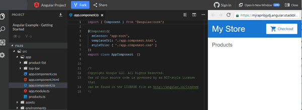
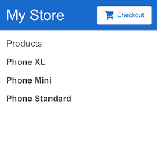
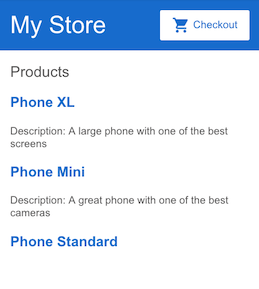
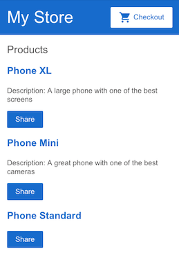
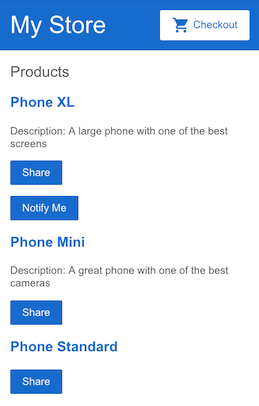

# Начало работы с Angular

Добро пожаловать в Angular!

Этот учебник познакомит вас с основными возможностями Angular и поможет создать сайт электронной коммерции с каталогом, корзиной и формой оформления заказа.

Чтобы помочь вам сразу же начать работу, в этом уроке используется готовое приложение, которое вы можете изучить и изменить в интерактивном режиме на [StackBlitz](https://stackblitz.com) &mdash; без необходимости [создания локальной рабочей среды](setup-local.md). StackBlitz - это браузерная среда разработки, в которой вы можете создавать, сохранять и совместно использовать проекты, используя различные технологии.

## Prerequisites

To get the most out of this tutorial, you should already have a basic understanding of the following.

-   [HTML](https://hcdev.ru/html/)
-   [JavaScript](https://learn.javascript.ru/)
-   [TypeScript](https://scriptdev.ru/)

## Take a tour of the example application

You build Angular applications with components. Components define areas of responsibility in the UI that let you reuse sets of UI functionality.

A component consists of three things:

| Часть компонента                  | Детали                                    |
| :-------------------------------- | :---------------------------------------- |
| Класс компонента                  | обрабатывает данные и функциональность    |
| HTML-шаблон                       | Определяет пользовательский интерфейс     |
| Стили, специфичные для компонента | Определяют внешний вид и функциональность |

Это руководство демонстрирует создание приложения со следующими компонентами:

| Компоненты             | Детали                                                          |
| :--------------------- | :-------------------------------------------------------------- |
| `<app-root>`           | Первый загружаемый компонент и контейнер для других компонентов |
| `<app-top-bar>`        | Название магазина и кнопка оформления заказа                    |
| `<app-product-list>`   | Список товаров                                                  |
| `<app-product-alerts>` | Компонент, содержащий оповещения приложения                     |


For more information about components, see [Introduction to Components](architecture-components.md).

## Create the sample project

To create the sample project, generate the <live-example name="getting-started-v0" noDownload>ready-made sample project in StackBlitz</live-example>. To save your work:

1.  Log into StackBlitz.
2.  Fork the project you generated.
3.  Save periodically.


В StackBlitz панель предварительного просмотра справа показывает начальное состояние примера приложения. Предварительный просмотр включает две области:

-   Верхняя панель с названием магазина, `My Store`, и кнопкой оформления заказа
-   Заголовок для списка товаров, `Products`.



The project section on the left shows the source files that make up the application, including the infrastructure and configuration files.

When you generate the StackBlitz example applications that accompany the tutorials, StackBlitz creates the starter files and mock data for you. The files you use throughout the tutorial are in the `src` folder.

For more information on how to use StackBlitz, see the [StackBlitz documentation](https://developer.stackblitz.com/docs/platform).

## Create the product list

In this section, you'll update the application to display a list of products. You'll use predefined product data from the `products.ts` file and methods from the `product-list.component.ts` file.

This section guides you through editing the HTML, also known as the template.

**1.** In the `product-list` folder, open the template file `product-list.component.html`.

**2.** Add an `*ngFor` structural directive on a `<div>`, as follows.

```html
<h2>Products</h2>

<div *ngFor="let product of products"></div>
```

With `*ngFor`, the `<div>` repeats for each product in the list.

Structural directives shape or reshape the DOM's structure, by adding, removing, and manipulating elements.

For more information about structural directives, see [Structural directives](structural-directives.md).

**3.** Inside the `<div>`, add an `<h3>` and `{{ product.name }}`.

The `{{ product.name }}` statement is an example of Angular's interpolation syntax.

Interpolation `{{ }}` lets you render the property value as text.

```html
<h2>Products</h2>

<div *ngFor="let product of products">
    <h3>{{ product.name }}</h3>
</div>
```

The preview pane updates to display the name of each product in the list.



**4.** To make each product name a link to product details, add the `<a>` element around `{{ product.name }}`.

**5.** Set the title to be the product's name by using the property binding `[ ]` syntax, as follows:

```html
<h2>Products</h2>

<div *ngFor="let product of products">
    <h3>
        <a [title]="product.name + ' details'">
            {{ product.name }}
        </a>
    </h3>
</div>
```

In the preview pane, hover over a product name to see the bound name property value, which is the product name plus the word "details".

Property binding `[ ]` lets you use the property value in a template expression.


**6.** Add the product descriptions.

On a `<p>` element, use an `*ngIf` directive so that Angular only creates the `<p>` element if the current product has a description.

```html
<h2>Products</h2>

<div *ngFor="let product of products">
    <h3>
        <a [title]="product.name + ' details'">
            {{ product.name }}
        </a>
    </h3>

    <p *ngIf="product.description">
        Description: {{ product.description }}
    </p>
</div>
```

The application now displays the name and description of each product in the list.

Notice that the final product does not have a description paragraph.

Angular doesn't create the `<p>` element because the product's description property is empty.



**7.** Add a button so users can share a product. Bind the button's `click` event to the `share()` method in `product-list.component.ts`. Event binding uses a set of parentheses, `( )`, around the event, as in the `(click)` event on the `<button>` element.

```html
<h2>Products</h2>

<div *ngFor="let product of products">
    <h3>
        <a [title]="product.name + ' details'">
            {{ product.name }}
        </a>
    </h3>

    <p *ngIf="product.description">
        Description: {{ product.description }}
    </p>

    <button type="button" (click)="share()">Share</button>
</div>
```

Each product now has a **Share** button.



Clicking the **Share** button triggers an alert that states, "The product has been shared!".


In editing the template, you have explored some of the most popular features of Angular templates. For more information, see [Introduction to components and templates](architecture-components.md#template-syntax).

## Pass data to a child component

Currently, the product list displays the name and description of each product. The `ProductListComponent` also defines a `products` property that contains imported data for each product from the `products` array in `products.ts`.

The next step is to create a new alert feature that uses product data from the `ProductListComponent`. The alert checks the product's price, and, if the price is greater than \$700, displays a **Notify Me** button that lets users sign up for notifications when the product goes on sale.

This section walks you through creating a child component, `ProductAlertsComponent`, that can receive data from its parent component, `ProductListComponent`.

**1.** Click on the plus sign above the current terminal to create a new terminal to run the command to generate the component.


**2.** In the new terminal, generate a new component named `product-alerts` by running the following command:

```console
ng generate component product-alerts
```

The generator creates starter files for the three parts of the component:

-   `product-alerts.component.ts`
-   `product-alerts.component.html`
-   `product-alerts.component.css`

**3.** Open `product-alerts.component.ts`.

The `@Component()` decorator indicates that the following class is a component.

`@Component()` also provides metadata about the component, including its selector, templates, and styles.

```ts
@Component({
    selector: 'app-product-alerts',
    templateUrl: './product-alerts.component.html',
    styleUrls: ['./product-alerts.component.css'],
})
export class ProductAlertsComponent {}
```

Key features in the `@Component()` are as follows:

-   `selector`, `app-product-alerts`, идентифицирует компонент. По соглашению, селекторы компонентов Angular начинаются с префикса `app-`, за которым следует имя компонента.
-   Имена файлов шаблона и стиля ссылаются на HTML и CSS компонента.
-   Определение `@Component()` также экспортирует класс `ProductAlertsComponent`, который управляет функциональностью компонента.

**4.** Чтобы настроить `ProductAlertsComponent` для получения данных о продукте, сначала импортируйте `Input` из `@angular/core`.

```ts
import { Component, Input } from '@angular/core';
import { Product } from '../products';
```

**5.** В определении класса `ProductAlertsComponent` определите свойство `product` с декоратором `@Input()`.

Декоратор `@Input()` указывает, что значение свойства передается от родителя компонента, `ProductListComponent`.

```ts
export class ProductAlertsComponent {
    @Input() product: Product | undefined;
}
```

**6.** Откройте `product-alerts.component.html` и замените абзац placeholder на кнопку **Notify Me**, которая появляется, если цена товара превышает \$700.

```html
<p *ngIf="product && product.price > 700">
    <button type="button">Notify Me</button>
</p>
```

**7.** Генератор автоматически добавил `ProductAlertsComponent` в `AppModule`, чтобы сделать его доступным для других компонентов приложения.

```ts
import { ProductAlertsComponent } from './product-alerts/product-alerts.component';

@NgModule({
  declarations: [
    AppComponent,
    TopBarComponent,
    ProductListComponent,
    ProductAlertsComponent,
  ],
})
```

**8.** Finally, to display `ProductAlertsComponent` as a child of `ProductListComponent`, add the `<app-product-alerts>` element to `product-list.component.html`. Pass the current product as input to the component using property binding.

```html
<button type="button" (click)="share()">Share</button>

<app-product-alerts [product]="product">
</app-product-alerts>
```

Новый компонент оповещения о продукте принимает продукт из списка продуктов. После ввода он показывает или скрывает кнопку **Уведомить меня**, основываясь на цене товара. Цена Phone XL превышает \$700, поэтому кнопка **Notify Me** появляется на этом продукте.



## Передача данных родительскому компоненту

Чтобы кнопка **Notify Me** работала, дочерний компонент должен уведомлять и передавать данные родительскому компоненту. Компонент `ProductAlertsComponent` должен испускать событие, когда пользователь нажимает **Notify Me**, а компонент `ProductListComponent` должен реагировать на это событие.

!!!note ""

    В новые компоненты Генератор Angular включает пустой `constructor()`, интерфейс `OnInit` и метод `ngOnInit()`. Поскольку в этих шагах они не используются, в следующих примерах кода они опущены для краткости.

**1.** В `product-alerts.component.ts` импортируйте `Output` и `EventEmitter` из `@angular/core`.

```ts
import {
    Component,
    Input,
    Output,
    EventEmitter,
} from '@angular/core';
import { Product } from '../products';
```

**2.** В классе компонента определите свойство `notify` с декоратором `@Output()` и экземпляром `EventEmitter()`.

Настройка `ProductAlertsComponent` с `@Output()` позволяет `ProductAlertsComponent` испускать событие при изменении значения свойства `notify`.

```ts
export class ProductAlertsComponent {
    @Input() product: Product | undefined;
    @Output() notify = new EventEmitter();
}
```

**3.** В `product-alerts.component.html` обновите кнопку **Notify Me** с привязкой к событию для вызова метода `notify.emit()`.

```html
<p *ngIf="product && product.price > 700">
    <button type="button" (click)="notify.emit()">
        Notify Me
    </button>
</p>
```

**4.** Определите поведение, которое происходит, когда пользователь нажимает на кнопку.

Родитель, `ProductListComponent` &mdash; не `ProductAlertsComponent`&mdash; действует, когда дочерний компонент поднимает событие.

In `product-list.component.ts`, define an `onNotify()` method, similar to the `share()` method.

```ts
export class ProductListComponent {
    products = [...products];

    share() {
        window.alert('The product has been shared!');
    }

    onNotify() {
        window.alert(
            'You will be notified when the product goes on sale'
        );
    }
}
```

**5.** Update the `ProductListComponent` to receive data from the `ProductAlertsComponent`.

In `product-list.component.html`, bind `<app-product-alerts>` to the `onNotify()` method of the product list component.

`<app-product-alerts>` is what displays the **Notify Me** button.

```html
<button type="button" (click)="share()">Share</button>

<app-product-alerts
    [product]="product"
    (notify)="onNotify()"
>
</app-product-alerts>
```

**6.** Click the **Notify Me** button to trigger an alert which reads, "You will be notified when the product goes on sale".


For more information on communication between components, see [Component Interaction](component-interaction.md).

## What's next

In this section, you've created an application that iterates through data and features components that communicate with each other.

To continue exploring Angular and developing this application:

-   Continue to [In-app navigation](start-routing.md) to create a product details page.
-   Skip ahead to [Deployment](start-deployment.md) to move to local development, or deploy your application to Firebase or your own server.

:date: 28.02.2022
