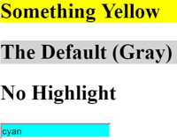

# Тестирование директив атрибутов

:date: 28.02.2022

Директива _атрибута_ изменяет поведение элемента, компонента или другой директивы. Ее название отражает способ применения директивы: в качестве атрибута на главном элементе.

!!!note ""

    Если вы хотите поэкспериментировать с приложением, которое описано в этом руководстве, [запустите его в браузере](https://angular.io/generated/live-examples/testing/stackblitz.html) или скачайте и запустите его локально.

## Тестирование `HighlightDirective`

В примере приложения `HighlightDirective` устанавливает цвет фона элемента на основе либо связанного с данными цвета, либо цвета по умолчанию (lightgray). Он также устанавливает пользовательское свойство элемента (`customProperty`) в `true` без какой-либо причины, кроме как для того, чтобы показать, что это возможно.

```ts
import {
    Directive,
    ElementRef,
    Input,
    OnChanges,
} from '@angular/core';

@Directive({ selector: '[highlight]' })
/**
 * Set backgroundColor for the attached element to highlight color
 * and set the element's customProperty to true
 */
export class HighlightDirective implements OnChanges {
    defaultColor = 'rgb(211, 211, 211)'; // lightgray

    @Input('highlight') bgColor = '';

    constructor(private el: ElementRef) {
        el.nativeElement.style.customProperty = true;
    }

    ngOnChanges() {
        this.el.nativeElement.style.backgroundColor =
            this.bgColor || this.defaultColor;
    }
}
```

Она используется во всем приложении, возможно, наиболее просто в `AboutComponent`:

```ts
import { Component } from '@angular/core';
@Component({
    template: `
        <h2 highlight="skyblue">About</h2>
        <h3>Quote of the day:</h3>
        <twain-quote></twain-quote>
    `,
})
export class AboutComponent {}
```

Тестирование конкретного использования `HighlightDirective` в `AboutComponent` требует только техник, рассмотренных в разделе ["Тесты вложенных компонентов"](testing-components-scenarios.md#nested-component-tests) раздела [Сценарии тестирования компонентов](testing-components-scenarios.md).

```ts
beforeEach(() => {
    fixture = TestBed.configureTestingModule({
        declarations: [AboutComponent, HighlightDirective],
        schemas: [CUSTOM_ELEMENTS_SCHEMA],
    }).createComponent(AboutComponent);
    fixture.detectChanges(); // initial binding
});

it('should have skyblue <h2>', () => {
    const h2: HTMLElement = fixture.nativeElement.querySelector(
        'h2'
    );
    const bgColor = h2.style.backgroundColor;
    expect(bgColor).toBe('skyblue');
});
```

Однако тестирование одного варианта использования вряд ли позволит изучить весь спектр возможностей директивы. Поиск и тестирование всех компонентов, использующих директиву, утомителен, сложен и почти так же маловероятен для полного охвата.

Тесты _только для классов_ могут быть полезны, но директивы атрибутов, подобные этой, обычно манипулируют DOM. Изолированные модульные тесты не касаются DOM и, следовательно, не внушают уверенности в эффективности директивы.

Лучшим решением будет создание искусственного тестового компонента, который демонстрирует все способы применения директивы.

```ts
@Component({
    template: ` <h2 highlight="yellow">Something Yellow</h2>
        <h2 highlight>The Default (Gray)</h2>
        <h2>No Highlight</h2>
        <input
            #box
            [highlight]="box.value"
            value="cyan"
        />`,
})
class TestComponent {}
```



!!!note ""

    Случай `<input>` связывает директиву `HighlightDirective` с именем значения цвета в поле ввода. Начальным значением является слово "cyan", которое должно быть фоновым цветом поля ввода.

Вот несколько тестов этого компонента:

```ts
beforeEach(() => {
    fixture = TestBed.configureTestingModule({
        declarations: [HighlightDirective, TestComponent],
    }).createComponent(TestComponent);

    fixture.detectChanges(); // initial binding

    // all elements with an attached HighlightDirective
    des = fixture.debugElement.queryAll(
        By.directive(HighlightDirective)
    );

    // the h2 without the HighlightDirective
    bareH2 = fixture.debugElement.query(
        By.css('h2:not([highlight])')
    );
});

// color tests
it('should have three highlighted elements', () => {
    expect(des.length).toBe(3);
});

it('should color 1st <h2> background "yellow"', () => {
    const bgColor =
        des[0].nativeElement.style.backgroundColor;
    expect(bgColor).toBe('yellow');
});

it('should color 2nd <h2> background w/ default color', () => {
    const dir = des[1].injector.get(
        HighlightDirective
    ) as HighlightDirective;
    const bgColor =
        des[1].nativeElement.style.backgroundColor;
    expect(bgColor).toBe(dir.defaultColor);
});

it('should bind <input> background to value color', () => {
    // easier to work with nativeElement
    const input = des[2].nativeElement as HTMLInputElement;
    expect(input.style.backgroundColor)
        .withContext('initial backgroundColor')
        .toBe('cyan');

    input.value = 'green';

    // Dispatch a DOM event so that Angular responds to the input value change.
    input.dispatchEvent(new Event('input'));
    fixture.detectChanges();

    expect(input.style.backgroundColor)
        .withContext('changed backgroundColor')
        .toBe('green');
});

it('bare <h2> should not have a customProperty', () => {
    expect(
        bareH2.properties['customProperty']
    ).toBeUndefined();
});
```

Несколько приемов заслуживают внимания:

-   Предикат `By.directive` — отличный способ получить элементы, имеющие эту директиву, когда типы их элементов неизвестны.

-   Псевдокласс [`:not`](https://developer.mozilla.org/docs/Web/CSS/:not) в `By.css('h2:not([highlight])')` помогает найти `<h2>` элементы, которые _не_ имеют директивы.

    `By.css('*:not([highlight])')` находит _любой_ элемент, у которого нет директивы.

-   `DebugElement.styles` позволяет получить доступ к стилям элементов даже в отсутствие реального браузера, благодаря абстракции `DebugElement`.

    Но не стесняйтесь использовать `nativeElement`, если это кажется проще или понятнее, чем абстракция.

-   Angular добавляет директиву в инжектор элемента, к которому она применяется.

    Тест на цвет по умолчанию использует инжектор второго `<h2>` для получения его экземпляра `HighlightDirective` и его `defaultColor`.

-   `DebugElement.properties` предоставляет доступ к искусственному пользовательскому свойству, которое задается директивой
