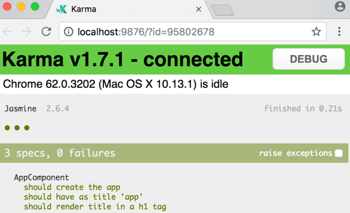

# Тестирование

:date: 17.01.2023

**Тестирование** вашего приложения Angular поможет вам проверить, что ваше приложение работает так, как вы ожидаете.

## Предварительные условия

Прежде чем писать тесты для вашего приложения Angular, вы должны иметь базовое представление о следующих концепциях:

-   [Основы Angular](architecture.md)
-   [JavaScript](https://learn.javascript.ru/)
-   [HTML](https://hcdev.ru/html/)
-   [CSS](https://hcdev.ru/css/)
-   [Angular CLI](https://angular.io/cli)

Документация по тестированию предлагает советы и методы модульного и интеграционного тестирования приложений Angular на примере приложения, созданного с помощью [Angular CLI](https://angular.io/cli). Этот пример приложения очень похож на пример из учебника [_Tour of Heroes_](toh.md).

!!!note ""

    Если вы хотите поэкспериментировать с приложением, которое описано в этом руководстве, [запустите его в браузере](https://angular.io/generated/live-examples/testing/stackblitz.html) или скачайте и запустите его локально.

## Настройка тестирования {: #setup}

Angular CLI загружает и устанавливает все необходимое для тестирования приложения Angular с помощью [Jasmine testing framework](https://jasmine.github.io).

Проект, который вы создаете с помощью CLI, сразу же готов к тестированию. Просто выполните команду CLI [`ng test`](https://angular.io/cli/test):

```shell
ng test
```

Команда `ng test` создает приложение в режиме _watch mode_ и запускает [Karma test runner](https://karma-runner.github.io).

Вывод консоли выглядит следующим образом:

```shell
02 11 2022 09:08:28.605:INFO [karma-server]: Karma v6.4.1 server started at http://localhost:9876/
02 11 2022 09:08:28.607:INFO [launcher]: Launching browsers Chrome with concurrency unlimited
02 11 2022 09:08:28.620:INFO [launcher]: Starting browser Chrome
02 11 2022 09:08:31.312:INFO [Chrome]: Connected on socket -LaEYvD2R7MdcS0-AAAB with id 31534482
Chrome: Executed 3 of 3 SUCCESS (0.193 secs / 0.172 secs)
TOTAL: 3 SUCCESS
```

Последняя строка журнала показывает, что Karma выполнила три теста, которые все прошли.

Результаты тестирования отображаются в браузере с помощью [Karma Jasmine HTML Reporter](https://github.com/dfederm/karma-jasmine-html-reporter).



Щелкните на строке теста для повторного выполнения только этого теста или щелкните на описании для повторного выполнения тестов в выбранной группе тестов ("test suite").

Тем временем команда `ng test` следит за изменениями.

Чтобы увидеть это в действии, внесите небольшое изменение в `app.component.ts` и сохраните. Тесты запускаются снова, браузер обновляется, и появляются новые результаты тестирования.

## Конфигурация

Angular CLI позаботится о конфигурации Jasmine и Karma за вас. Он создает полную конфигурацию в памяти, основываясь на опциях, указанных в файле `angular.json`.

Если вы хотите настроить Karma, вы можете создать файл `karma.conf.js`, выполнив следующую команду:

```shell
ng generate config karma
```

!!!note ""

    Подробнее о конфигурации Karma читайте в [Руководстве по конфигурации Karma](http://karma-runner.github.io/6.4/config/configuration-file.html).

### Другие тестовые фреймворки

Вы также можете проводить модульное тестирование приложения Angular с помощью других библиотек тестирования и программ запуска тестов. Каждая библиотека и программа тестирования имеет свои собственные процедуры установки, конфигурации и синтаксис.

### Имя и расположение тестового файла

Внутри папки `src/app` Angular CLI создал тестовый файл для `AppComponent` под названием `app.component.spec.ts`.

!!!warning ""

    Расширение тестового файла **должно быть `.spec.ts`**, чтобы инструментарий мог идентифицировать его как файл с тестами (также известный как *спец* файл).

Файлы `app.component.ts` и `app.component.spec.ts` являются родными в одной папке. Имена корневых файлов (`app.component`) одинаковы для обоих файлов.

Примите эти два соглашения в ваших собственных проектах для _любого вида_ тестовых файлов.

#### Поместите файл спецификации рядом с файлом, который он тестирует {: #q-spec-file-location}

Хорошей идеей является размещение файлов спецификаций модульных тестов в той же папке, что и файлы исходного кода приложения, которое они тестируют:

-   Такие тесты легко найти.
-   Вы сразу видите, если в какой-то части вашего приложения отсутствуют тесты.
-   Находящиеся рядом тесты могут показать, как часть работает в контексте.
-   Когда вы перемещаете исходный файл (неизбежно), вы не забываете переместить тест
-   Когда вы переименовываете исходный файл (неизбежно), вы помните, что нужно переименовать тестовый файл

#### Поместите файлы спецификаций в тестовую папку {: #q-specs-in-test-folder}

Спецификации интеграции приложений могут тестировать взаимодействие нескольких частей, распределенных по папкам и модулям.

На самом деле они не относятся к какой-либо конкретной части, поэтому у них нет естественного места рядом с каким-либо одним файлом.

Часто лучше создать для них соответствующую папку в каталоге `tests`.

Конечно, спецификации, которые тестируют помощников тестов, должны находиться в папке `test`, рядом с соответствующими файлами-помощниками.

## Тестирование в непрерывной интеграции {: #ci}

Один из лучших способов сохранить проект без ошибок - это набор тестов, но вы можете постоянно забывать запускать тесты.

Серверы непрерывной интеграции (CI) позволяют настроить репозиторий проекта таким образом, чтобы тесты запускались при каждом коммите и запросе на извлечение.

Чтобы протестировать ваше приложение Angular CLI в режиме непрерывной интеграции (CI), выполните следующую команду:

```shell
ng test --no-watch --no-progress
```

## Дополнительная информация о тестировании

После того, как вы настроили свое приложение для тестирования, вам могут быть полезны следующие руководства по тестированию.

|                                                                      | Подробности                                                                        |
| :------------------------------------------------------------------- | :--------------------------------------------------------------------------------- |
| [Покрытие кода](testing-code-coverage.md)                            | Какую часть вашего приложения покрывают тесты и как определить необходимые объемы. |
| [Тестирование сервисов](testing-services.md)                         | Как тестировать сервисы, используемые вашим приложением.                           |
| [Основы тестирования компонентов](testing-components-basics.md)      | Основы тестирования компонентов Angular.                                           |
| [Сценарии тестирования компонентов](testing-components-scenarios.md) | Различные виды сценариев тестирования компонентов и сценарии использования.        |
| [Тестирование директив атрибутов](testing-attribute-directives.md)   | Как тестировать директивы атрибутов.                                               |
| [Тестирование пайпов](testing-pipes.md)                              | Как тестировать пайпы.                                                             |
| [Отладка тестов](test-debugging.md)                                  | Общие ошибки тестирования.                                                         |
| [Тестирование API утилит](testing-utility-apis.md)                   | Особенности тестирования Angular.                                                  |
