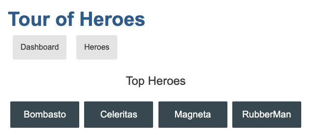
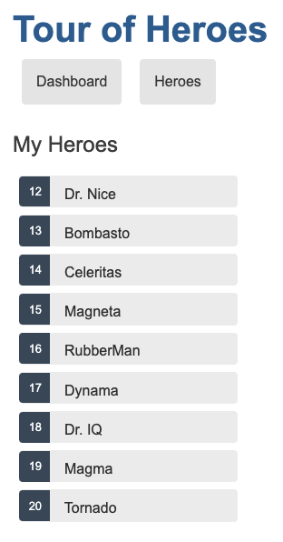
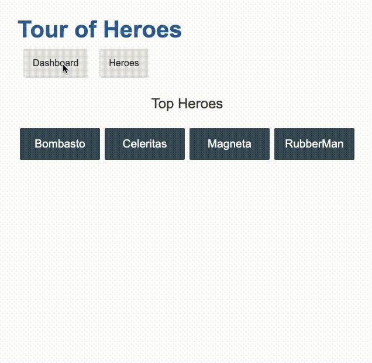

# Тур Героев приложение и учебник

:date: 16.05.2022

!!!note "Начало работы"

    В этом учебном пособии вы создадите собственное приложение Angular с самого начала. Это хороший способ познакомиться с типичным процессом разработки и изучить концепции, инструменты и терминологию проектирования приложений Angular.

    Если вы новичок в Angular, сначала попробуйте приложение [**Try it now**](start.md) быстрого запуска. Приложение **Try it now** основано на готовом частично завершенном проекте.

    Вы можете редактировать приложение в StackBlitz и видеть результаты в реальном времени.

    **Try it now** охватывает те же основные темы &mdash; компоненты, синтаксис шаблонов, маршрутизация, сервисы и доступ к данным с помощью HTTP&mdash; в сжатом формате, следуя лучшим практикам.

Этот учебник _Тур героев_ содержит введение в основы Angular и показывает, как:

-   Настроить локальную среду разработки Angular.
-   Использовать [Angular CLI](https://angular.io/cli 'Справочник команд CLI') для разработки приложения.

Приложение _Tour of Heroes_, которое вы создадите, поможет кадровому агентству управлять своим штатом героев. Приложение обладает многими функциями, которые вы ожидаете найти в любом приложении, управляемом данными.

Готовое приложение:

-   Получает список героев
-   Отображает героев в списке
-   Редактирует информацию о выбранном герое
-   Перемещается между различными представлениями данных о героях.

Этот учебник поможет вам обрести уверенность в том, что Angular может делать все, что вам нужно, показав вам, как:

-   Использовать [директивы](glossary.md#directive 'Directives definition') для показа и скрытия элементов и отображения списков данных героев.

-   Создавать компоненты Angular [components](glossary.md#component 'Components definition') для отображения данных о героях и показа массива героев.

-   Используйте одностороннее [связывание данных](glossary.md#data-binding 'Data binding definition') для данных, доступных только для чтения.

-   Добавьте редактируемые поля для обновления модели с помощью двусторонней привязки данных.

-   Привязка методов компонентов к событиям пользователя, таким как нажатие клавиш и клики.

-   Предоставление пользователям возможности выбирать героя из списка и редактировать его в представлении подробностей.

-   Форматируйте данные с помощью [пайпов](glossary.md#pipe 'Определение пайпа').

-   Создайте общую [службу](glossary.md#service 'Service definition') для сборки героев.

-   Используйте [routing](glossary.md#router 'Router definition') для навигации между различными представлениями и их компонентами.

!!!note "Решение"

    После выполнения всех шагов учебника конечное приложение будет выглядеть так, как показано в этом примере.

    [Живой пример](https://angular.io/generated/live-examples/toh-pt6/stackblitz.html)

    [Скачать](https://angular.io/generated/zips/toh-pt6/toh-pt6.zip)

## Создайте свое новое приложение

Вот изображение того, к чему ведет этот учебник, показывающее вид Dashboard и самых героических героев:

Для перехода между представлениями можно нажать на ссылки **Приборная панель** и **Герои** на приборной панели.

Если вы нажмете на героя приборной панели "Магнета", маршрутизатор откроет представление "Сведения о герое", где вы можете изменить имя героя.

Нажатие кнопки "Назад" возвращает вас на приборную панель. Ссылки, расположенные в верхней части, позволяют перейти к любому из основных видов.

Если вы нажмете "Герои", приложение отобразит представление списка "Герои".

Когда вы щелкаете по имени другого героя, в мини-подробностях под списком, доступных только для чтения, отражается новый выбор.

Вы можете нажать кнопку "Просмотр деталей", чтобы перейти к редактируемым деталям выбранного героя.

На следующей схеме показаны варианты навигации.

Вот приложение в действии:

## Ссылки

-   [Tour of Heroes application and tutorial](https://angular.io/tutorial/tour-of-heroes)
