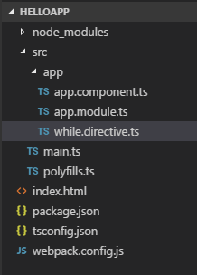
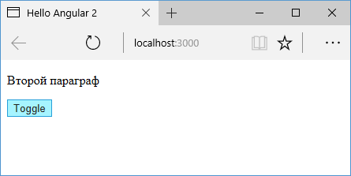

# Создание структурных директив

Создадим простейшую **структурную директиву**. Добавим в папку `src/app` новый файл `while.directive.ts`:



Этот файл будет содержать директиву. Определим в файле следующий код:

```typescript
import {
    Directive,
    Input,
    TemplateRef,
    ViewContainerRef,
} from '@angular/core';

@Directive({ selector: '[while]' })
export class WhileDirective {
    constructor(
        private templateRef: TemplateRef<any>,
        private viewContainer: ViewContainerRef
    ) {}

    @Input() set while(condition: boolean) {
        if (condition) {
            this.viewContainer.createEmbeddedView(
                this.templateRef
            );
        } else {
            this.viewContainer.clear();
        }
    }
}
```

Структурная директива должна применять декоратор `@Directive`, в который передается название селектора директивы в квадратных скобках. В данном случае селектор — `while`.

Для получения доступа к шаблону директивы применяется объект `TemplateRef`. Этот объект автоматически передается в конструктор через механизм внедрения зависимостей. Кроме этого объекта в конструктор также передается объект рендерера — `ViewContainerRef`. Ну и с помощью применения модификатора `private` для обоих этих параметров автоматически будут создаваться локальные переменные, к которым мы затем сможем обратиться.

```typescript
constructor(
	private templateRef: TemplateRef<any>,
    private viewContainer: ViewContainerRef
){ }
```

С помощью входного свойства-сеттера, к которому применяется декоратор `@Input`, мы будем получать из вне некоторые значения, которые могут использоваться при создании разметки html. В данном случае мы получаем извне некоторое булевое значение:

```typescript
@Input() set while(condition: boolean) {
    if (condition) {
        this.viewContainer.createEmbeddedView(this.templateRef);
    } else {
        this.viewContainer.clear();
    }
}
```

Если в данном случае `condition` равно `true`, то производим рендеринг шаблона через вызов `this.viewContainer.createEmbeddedView(this.templateRef);`. В итоге на веб-странице появится элемент, к которому применяется данная директива.

В обратном случае, если `condition` равно `false`, то, наоборот, удаляем элемент из разметки с помощью вызова `this.viewContainer.clear()`.

То есть по факту мы получили аналог директивы `ngIf`.

Далее применим директиву в главном компоненте `AppComponent`:

```typescript
import { Component } from '@angular/core';

@Component({
    selector: 'my-app',
    template: `
        <p *while="condition">Первый параграф</p>
        <p *while="!condition">Второй параграф</p>
        <button (click)="toggle()">Toggle</button>
    `,
})
export class AppComponent {
    condition: boolean = true;
    toggle() {
        this.condition = !this.condition;
    }
}
```

И далее задействуем директиву в главном модуле `AppModule`:

```typescript
import { NgModule } from '@angular/core';
import { BrowserModule } from '@angular/platform-browser';

import { AppComponent } from './app.component';
import { WhileDirective } from './while.directive';

@NgModule({
    imports: [BrowserModule],
    declarations: [AppComponent, WhileDirective],
    bootstrap: [AppComponent],
})
export class AppModule {}
```

И после запуска приложения с помощью этой директивы мы сможем регулировать добавление или удаление определенного блока веб-страницы:


